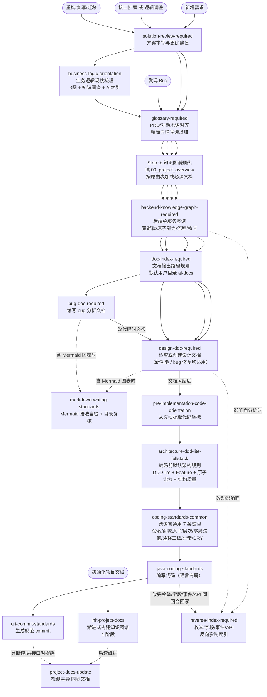
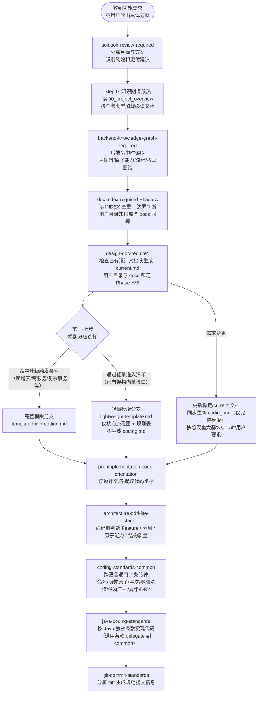
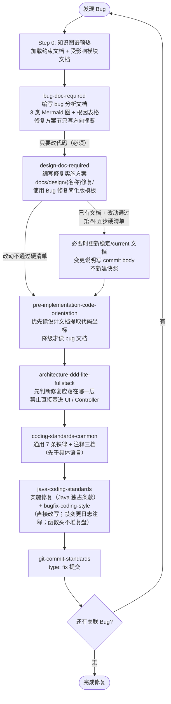
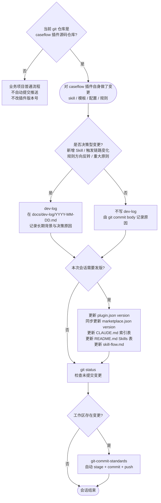
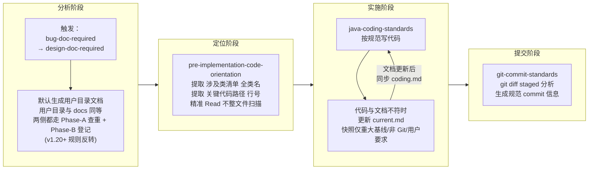

# Skill 链路全景图

> 本文档梳理 caseflow 各 skill 的触发时机、调用关系及两条主链路,用于解决"该调哪个 skill、顺序是什么"的疑惑。
>
> **变更历史**:由 git log 承担,本文不再在头部累加变更摘要,也不保留文件式快照(v21.1 删除快照、v21.2 删除头部 changelog 段)。需要查某次改动的背景,执行 `git log --follow docs/skill-flow.md` 找 commit,提交说明里写为什么改;需要某历史版本的全文,`git show <sha>:docs/skill-flow.md`。

---

## 快速导航

- **看触发时机** → [Skill 总览](#skill-总览)
- **看完整链路** → [Skill 调用关系图](#skill-调用关系图) / [功能开发完整链路](#功能开发完整链路) / [Bug 修复完整链路](#bug-修复完整链路)
- **看维护规则** → [caseflow 维护链路](#caseflow-维护链路) / [文档-索引-coding 子循环详解](#文档-索引-coding-子循环详解)
- **查常见问题** → [常见困惑速查](#常见困惑速查)

---

## Skill 总览

| Skill 名称 | 来源 | 触发时机 |
|---|---|---|
| `solution-review-required` | caseflow | 用户提出具体想法/方案并要求实施，或要求按某个回复、目录策略、架构路径、现有代码直接改时，先审视目标、现有代码质量、风险和更优方案 |
| `design-doc-required` | caseflow | 写任何实现代码前，或被要求提供修复方案/实施方案时（新功能和 bug 修复均适用）；**任何源码 Edit/Write 请求（含「根据文档改代码」「帮我改一下」等）也必须先触发**；文档定位为方案/接口开发的简明编码依据，重点确认核心逻辑、编码落点和风险点；图表遵循最小图原则；Git 管理下默认维护稳定/current 文档，历史由 commit body 承担 |
| `doc-index-required` | caseflow | **(辅助)** 创建任何 Markdown 文档前先确定输出路径；AI 生成 Markdown 默认写用户 Documents 下的 `ai-docs/{project}/{type}/{topic}/{filename}`（无 `{agent}/`、无 `{YYYY-MM-DD}/`、文件名不带日期）；**v1.20 起用户目录知识库与项目 `docs/` 索引体系等同**，写文档前必须 Phase-A 读 INDEX 查重，写完必须 Phase-B 登记；`work-log/`（日期型）和 `knowledge-graph/`（自有 `00_index.md`）走自管模式 |
| `backend-knowledge-graph-required` | caseflow | 后端接口/服务开发前读取后端图谱，重点回顾表逻辑索引、原子能力索引和 SQL 查询索引；会话中提到业务、表、字段来源、SQL/DAO/Mapper 查询逻辑时自动沉淀 SQL 指纹；生成/更新全景 ER、SQL 查询卡、表逻辑和原子能力；编码后同步 DAO/SQL、表关系、订单/退款/支付状态判定、金额聚合、原子能力复用 |
| `bug-doc-required` | caseflow | 编写 bug 分析文档时；完成后必须继续调用 design-doc-required 写修复实施方案 |
| `pre-implementation-code-orientation` | caseflow | 文档写完后、开始实施代码前（含「帮我修改代码」「改代码」等直接编码请求） |
| `architecture-ddd-lite-fullstack` | caseflow | 编写或审查 Java / React / Vue / Flutter 业务代码前；在实施前代码定位后，先判断 Feature、分层、单向依赖、原子能力与结构质量（清晰、易维护、低耦合、高内聚）；含 **函数级业务场景分流**（阶梯 1 私有方法 / 阶梯 2 升级 service，判定锚点是「业务定位」而非「代码相似度」） |
| `coding-standards-common` | caseflow | 编写/修改任何源码语言（Java / TS / JS / Dart / Python / Kotlin / Go 等）前；通用 7 条铁律 + 注释三档（+ 字段可选档）+ 注释放置原则（注释只落在类/字段/方法声明上，函数体内除 §5.3 六类核心块外不写，靠拆函数+命名表达）+ §7.6 复用项目公共能力优先（编码前查 coding-profile 的 common-capabilities.md，禁造轮子/禁原生替代公共封装）；先于具体语言 skill 触发 |
| `java-coding-standards` | caseflow | 编写或修改任何 Java 代码时（自动应用，通用条款 delegate 到 coding-standards-common） |
| `finance-coding-standards` | caseflow | 编写或修改金融技术部 Java 后端代码时（SCF 服务 / 聚合层 / FinanceBiz 系列基类）；叠加在 coding-standards-common + java-coding-standards 之上，部门独占条款，冲突时金融优先（优先级链路：金融 → 转转研发中心通用 → caseflow 自有）；注意辨伪冲突（SCF 实现类不加 Impl ≠ 普通 Java ServiceImpl） |

| `llm-agent-coding-standards` | caseflow | 编写/修改接 LLM 或做 agent 的代码时（import langchain4j/spring-ai/openai/anthropic；定义 @Tool/AiService；拼 prompt；解析 LLM 输出）；在 coding-standards-common + 语言 skill 之上叠加 LLM 集成独占条款（确定性优先/输出当不可信/枚举输出/约定 SSOT/工具描述契约/循环兜底/上下文注入） |
| `git-commit-standards` | caseflow | 大改 git commit 之前（>2 文件 / >30 行 / 含新增/重命名/删除文件）；**v1.18.1 起 hook 按改动大小放行**：`hooks/check-git-commit-skill.js` 看 staged diff，≤2 文件 ∧ ≤30 行 ∧ 仅 `M` 修改时直接放行（让模型自行写 commit message），其它情况未调用本 skill 时直接 exit 2 阻断；阈值可用 `CASEFLOW_TRIVIAL_FILES` / `CASEFLOW_TRIVIAL_LINES` 调整；git push 不门禁；仅在当前仓库就是 caseflow 插件源码仓库且插件自身变更完成后自动 stage、commit、push |
| `dev-log` | caseflow | 对 caseflow 做决策型变更后：新增/删除 Skill、触发时机或核心行为变化、规则方向反转、跨 Skill 链路变化、重大团队原则沉淀；普通小改只写 commit body |
| `markdown-writing-standards` | caseflow | 生成或修改包含 Mermaid 图表的 Markdown 内容；完成 Markdown 文件的结构性写入/重组后做目录复核（自动应用，与 java-coding-standards 同级） |
| `business-logic-orientation` | caseflow | 重构/复写/迁移前需要理解现有业务逻辑时（产出梳理文档 + AI 速查索引） |
| `init-project-docs` | caseflow | 要求初始化/生成知识图谱/分析项目文档时（4 阶段渐进式构建，独立分析类 skill） |
| `generate-project-profile` | caseflow | 要求生成项目画像时（独立分析类 skill，生成 AI Agent 消费的 10 维度 Markdown） |
| `coding-violation-log` | caseflow | 用户纠正 AI 编码错误时登记违规；编码前回顾已登记记录防重犯（嵌入编码链路，java-coding-standards 之前） |
| `project-docs-update` | caseflow | 项目代码结构变更后同步知识图谱文档（检测差异 + 自动/确认更新） |

| `comment-cleanup` | caseflow | 用户主动要求时对**存量**文件/类/模块成批清理违反注释红线的注释（`vN 新增` 版本标记 / `[BUGFIX]` 等变更日志 / 历史叙事 prose / 私有方法契约史 / 废话 / 死代码），多语言；红线规则单一来源引用 `coding-standards-common` §5.4 + §5.4.1，本 skill 只管范围圈定 / 分类决策 / 安全边界 / 提交纪律；**清理 ≠ 字面匹配删除**，Read 后判断、啰嗦的改写成一句话、函数体内非核心块注释默认清。与 §5.5 顺手清理、`check-comment-density.js` hook 写入拦截互补 |
| `bugfix-coding-style` | caseflow | bug 修复 / 任何源码改动期的应用层指引（v1.28.8 起注释红线单一来源化）：**注释禁令统一收口到 `coding-standards-common` §5.4 + §5.4.1，本 skill 不再独立定义红线表**。只承担 bug 修复期独有内容：v1.17 方向反转的历史背景、推荐写法 dart 代码示例、摆放位置示例、适用范围矩阵、遇到存量 `[DEPRECATED]` / `[ADDED]` 注释顺手清理的边界、红色警告对照表 |
| `glossary-required` | caseflow | 业务术语会话级强制登记;PRD / 设计 / 对话出现未登记的业务领域名词时自动候选追加;用户与 AI 同义词错位时主动对齐到规范术语;候选池 `{USER_DOCUMENTS}/ai-docs/{project}/glossary/_candidates.md`、正式版 `docs/knowledge-graph/glossary.md`;与 init-project-docs 的批量初始化术语表分工互补 |
| `reverse-index-required` | caseflow | 反向影响索引强制维护(4 类:状态/字段/事件/API);冷启动 `hooks/scan-reverse-index.js` 扫描 Java/Dart/TS 枚举 + SQL 字面量产出 states 初版;增量维护规则:变更枚举 / 字段 / 事件 / API 同回合必须回写反向索引;与 backend-knowledge-graph-required 互补(正向 vs 反向)、与 cross-project-locator 边界明确(单服务内 vs 跨项目调用方) |

---

## Skill 调用关系图

三类入口，汇入同一条实施链路：

---

## 功能开发完整链路

---

## Bug 修复完整链路

> **关键变更（v2）：** 原链路在"纯修复"时可绕过 design-doc-required。新链路**移除该分支**：只要 bug 需要改代码，design-doc-required 必须执行。bug 文档负责"分析清楚问题"，设计文档负责"规划清楚怎么改"，二者各有职责，不可合并。

---

## caseflow 维护链路

> 仅在**修改 caseflow 插件本身**时触发（修改 skill、模板、配置等）。与业务开发链路无关。

> **触发判断：** 只有当前 git 仓库就是 `caseflow` / `kpay-caseflow` 插件源码仓库，且在本次会话中创建、修改、删除了 `skills/` 下任意文件，或调整了 `CLAUDE.md`、`AGENTS.md`、插件元数据、README、skill-flow 等插件自身规则，才进入本维护链路。
>
> **自动提交判断：** 只要 caseflow 插件源码仓库变更完成且 `git status --short` 非空，必须立即按 `git-commit-standards` 自动提交并 push，避免多轮变更累计到一个大提交。业务项目即使安装本 plugin，也不自动 commit/push、不自动改版本号。用户明确要求暂不提交或暂不 push 时除外。

---

## 文档-索引-coding 子循环详解

这是最容易混淆的部分，拆解如下：

### 各文档类型与用途

| 文件名格式 | 何时创建 | 谁来读 | 可否修改 |
|---|---|---|---|
| `{需求}-current.md` | Git 管理下的项目正式设计文档（默认） | 人 + AI 优先读取 | 随代码演进直接更新，历史由 git commit 负责 |
| `{需求}-coding.md` | 完整模版读完设计文档后自动生成 | AI（节省 token） | 随 current 文档同步 |
| `snapshots/{需求}-{日期}-v{N}.md` | 重大基线、发布快照、非 Git 管理文档或用户明确要求时 | 人 | 创建后不改，后续重大基线另建快照 |
| `{USER_DOCUMENTS}/ai-docs/{project}/bug/{模块名}/{bug名称}/{bug名称}.md` | 确认 bug 根因后（**默认**） | 人 + AI 分析阶段 | 可补充，修复方案节只写方向摘要；用户目录知识库由 doc-index-required Phase-A/B 管控 |
| `docs/bug/{模块名}/{bug名称}/{bug名称}.md` | 用户明确要求"上传终版 / 写到 docs/" 时 | 人 + AI 分析阶段 | 可补充；归档结构与用户目录一致，按模块分组 + 触发 doc-index-required |
| `docs/design/{名称}修复/{名称}修复-current.md` | bug 分析完成后 | AI 实施阶段 | 随修复方案演进直接更新，历史由 git commit 负责 |
| `docs/{subdir}/INDEX.md` | 首个文档创建时 | doc-index-required 读取 | 随文档新增自动追加 |
| `docs/dev-log/YYYY-MM-DD.md` | caseflow 决策型变更时 | 人（追溯重大规则为什么存在） | 当天可追加，禁止修改历史日期文件；普通小改不写 |

---

## 常见困惑速查

| 困惑 | 答案 |
|---|---|
| 什么时候要先调用 solution-review-required? | 用户已经给出具体方案、目录策略、架构路径、现有代码参考或要求“按这个回复实施”时先调用。它先判断真实目标、现有代码质量、风险和更优做法，再进入设计文档或编码流程。 |
| 用户要求“参考现有代码照着写”时可以直接抄吗? | 不可以默认抄。现有代码只能作为事实材料，必须先判断它是否符合当前架构、分层、状态机、数据一致性和测试约束。质量差的旧代码只能提取业务规则，不能作为新实现模板继续扩散。 |
| 用户没问更优方案时，AI 要主动提吗? | 要。`solution-review-required` 的核心职责就是反迎合：当用户方案或现有代码惯性存在明显风险时，必须主动指出问题，并给出更简单、更安全或更可维护的建议。 |
| 后端知识图谱会因为会话里反复提到就自动更新吗? | 会自动记录到用户目录候选池，避免遗漏；但不会把未验证猜测直接写入正式图谱。代码/DDL/枚举/API 契约验证过，或本次后端代码变更影响 DAO/SQL、表关系、状态判定、金额聚合、原子能力时，必须同步正式图谱或候选池。 |
| backend-knowledge-graph-required 管哪些范围? | 管后端单服务。沉淀领域能力、原子能力、流程、全景 ER、SQL 查询逻辑、表逻辑、表关系、枚举、状态判定、API、外部依赖和代码坐标；前端 UI、跨项目拓扑不放进这个 skill。 |
| 后端接口开发前要看哪些图谱? | 先看 `07_table_logic_index.md`、`08_atomic_capability_index.md` 和 `09_sql_query_index.md`，再看命中的 `table-logic/{scenario}.md`、`atomic-capabilities/{capability}.md`、`sql-queries/{scenario}.md`、表卡、流程卡、枚举卡，最后才读 DAO/Service 代码。 |
| 会话里提到 SQL 或业务查询逻辑要怎么处理? | 必须同回合追加到 `_sql_candidates.md`，记录业务问题、SQL 指纹、参数、返回字段、涉及表、join/where/group by/order by 语义、状态枚举、原子能力和代码坐标；用户要求整理时合并到 `09_sql_query_index.md`、`sql-queries/` 和全景 ER。 |
| “完善 SQL”时能直接新写一条吗? | 不能默认新写。先查 `09_sql_query_index.md` 和 `sql-queries/`，命中相似 SQL 时按 SQL 指纹合并为同一查询能力的变体，只补必要的 join/where/group by/order by，并回写图谱。 |
| 订单部分退、订单状态判定这类反复问题怎么处理? | 必须沉淀到 `table-logic/` 和原子能力索引。卡片要写清涉及表、状态/金额字段、判定矩阵、状态变化矩阵、可复用 DAO/Service 方法和代码坐标，后续新增接口先按图谱判断是否支持。 |
| 多项目知识图谱还要整理什么? | 不做各服务内部能力的重复沉淀，主要记录服务间调用关系、入口契约、关键业务对象、数据归属、失败传播和幂等补偿边界；具体跨项目链路由 `cross-project-locator` 负责。 |
| 需要单独调用 doc-index-required 吗? | 创建任何 Markdown 文档前都要先应用它的"输出路径规则"。**v1.20 起：用户目录知识库与项目 `docs/` 索引体系等同**，写文档前都要 Phase-A 读 INDEX 查重，写完都要 Phase-B 登记；`work-log/`（日期型）和 `knowledge-graph/`（自管 `00_index.md`）走豁免模式。 |
| AI 生成文档默认写到哪里? | 默认写到用户 Documents 下的 `ai-docs/{project}/{type}/{topic}/{filename}`（无 `{agent}/`、无 `{YYYY-MM-DD}/`、文件名不带日期）；Windows 为 `%USERPROFILE%\Documents\ai-docs\...`，macOS/Linux 为 `~/Documents/ai-docs/...`，无 Documents 时兜底 `~/ai-docs/...`。例：`ai-docs/{project}/design/{需求名}/{需求名}-current.md`、`ai-docs/{project}/bug/{模块名}/{bug名}/{bug名}.md`。 |
| 正式设计文档还能写 `docs/design/` 吗? | 可以，但不再由 AI 默认写入。终版文档由用户自行上传；或用户明确指定 `docs/...` 路径后，AI 才写项目目录并更新索引。 |
| pre-implementation-code-orientation 什么时候调? | 两份文档（bug 分析 + 设计文档）都写完后、敲第一行代码前 |
| pre-implementation-code-orientation 读哪份文档? | 优先读设计文档（coding.md），没有则降级读 bug 文档的涉及类清单 |
| 需求变更时改原设计文档还是新建? | 如果文档在项目 Git 中，默认直接更新 `{需求}-current.md`，历史由 commit body / PR diff / blame 负责。只有重大基线、非 Git 管理文档或用户明确要求时才新建 `YYYYMMDD-vN` 快照。 |
| coding.md 和 current.md 有什么区别? | current.md 是当前代码的正式设计描述；coding.md 是完整模版的当前编码摘要，给 AI 实施时节省 token。二者都随当前实现同步更新，不承担变更流水职责。 |
| Bug 修复需要调 design-doc-required 吗? | **必须**。只要 bug 需要改代码，就必须有设计文档。bug 文档负责分析，设计文档负责实施方案，两者职责不同不可省略。bug 修复可用简化版模板（仅 8 节）。 |
| bug 文档的修复方案节写什么? | 仅写方向摘要（每级一句话），加设计文档路径指引。详细实施细节写进设计文档。 |
| dev-log 什么时候调? | 只在 caseflow 发生决策型变更时调用：新增/删除 Skill、触发时机或核心行为变化、规则方向反转、跨 Skill 链路变化、重大团队原则沉淀。普通小改、措辞同步、版本号递增不写 dev-log。 |
| dev-log 和 git-commit-standards 有什么区别? | git-commit-standards 是默认变更日志，commit body 要写清楚本次为什么改；dev-log 只记录“这个规则为什么存在”的长期背景。普通变更只需 commit body，重大规则决策才两者都写。 |
| caseflow 改完后会自动 commit 和 push 吗? | 只在当前 git 仓库就是 caseflow 插件源码仓库时会。业务项目安装本 plugin 后不会自动提交、推送或改版本号。 |
| 为什么每次 push 还可能要授权? | 自动 push 是 skill 的行为规则；是否弹授权由 Codex/宿主运行环境的命令审批策略控制。若环境没有持久化允许 `git push`，skill 不能绕过授权，只能在获准后继续执行。 |
| init-project-docs 什么时候调? | 仅在明确要求"初始化项目文档"或"分析项目能力"时调用，是独立的分析类 skill，不属于功能开发或 bug 修复链路。 |
| markdown-writing-standards 和 design-doc-required 的 Mermaid 章节什么关系? | design-doc-required 规定「什么场景适合画什么图」，并遵循最小图原则：能一张图讲清就只画一张；markdown-writing-standards 规定「图怎么画不出错」（语法规则、自检清单）。前者定义 what，后者定义 how。 |
| 设计文档需要写完整模块资料吗? | 不需要。`design-doc-required` 的设计文档是某个方案/接口开发的编码依据，重点写核心逻辑、关键规则、编码落点、风险与验证。项目全集资料里已有的数据结构、下游依赖、缓存/消息/事务等，只在本次有新增、修改或风险时写。 |
| 功能模块总览图、能力分解图还要画吗? | 默认不画。简单接口设计、单个后端动作、已有模块内方案开发都不需要；涉及模块交互时也优先用文字/表格说明，只有不画就无法确认风险或职责边界时才画。 |
| 写 Mermaid 时需要显式调用 markdown-writing-standards 吗? | 自动应用，与 java-coding-standards 同级。只要检测到要写 Mermaid 代码块，规则自动生效。 |
| business-logic-orientation 和 design-doc-required 的区别? | business-logic-orientation 梳理**现有代码的现状**（是什么），design-doc-required 规划**要改成什么样**（怎么改）。重构场景先梳理现状，再写设计文档。 |
| AI 速查索引和 coding.md 有什么区别? | AI 速查索引是对**现有代码**的紧凑索引（文件/方法/调用链/表操作），coding.md 是对**设计方案**的编码摘要（接口契约/类清单/业务规则）。前者面向理解，后者面向实施。 |
| init-project-docs 的 4 个 Phase 必须全部执行吗? | 不必须。Phase 1-2 是核心（全自动），Phase 3-4 可选。可以只运行 Phase 1-2 快速建立基础知识图谱，后续按需补充。 |
| project-docs-update 和 init-project-docs 的区别? | init-project-docs 是**从零构建**知识图谱（首次使用），project-docs-update 是**增量维护**（代码变更后同步文档）。前者生成，后者更新。 |
| architecture-ddd-lite-fullstack 什么时候调? | 设计文档和代码定位完成后、第一行业务源码改动前。它是默认架构门禁：先判断 Feature、Presentation/Application/Domain/Repository/Infrastructure 分层、调用方向、原子能力和结构质量（清晰、易维护、低耦合、高内聚），再写代码。 |
| 什么时候必须把 if-else 分支拆成独立 service，什么时候在函数内拆私有方法就够了？(v1.26.3) | 判定锚点是「业务定位」而非「代码相似度」。共享同一状态机/校验/补偿/团队 → 函数内拆私有方法即可（**阶梯 1**：`_handleTypeA()` / `_handleTypeB()` 私有方法，主方法只分流派发）；分支差异本质是不同业务定位（独立状态机/独立 PRD 模块/独立团队，命中 ≥3 个判定信号） → 升级到 service 级（**阶梯 2**：建 `AService` / `BService1`，共享逻辑沉到原子能力层）。1-100 期成熟项目扩展期最易违反——AI 看到 `OrderService.handle()` 已存在就习惯性加 `else if (type == B)`，结果两种业务定位逻辑黏死。详见 `architecture-ddd-lite-fullstack` 「函数级业务场景分流」节、`coding-standards-common §2.5`、`anti-pattern-case-library C4`。 |
| architecture-ddd-lite-fullstack 和 java-coding-standards 的区别? | architecture-ddd-lite-fullstack 管**代码放哪一层、依赖方向、业务能力怎么复用、结构是否清晰易维护且低耦合高内聚**；java-coding-standards 管 **Java 代码质量**（命名、格式、异常、集合、日志等）。先分层和结构设计，再写具体语言代码。 |
| coding-standards-common 和 java-coding-standards 的区别? | coding-standards-common 是**跨语言通用底**（命名表意、函数原子 80 行、层次分明、零魔法值、注释三档、异常不静默、DRY rule of 3），适用一切源码语言；java-coding-standards 是 **Java 独占条款**（Javadoc 语法、Integer 比较、SimpleDateFormat、SLF4J、HashMap 容量、@Override、关系库 SQL 规范等）。触发顺序：common 先（任何源码语言都要走） → 具体语言 skill 后（叠加独占条款）。新写 TS/Python/Kotlin/Go 时只走 common，新写 Java 走 common + java。 |
| finance-coding-standards 和 java-coding-standards 的区别? | java-coding-standards 是**阿里黄山版 Java 通用独占条款**，所有 Java 代码适用；finance-coding-standards 是**金融技术部部门独占**，只在写金融 Java 后端（SCF 服务 / 聚合层 / FinanceBiz 基类）时叠加。触发顺序：common → java → finance。**冲突时金融条款优先**（优先级链路：金融 → 转转研发中心通用 → caseflow 自有）。注意辨伪冲突：SCF 接口实现类不加 Impl 是框架场景（`scfProxyFactoryUtil.creat` 有坑），普通 Java 类仍用 ServiceImpl，两者不矛盾。 |
| 注释到底要写多少? | 三档铁律：类 1-3 行（业务职责 + 所属层 + 关键协作）、方法 1-2 行 + 参数/返回/异常项（业务意图，不是重复方法名）、核心代码块 1 行（业务规则 / 技术决策 / 魔法数字 / 容错降级 / TODO）。**禁止**：注释掉的旧代码、变更历史/日期/PR 号、段落式设计史、重复函数名的废话、无原因 TODO。简要原则：写不下就说明你想塞实现细节，那部分应该进 design doc 而不是源码。 |

| Phase 3-4 的自动模式和确认模式怎么选? | 自动模式：AI 尽力推断后生成，标注"需人工校验"，适合快速产出初稿。确认模式：逐份展示等用户确认，适合对准确度要求高的场景。 |
| Step 0 知识图谱预热是什么? | 在 design-doc-required / bug-doc-required 执行前，先读 `00_project_overview.md` 获取全局索引，再按 AI 上下文路由表加载当前任务类型对应的 2-3 份文档。避免全量扫码，按需获取上下文。 |
| 什么时候走「轻量修订」而不是新建快照? | 设计文档已存在 + 改动通过 design-doc-required 第四·五步硬清单（不新增接口/字段/类、不改方法签名、单文件 ≤30 行净变更、性质属修正/对齐/删冗余/修 bug）。Git 管理下必要时更新 current 文档，变更说明写 commit body；任一项 ❌ 进入需求变更处理。 |
| 轻量修订期间代码怎么写? | 注释红线遵循 **`coding-standards-common` §5.4 + §5.4.1（v1.28.8 起注释红线单一来源化到 common）**：直接改写或新增，**禁止**在源码中保留 `[DEPRECATED]` / `[ADDED]` / `[BUGFIX 日期]` / `[REWRITTEN]` / section divider 带日期等变更日志标记，**禁止**注释保留旧代码段。源码只描述当前正确逻辑，变更原因写进 commit message body；函数/类 doc comment 只写当前职责、输入输出语义、不变式和误用风险，复杂逻辑在对应代码块附近写 1-2 行 WHY 注释。`bugfix-coding-style` 承担应用层指引（推荐写法 dart 示例、摆放位置、适用范围、旧标记顺手清理）。 |
| 函数上能不能写一大段旧实现问题和新实现步骤? | 不能。`[REWRITTEN 日期]`、旧实现缺陷、新实现 1/2/3 步、设计文档第几节、未来版本计划都不应堆在函数头（规则源：`coding-standards-common` §5.4 + §5.4.1 字面反例对照表）。私有方法的 dartdoc 更不能堆"前端契约 / 早期版本曾要求 / 现已统一为"的契约演变史——私有方法不是公开接口，函数名 + 1 行职责就够；契约迁移属于 commit body / bug doc。代码块上方的行内 WHY 注释硬阈值 1 行，超过 1 行就该删或拆。 |
| `bugfix-coding-style` 和 `coding-violation-log` 有什么区别? | bugfix-coding-style v1.28.8 起是**应用层指引**（注释红线收口到 `coding-standards-common` §5.4 + §5.4.1，本 skill 承担 bug 修复期推荐写法 dart 示例 / 摆放位置 / 旧标记顺手清理边界 / 红色警告对照表），coding-violation-log 是**反应式登记**（用户纠错后记录到违规表防重犯）。前者管"怎么写得对"，后者管"错过的别再错"。 |
| 注释红线有三套机制（§5.5 / hook / comment-cleanup），分别管什么? | **同一份红线（`coding-standards-common` §5.4 + §5.4.1），三个触发面**：§5.5「改到哪清到哪」——改逻辑时顺手清被覆盖到的方法/块；`check-comment-density.js` hook——写入**新内容**（Write/Edit）时 warn 抓机械红线（变更标记/日期/工单号/`vN 新增`/超长块）；`comment-cleanup` skill——用户**主动要求**对**存量**文件/类/模块成批清理（regex 抓不到的 prose 史 / 契约史靠它的语义判断）。规则不重复定义，全部引用 §5.4。 |
| 项目没有知识图谱时 Step 0 怎么办? | 自动跳过。Step 0 检测用户目录知识库 `{USER_DOCUMENTS}/ai-docs/{project}/00_project_overview.md` 不存在时直接进入后续流程，完全向后兼容（知识图谱由 init-project-docs 统一生成在用户目录，不再在项目 `docs/`）。 |
| 什么时候走「轻量模版」? | 命中第一·七步全部 9 项硬清单（不新增表/字段/对外契约/类 ≥3、不跨服务、不引入新中间件、不重设状态机、改动可由「核心流程图 + 规则表 + 失败行为表」描述）。任一 ❌ 升级到完整模版。已有架构内的单接口新增/调整、接口自身流程或库表读写流程描述就是典型轻量场景。 |
| 轻量模版需要 coding.md 吗? | **不需要**。核心流程图 + 规则表 + 失败行为表已经覆盖编码所需的最小信息。第四步（生成 coding.md）和第六步（同步 coding.md）只对完整模版生效，轻量分支跳过。 |
| 轻量文档实施完后还要做什么? | 回填代码入口的真实行号（编码前可以写「待实现」，实施完成后填实际 Service / DAO 文件:line），让文档同时承担「设计意图」与「库表行为索引」两个角色。 |
| 轻量改到一半发现要新增表怎么办? | 立即升级到完整模版（按 lightweight-template 第 6 节「升级到完整模版的触发条件」处理）。以轻量文档为草稿，按 template.md 章节逐节展开；Git 管理下更新 current + coding，只有重大基线/非 Git/用户要求时才建快照。 |
| glossary-required 和 init-project-docs 的 07_glossary.md 是什么关系? | init-project-docs 负责**项目首次初始化**时一次性批量产出完整版术语表(7 章节、按业务域分组、含完整业务规则/反例);`glossary-required` 负责**日常会话级**增量补登(精简五栏 + 同义词归一对齐)。两者共用同一份 `docs/knowledge-graph/glossary.md`,但触发时机和模板形态不同——init 是项目化的批量动作,本 skill 是会话化的写前/答前拦截。 |
| 通用编程概念(线程 / 缓存 / 事务 / 子进程)要不要登记到 glossary? | 不要。`glossary-required` 只管业务领域名词;线程 / 缓存 / 事务 / 子进程编排等通用编程或运维边界概念归 `backend-knowledge-graph-required` 的「项目级技术难点图谱」,长对话反复疑问 ≥3 轮自动追加技术难点候选。跨项目同名异叫法对照(项目 A 叫「订单」、项目 B 叫「Order」)归 `cross-project-locator/shared-glossary.md`。 |
| 用户用「退货」我用「退款」要纠正吗? | 必须主动对齐到规范术语。glossary-required 的核心职责之一就是同义词归一——以代码命名为准,把用户口语化表达标记为「同义词 / 旧叫法」。AI 后续回答统一用规范术语,首次出现时做映射提示「(您所说的「退货」= 本项目术语「退款」)」。**不主动对齐 = 流程违反**,因为 Agent 后续场景匹配 / 反向索引 / 工时分析全靠术语一致性。 |
| 反向索引和后端知识图谱有什么区别? | 互补关系。`backend-knowledge-graph-required` 是**正向**沉淀(这个枚举有什么值、这张表有什么字段、这个状态机怎么转);`reverse-index-required` 是**反向**沉淀(这个枚举值在哪里被判断、这个字段在哪里被读写、这个事件谁订阅、这个 API 谁调用)。AI 回答「加这个状态会破坏哪些旧逻辑」类问题时,正向图谱回答不了,必须查反向索引。两者用不同文件分别存放:`docs/knowledge-graph/backend/` vs `docs/knowledge-graph/reverse-index/`。 |
| 反向索引第一次怎么建? | 跑冷启动扫描器:`node ${CLAUDE_PLUGIN_ROOT}/hooks/scan-reverse-index.js --project=. --output=./docs/knowledge-graph/reverse-index/`。V1 扫描器支持 Java / Dart / TS,识别 enum 定义 + `EnumName.VALUE` 引用 + SQL 字面量候选,产出 `states.md` 初版;`fields.md` / `events.md` / `apis.md` 输出存根需人工填充。扫描器局限:不识别 case 裸值(Java `case PAID:`)、反射调用(`Enum.valueOf`)、配置文件中的字面量,这些用候选区人工补。 |
| 反向索引每次怎么维护? | 增量,**同回合回写**。改了枚举值就回写 states.md;改了字段就回写 fields.md;改了同步事件 payload 就回写 events.md;改了 API 就回写 apis.md。**严禁延迟到下次会话**——上下文一旦丢失,反向索引重做成本极高。每次新增枚举值时,必须逐条复核「新增态时是否需要补判断」列(回顾每个已存在判断点是否需要补 case)。 |
| 跨项目调用方索引归哪个 skill? | 单服务内 API 的调用方走 `reverse-index-required` 的 `apis.md`;跨项目(如 PWA → BFF → 云端)的调用方对照走 `cross-project-locator` 的 `kpay-pos-topology/`。判断界限:被调对象是同服务内类则单服务索引,被调对象在另一个工程则跨项目拓扑。 |
