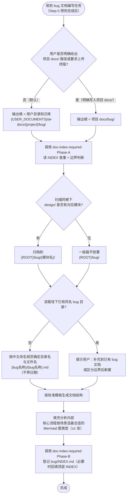
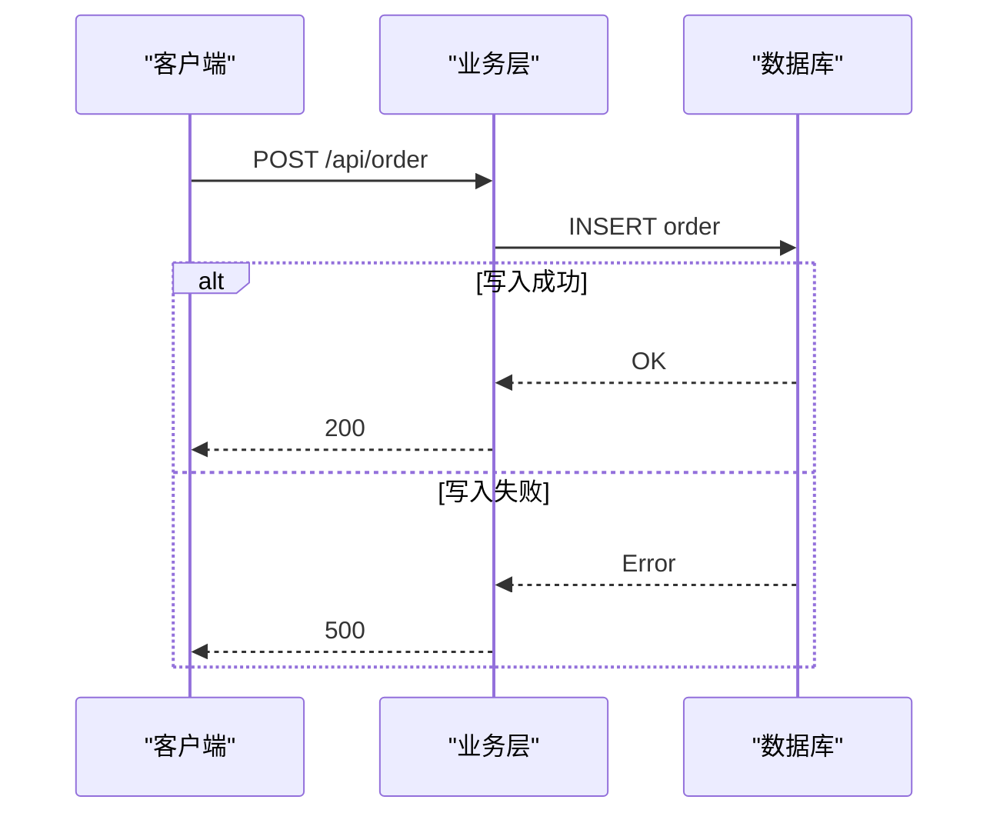
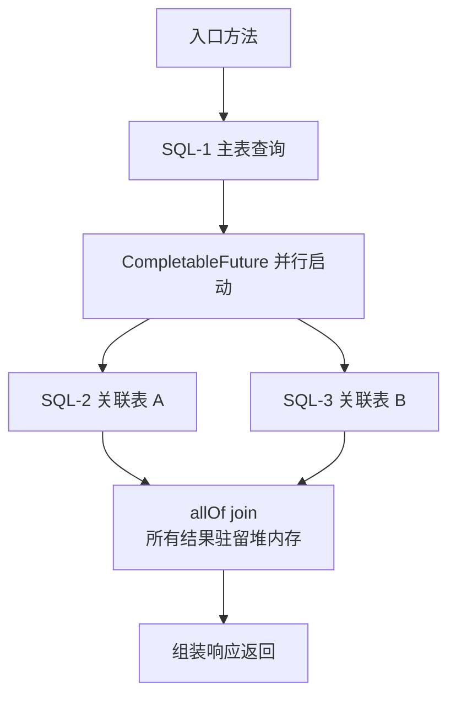
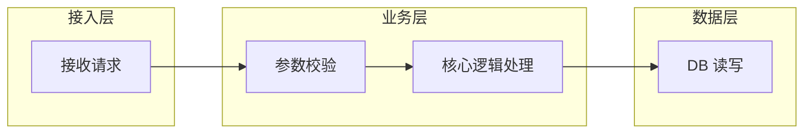

# Bug 分析文档强制规范

## 核心原则

**编写 bug 文档必须遵守标准章节结构；核心流程分析必须使用 Mermaid 图（禁止 ASCII 字符图），具体图类型与数量由 AI 按场景选最合适的 1 类或多类，至少 1 张。**

---

## Step 0：知识图谱上下文预热

**在开始 Bug 分析之前，先加载项目知识图谱上下文，快速定位受影响的模块和架构约束。**

1. 检查用户目录知识库 `{USER_DOCUMENTS}/ai-docs/{project}/00_project_overview.md` 是否存在（知识图谱由 `init-project-docs` 统一生成在用户目录，不再在项目 `docs/`）
2. **若存在**：
   - 读取该文件，获取项目全局索引 + AI 上下文路由表
   - 按路由表「Bug 修复」行加载：`08_constraints_and_rules` + `modules/{受影响模块}.md`
   - 按需：若 Bug 涉及数据库，追加读 `04_data_model_map`；涉及接口调用，追加读 `06_frontend_backend_mapping`
3. **若不存在**：跳过，直接进入下方流程（兼容无知识图谱的项目）

> Step 0 提供的上下文用于：准确判断 Bug 涉及哪些类/层/模块、识别是否违反架构约束、加速「涉及类清单」和「关键代码路径」的填写。

---

## 执行流程



---

## 输出路径边界

> **核心规则（v1.20 起）**：AI 生成的 bug 分析文档**默认写入用户目录知识库** `{USER_DOCUMENTS}/ai-docs/{project}/bug/`，由本 skill 与 `doc-index-required` Phase-A/B 共同管控。用户目录知识库与项目 `docs/bug/` 享有同等的索引规范——**两者都必须执行 Phase-A 查重和 Phase-B 登记**。

### 默认输出路径（用户未指定项目内路径时）

```text
{USER_DOCUMENTS}/ai-docs/{project}/bug/{模块名}/{bug名称}/{bug名称}.md
```

或在无对应 design 模块时退化为一级扁平：

```text
{USER_DOCUMENTS}/ai-docs/{project}/bug/{bug名称}/{bug名称}.md
```

路径解析规则：

1. Windows：`%USERPROFILE%\Documents\ai-docs\{project}\bug\...`
2. macOS / Linux：`~/Documents/ai-docs/{project}/bug/...`
3. 若系统没有 Documents 目录，兜底写入 `~/ai-docs/{project}/bug/...`
4. `{project}` 取当前项目目录名

**路径硬约束（v1.20 起）：**
- **禁止** `{agent}/` 层（不再按 claude / codex 隔离）
- **禁止** `{YYYY-MM-DD}/` 层（同一 bug 跨会话稳定汇聚在同一目录）
- **文件名禁止带日期后缀**（不要 `-bug分析-{YYYYMMDD}-v{N}.md`）；同一 bug 始终更新 `{bug名称}.md`，复盘历史由 git log 承担

**默认路径下的文档：**
- **必须**调用 `doc-index-required` Phase-A（读 `bug/INDEX.md` 查重）和 Phase-B（写完登记/更新条目）
- 写入前必须按 `doc-index-required` 的"输出路径回显"要求向用户展示一行目标路径
- 若 Phase-A 命中已有同主题 bug 文档，**默认补充到已有文档**而非新建带版本号副本

### 项目 docs/bug/ 例外（仅当用户明确要求时）

只有以下三种情况，AI 才允许把 bug 文档直接写入项目 `docs/bug/`：

1. 用户明确给出 `docs/bug/...` 路径
2. 用户明确说"上传终版文档 / 写到项目 docs / 更新项目 bug 文档"
3. 当前操作是编辑、移动、整理已有 `docs/bug/` 下的文件

无论目标是用户目录还是项目 `docs/bug/`，归档结构（按模块分组）和 Phase-A/B 流程都保持一致。

---

## bug/ 归档结构（用户目录知识库与项目 docs/ 通用）

bug 文档**必须按模块分组**（对齐同根下 `design/` 的模块划分），结构为三级：

```
{ROOT}/bug/                              ← {ROOT} = {USER_DOCUMENTS}/ai-docs/{project} 或 {项目根}/docs
  INDEX.md                              ← 顶层索引，列出所有模块目录和未归类 bug
  {模块名}/                              ← 模块目录，必须与同根下 design/{模块名}/ 同名
    INDEX.md                            ← 模块级 bug 子索引，列出该模块下所有 bug
    {bug名称}/                          ← bug 独立目录
      {bug名称}.md                      ← bug 分析文档，文件名与目录名一致
  {bug名称}/                            ← 若无对应 design 模块，退化为一级扁平结构
    {bug名称}.md
```

**命名规则：** 目录名和文件名统一使用**中文**描述 bug 核心现象（与 `design/` 下模块命名保持一致风格）:

```
{ROOT}/bug/
  退款退单逻辑重构/                      ← 对应 {ROOT}/design/退款退单逻辑重构/
    INDEX.md
    订单附加费必填字段缺失/
      订单附加费必填字段缺失.md
    退款算价结果缺分摊/
      退款算价结果缺分摊.md
  支付冲正/                              ← 对应 {ROOT}/design/支付冲正/
    INDEX.md
    冲正回滚后金额未还原/
      冲正回滚后金额未还原.md
  对账任务启动失败/                       ← 无对应 design 模块，一级扁平放置
    对账任务启动失败.md
```

**规范：**
- 模块目录名必须与同根下 `design/` 已有模块**完全一致**（包括大小写、空格、下划线等），不允许同义替换
- 写入 bug 前必须先扫描同根下 `design/` 判断是否有对应模块：
  - 有 → `{ROOT}/bug/{模块名}/{bug名称}/{bug名称}.md`
  - 没有 → `{ROOT}/bug/{bug名称}/{bug名称}.md`（一级扁平，作为未归类兜底）
- bug 目录名和文档名使用中文，简洁描述核心现象，不加 `bug-` / `bug_` 前缀，**不带日期后缀**
- 目录名与文档文件名保持一致
- 禁止直接把 `.md` 文件放在 `bug/` 或 `bug/{模块名}/` 根目录下，必须建对应 bug 子目录
- 历史遗留的英文 kebab-case 目录或带日期文件名**不要求强制迁移**，新建 bug 必须按新规则

---

## 标准章节结构

每份 bug 文档**必须包含**以下章节，顺序固定：

```
# {Bug 简要标题}

## 问题背景
## 触发条件
## 涉及类清单        ← 必须写全类名
## 关键代码路径      ← 文件路径 + 行号 + 说明
## 核心流程分析      ← 按场景选最合适的 Mermaid 图类型，至少 1 张（禁止 ASCII 字符图）
## 相关代码 / SQL 清单
## 根因总结          ← 必须用表格
## 修复方案
```

各章节规范如下：

### 问题背景

必须包含：
- 接口或功能路径
- 现象描述（一句话）
- 复现参数（JSON 代码块）
- 错误日志（代码块，截取关键行）

### 触发条件

用表格列出触发该 bug 的关键条件，例如数据量、时间范围、并发数等。

### 涉及类清单

**必须使用全类名（完整包路径），禁止只写短类名。** 目的是让 AI 在后续会话中无需扫描即可精准定位文件。

用表格列出所有直接参与该 bug 的类，按角色分类：

| 角色 | 全类名 |
|---|---|
| Controller | `com.example.xxx.XxxController` |
| Service 实现 | `com.example.xxx.impl.XxxServiceImpl` |
| Mapper | `com.example.xxx.XxxMapper` |
| 请求 / 响应参数 | `com.example.xxx.XxxRequest` |

**全类名来源：** 读取对应 `.java` / `.kt` 文件头部的 `package` 声明 + 类名拼接。不确定时先 Grep 再填写，禁止凭记忆猜测。

### 关键代码路径

**必须用表格**，列出所有直接相关的文件路径、行号和说明。目的是让 AI 在后续会话中无需扫描即可精准跳转。

| 描述 | 文件路径 | 行号 | 说明 |
|---|---|---|---|
| {角色} | `{模块/src/main/java/.../XxxClass.java}` | {行号} | {该行/方法的关键作用} |

**规范：**
- 文件路径从模块名开始写（如 `order-manage-server/src/...`），不写绝对路径
- 行号通过 Grep 或 IDE 确认后填写，禁止估算
- 说明聚焦「为什么这行重要」，不复述方法名
- 核心问题代码行须加粗标注

### 核心流程分析

**必须使用 Mermaid 图**，禁止用 ASCII 字符图（`├──`、`↓` 等）。

**图类型与数量按场景选最合适的 1 类或多类，至少 1 张。** 不要为了凑数硬画三类图——表达力重叠或与场景无关的图反而降低可读性。下表给出常见图类型与适用场景，AI 应基于 Bug 性质判断：

| 图类型 | Mermaid 语法 | 侧重点 | 典型适用场景 |
|--------|-------------|--------|------|
| 时序图 | `sequenceDiagram` | 组件间消息传递顺序、请求/响应方向、分支条件（alt/opt） | 跨服务/跨组件调用乱序、异步回调、并发竞争、分布式事务 |
| 流程图 | `flowchart TD` | 完整决策路径、条件分支、异常处理走向 | 单方法/单服务内逻辑分支错乱、参数校验或状态判断遗漏 |
| 泳道图 | `flowchart` + `subgraph` | 按职责层级划分（如 网关/业务层/数据层/外部系统），展示跨层调用关系 | 跨层职责模糊、业务逻辑泄漏到错误层、架构约束违规 |
| 状态图 | `stateDiagram-v2` | 状态机转移、生命周期合法性 | 订单/退款状态非法流转、状态回退、终态再变更 |
| ER 图 | `erDiagram` | 表/实体关系 | 数据建模缺失、外键约束、1:1 vs 1:N 误判 |
| 类图 | `classDiagram` | 继承/组合/依赖关系 | 设计层 Bug、抽象/职责划分错乱 |

**选型决策建议：**

1. **先问"读者从这张图里要看到什么"**——是看交互顺序？看分支决策？看分层职责？看状态变迁？答案决定图类型。
2. **简单 Bug 一张图就够**：如单层逻辑错误，一张流程图即可；如纯前后端调用乱序，一张时序图即可。
3. **复杂 Bug 才组合多张**：当一类图无法同时覆盖「时序 + 决策 + 分层」中的多个维度时，再叠加，每张图都要有不可替代的信息。
4. **避免画"全景图 + 细节图"两张高度重叠的同类型图**——合并成一张，必要时用 `rect rgb(...)` 高亮关注区。

Mermaid 语法规范：
- 节点标签含 `=`、`,`、`/`、`(`、`)`、`[`、`]`、`:` 必须加双引号
- `<` 和 `>` 改用文字替代，不得出现在标签内
- 不使用 emoji
- 并行分支用多条 `-->` 从同一节点分叉表示
- 时序图中用 `rect rgb(...)` 高亮关键区域（如锁保护范围、事务边界）
- 泳道图中 `subgraph` 标题用中文标注层级名称

**示例 — 时序图：**



**示例 — 流程图：**



**示例 — 泳道图：**



### 相关代码 / SQL 清单

- SQL 使用代码块，标注表名和关键 WHERE 条件
- 代码引用注明文件路径和行号

### 根因总结

**必须用表格**，列出每个问题现象和对应根因：

| 问题现象 | 根因 |
|---|---|
| ... | ... |

### 修复方案

按以下三级分类：

| 级别 | 说明 |
|---|---|
| 短期（治标）| 最小改动，快速止血 |
| 中期（治本）| 从设计层面解决根本问题 |
| 配置 / 运维 | 不改代码的临时缓解手段（如有）|

---

## 与其他 Skill 的协作关系

| Skill | 何时调用 |
|---|---|
| `doc-index-required` | **必须调用**（v1.20 起）。无论默认用户目录知识库还是项目 `docs/bug/`，都按"前置 Phase-A → 文档写作 → 后置 Phase-B"流程调用，读 `bug/INDEX.md` 查重，写完登记/更新条目 |
| `design-doc-required` | 若 bug 修复需要引入新功能或接口变更，修复方案实施前须调用 |

---

## 红色警告

| 想法 | 正确处理 |
|---|---|
| "默认就写到项目 docs/bug/" | **错**。AI 生成的 bug 文档默认走用户目录知识库 `{USER_DOCUMENTS}/ai-docs/{project}/bug/`，仅当用户明确指定项目内路径或要求上传终版时才写入 `docs/bug/` |
| "用户目录是草稿，不用查索引" | **错（v1.20 起）**。用户目录知识库与项目 docs/ 享有同等的 Phase-A/B 待遇，必须读 `bug/INDEX.md` 查重 |
| "同一 bug 每次新建带日期文件名" | **错**。同一 bug 始终更新 `{bug名称}.md`；版本快照仅限重大修复或用户明确要求 |
| "路径里加 `claude/` 或 `codex/` 隔离一下吧" | **错**。{agent} 层已废除；所有 AI agent 共享同一知识库 |
| "调用链用文字描述就够了" | 核心流程必须至少 1 张 Mermaid 图，按场景从时序/流程/泳道/状态/ER/类图中选最合适的 |
| "为了规范，每份 bug 都画时序+流程+泳道三张" | **错**。盲目凑三张反而稀释信息，应基于 Bug 性质选最合适的 1 张或几张；多张图必须各有不可替代的视角 |
| "用 ASCII 树状图或箭头图代替 Mermaid" | **错**。禁止 `├──` `↓` 等字符图，必须用 Mermaid |
| "根因写一段话说明" | 必须用表格，一行一个问题 |
| "不用更新 INDEX.md" | **错**。无论用户目录还是项目 `docs/bug/`，写完都必须执行 Phase-B 登记 |
| "直接放在 bug/ 根目录" | 必须建 {模块名}/{bug名称}/ 或 {bug名称}/ 子目录再放文件 |
| "用英文 kebab-case 命名目录就行" | 必须用**中文**命名 bug 目录与文档，简洁描述核心现象 |
| "不用看 design 目录，直接扁平放" | 写入 bug 前必须扫描同根下 `design/`，有对应模块必须归到 {模块名}/ 下，不得随意扁平化 |
| "自己新创建个和 design 不一样的模块名也行" | 模块名必须与同根下 `design/{模块名}/` **完全一致**，不允许同义替换 |
| "类名我知道，不用查" | 必须读 package 声明确认，禁止凭记忆填写 |
| "只写短类名就够了" | 短类名无法精准定位文件，必须写完整包路径 |
