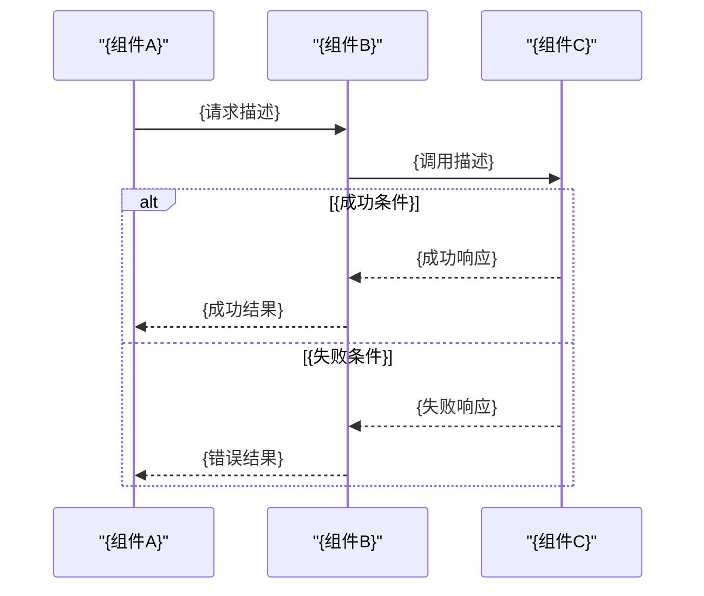
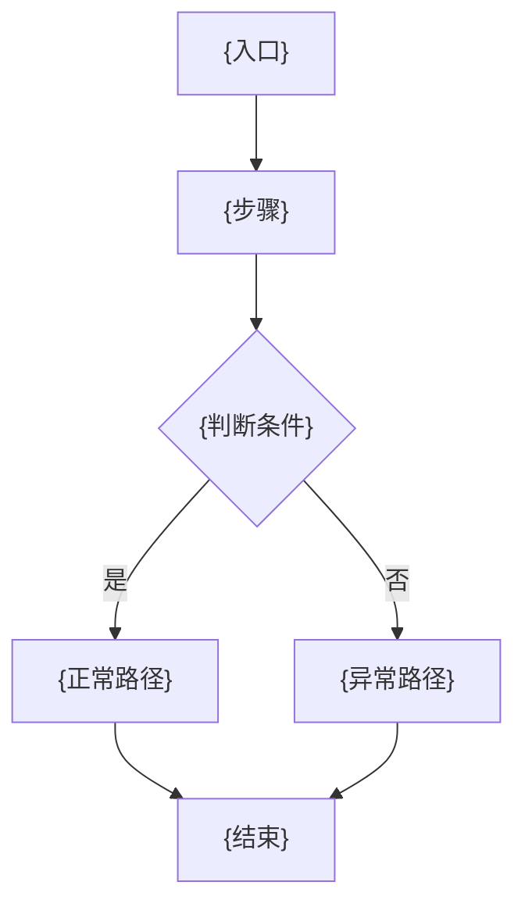
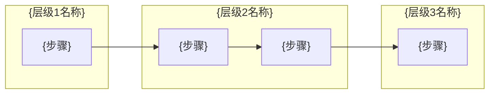

# {Bug 简要标题}

> 创建时间：{YYYY-MM-DD}
> 问题现象：{一句话描述}

---

## 问题背景

**接口 / 功能：** `{METHOD /path/to/api}`

**现象：** {描述用户感知到的异常表现}

**复现参数：**
```json
{
  "param": "value"
}
```

**错误日志：**
```
{粘贴关键错误堆栈或日志行}
```

---

## 触发条件

| 条件 | 值 |
|---|---|
| {条件名} | {值} |

---

## 涉及类清单

| 角色 | 全类名 |
|---|---|
| Controller | `com.example.{module}.controller.{XxxController}` |
| Service 实现 | `com.example.{module}.service.impl.{XxxServiceImpl}` |
| Mapper | `com.example.{module}.mapper.{XxxMapper}` |
| 请求参数 | `com.example.{module}.model.request.{XxxRequest}` |
| 响应参数 | `com.example.{module}.model.response.{XxxResponse}` |

---

## 关键代码路径

| 描述 | 文件路径 | 行号 | 说明 |
|---|---|---|---|
| 接口入口 | `{模块}/src/main/.../XxxController.java` | {行号} | `@PostMapping(...)` |
| **核心问题方法** | `{模块}/src/main/.../XxxServiceImpl.java` | **{行号}** | {问题根因所在方法} |
| Mapper 接口 | `{模块}/src/main/.../XxxMapper.java` | {行号} | {关键查询方法} |
| SQL 定义 | `{模块}/src/main/resources/mapper/extend/XxxMapperExtend.xml` | {行号} | {SQL 关键条件说明} |

---

## 核心流程分析

### 时序图

> 侧重：组件间消息传递顺序、请求/响应方向、分支条件



### 流程图

> 侧重：完整决策路径、条件分支、异常处理走向



### 泳道图

> 侧重：按职责层级划分，展示跨层调用关系



---

## 相关代码 / SQL 清单

### SQL-1 {说明}

```sql
SELECT ...
FROM {table}
WHERE {conditions};
```

---

## 根因总结

| 问题现象 | 根因 |
|---|---|
| {现象} | {根因} |

---

## 修复方案

### 短期（治标）

{最小改动描述}

### 中期（治本）

{从设计层面解决根本问题}

### 配置 / 运维

{不改代码的临时缓解手段，若无则删除本节}
