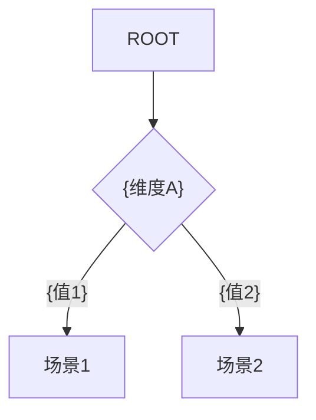

# {业务模块} AI 速查索引

> 自动生成于 {YYYY-MM-DD}，对应梳理文档：[{文档名}]({文档链接})
> 代码变更后可直接覆盖更新此文件，无需保留历史版本

---

## 1. 场景决策树



---

## 2. 文件索引

| 文件 | 类 | 职责 | 行数 |
|------|-----|------|------|
| `{path/to/file}` | {Class} | {10字内} | {N} |

---

## 3. 方法索引

| 方法 | 文件 | 行 | 入参 | 出参 | 场景 |
|------|------|---|------|------|------|
| `{method()}` | {file} | {L} | {params} | {return} | {1,2} |

---

## 4. 调用链索引

每个场景一行，`->` 表示调用方向，`[]` 内为行号，涉及接口调用时用 `>>` 标注实际接口地址：

```
场景1({描述}): {入口} -> {方法A}[:{行号}] -> {方法B}[:{行号}] >> POST /v1/actual/path -> {底层操作}
场景2({描述}): {入口} -> {方法C}[:{行号}] -> {内部Shelf /actual/endpoint} -> {方法D}[:{行号}] -> {DB操作}
```

---

## 5. 表操作索引

I=INSERT, U=UPDATE, D=DELETE(软删除), S=SELECT, -=不涉及

| 表 | 场景1 | 场景2 | 场景3 |
|----|-------|-------|-------|
| {table} | I+U | I | - |

---

## 6. 状态扭转索引

| 表.字段 | 原值 | 新值 | 触发 | 代码 |
|---------|------|------|------|------|
| {table.field} | {old} | {new} | {条件} | {file}:{line} |

---

## 7. 业务规则索引

| 规则 | 公式/条件 | 代码 |
|------|---------|------|
| {规则名} | {描述} | {file}:{line} |
