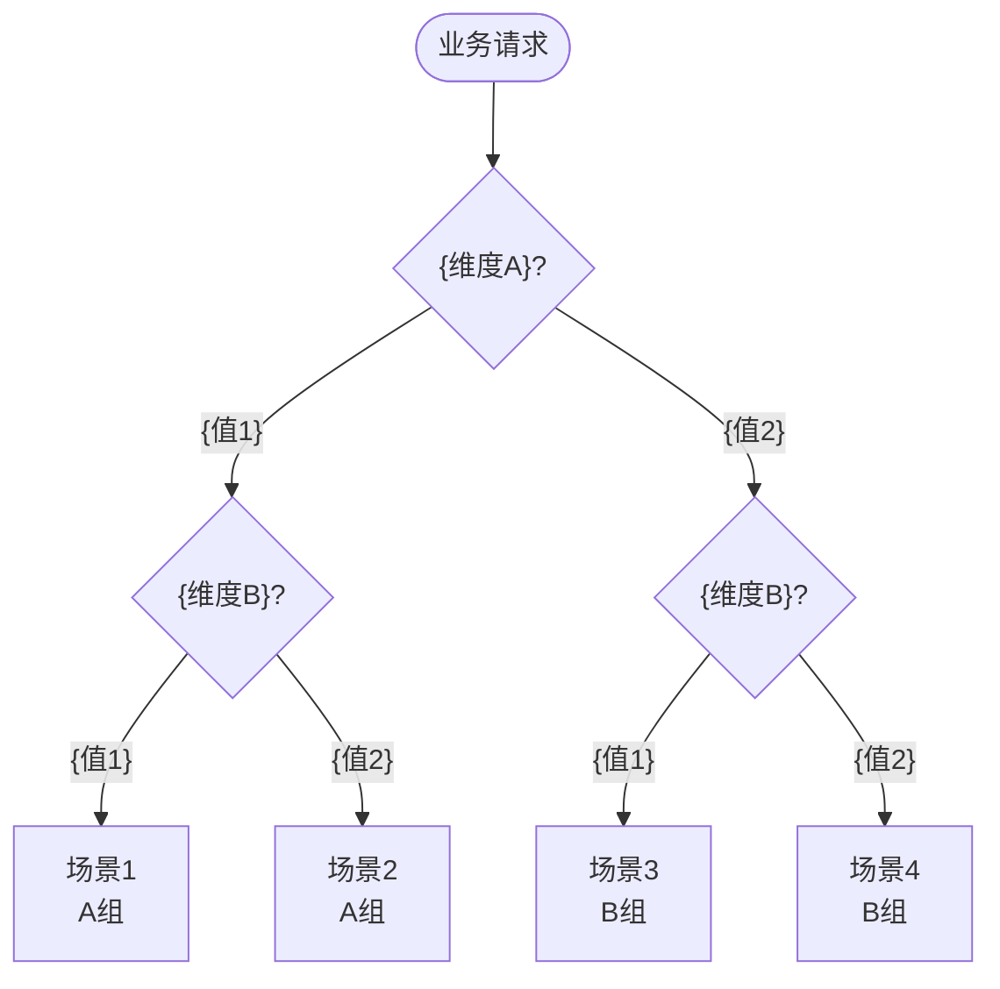
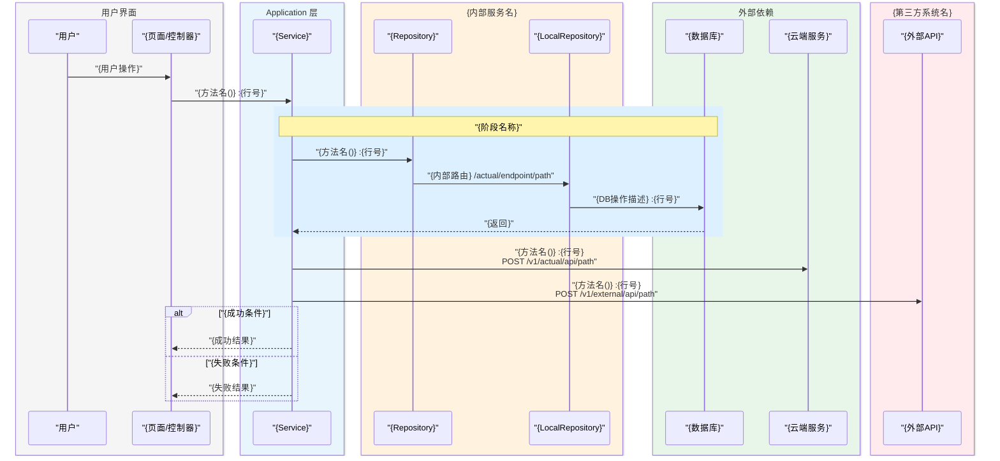
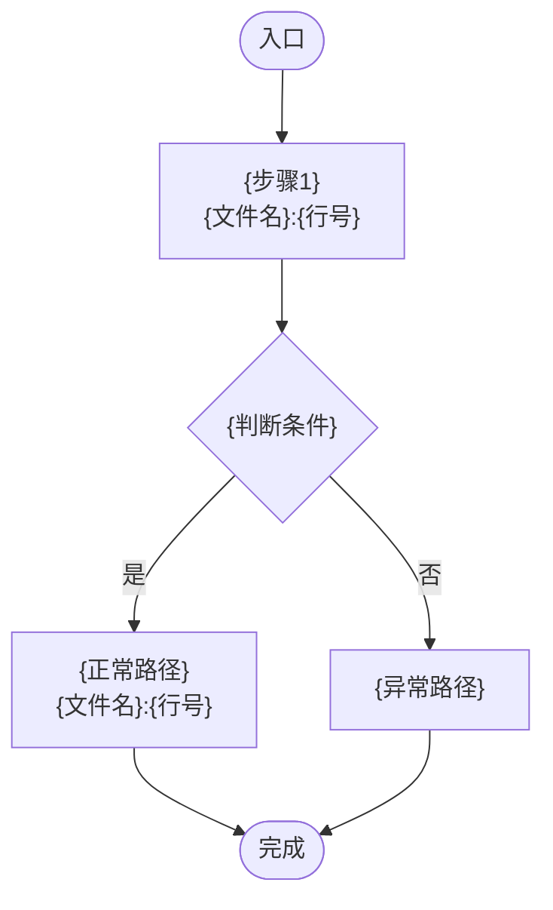
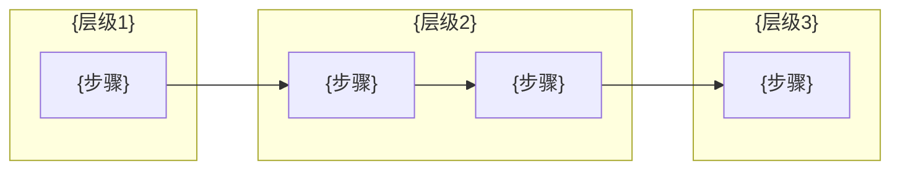
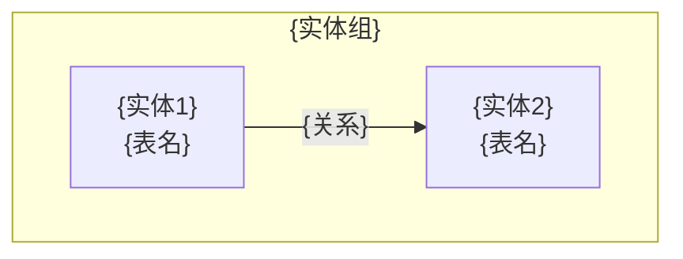
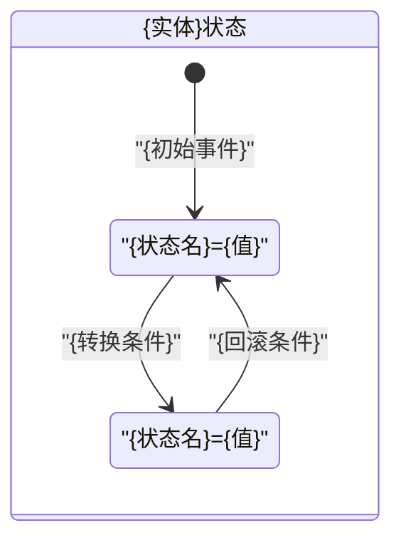
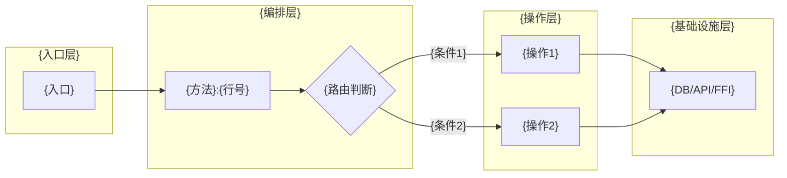
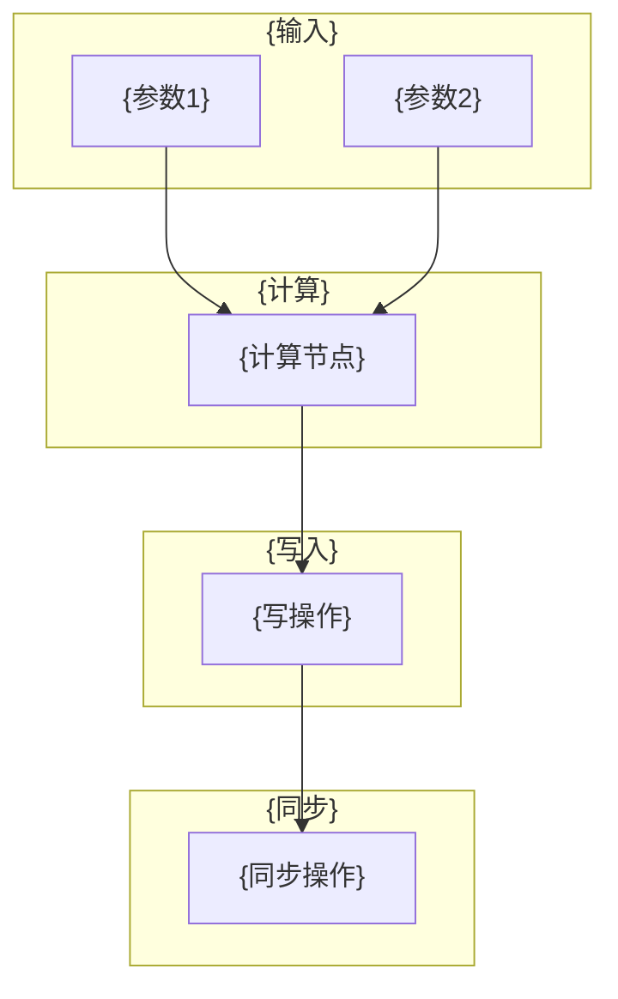
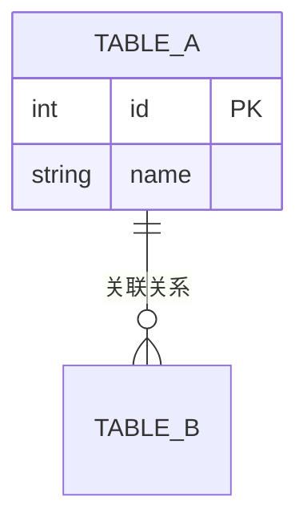
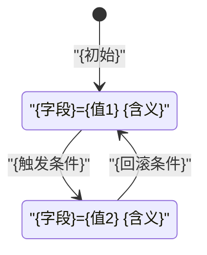

# {业务模块} 现状梳理

> 梳理时间：{YYYY-MM-DD}
> 梳理目的：{重构 / 迁移 / 回归测试 / 新人 onboarding}
> 技术栈：{前端 / 后端 / 全栈}
> 关联设计文档：{链接}（如有）

---

## 1. 场景总览矩阵

| # | {维度 A} | {维度 B} | {维度 C} | 关键差异 | 图组 |
|---|---------|---------|---------|---------|------|
| 1 | ... | ... | ... | ... | A 组 |
| 2 | ... | ... | ... | ... | A 组(标注差异) |

### 场景决策树



---

## 2. 核心代码索引

### 2.1 文件清单

| 层 | 文件路径 | 核心类 | 行数 | 职责 |
|----|---------|--------|------|------|
| Presentation | `{path}` | {ClassName} | {N} | {一句话} |
| Application | `{path}` | {ClassName} | {N} | {一句话} |
| Data | `{path}` | {ClassName} | {N} | {一句话} |
| Domain | `{path}` | {ClassName} | {N} | {一句话} |

### 2.2 关键方法速查

| 方法签名 | 文件 | 行号 | 关联场景 |
|---------|------|------|---------|
| `{methodName()}` | {file} | {line} | 场景 1,2,3 |

---

## 3. 各场景详细分析

### 3.X {图组名}：{场景组描述}

> 覆盖场景 {N}（...）、场景 {M}（...）

#### 时序图

> **规范：** 属于同一服务/系统的参与者用 `box` 包裹分组；所有接口调用必须标注实际接口地址（通过 Grep 确认，禁止推测）。



#### 流程图



#### 泳道图



#### 场景差异标注

| 维度 | 场景 {N} | 场景 {M} |
|------|---------|---------|
| {差异点} | ... | ... |

#### 核心代码片段

**{描述}** -- `{文件名}:{起始行}-{结束行}`

```{language}
// 提取核心逻辑，省略日志等无关代码
{code}
```

---

## 4. 知识图谱

### 4.1 实体关系图



### 4.2 状态机图



### 4.3 调用链图



### 4.4 数据流图



---

## 5. 业务规则速查表

| 规则名称 | 规则描述 | 代码位置 | 适用场景 |
|---------|---------|---------|---------|
| {规则名} | {公式/条件/约束} | `{file}:{line}` | 场景 {N} |

---

## 6. 代码核实差异说明

> 基于 {YYYY-MM-DD} 代码阅读

| # | 文档/预期描述 | 实际代码 | 影响 |
|---|-------------|---------|------|
| 1 | {描述} | {实际} | {影响} |

---

## 7. 回归测试检查表

### {图组} 场景

- [ ] {检查项}：{预期行为}

---

<!-- 以下为后端附加章节，前端项目可删除 -->

## B1. 数据库表清单与 ER 图

| 表名 | 操作类型 | 说明 |
|------|---------|------|
| {table} | INSERT / UPDATE | {说明} |



## B2. 表操作矩阵

| 步骤 | 表 | 操作 | 场景 1 | 场景 2 | 行号 |
|------|-----|------|--------|--------|------|
| 1 | {table} | INSERT | Y | N | {line} |

## B3. 表状态扭转明细

### {表名}.{字段名} 状态机



| 表.字段 | 原值 | 新值 | 触发条件 | 代码位置 |
|---------|------|------|---------|---------|
| {table.field} | {old} | {new} | {condition} | `{file}:{line}` |

## B4. 事务边界与并发控制

| 事务范围 | 包含操作 | 隔离级别 | 失败策略 | 代码位置 |
|---------|---------|---------|---------|---------|
| {描述} | {N 张表/N 步} | {级别} | 回滚/重试/忽略 | `{file}:{line}` |

## B5. SQL / ORM 关键查询清单

```sql
-- {查询名称} | {文件}:{行号}
SELECT ...
FROM {table}
WHERE {conditions};
```
