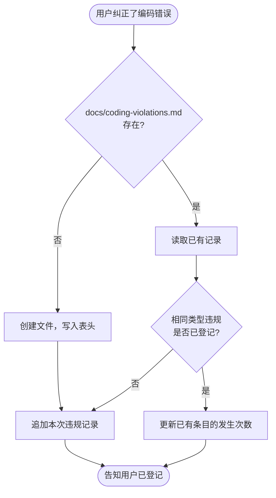

# 编码违规登记与防重犯

## 核心原则

**被纠正的错误必须登记，登记的错误不能再犯。**

本 Skill 建立"犯错→登记→编码前回顾"的闭环，确保同一类编码规范错误不会在项目中反复出现。

---

## 触发场景

### 场景 A：登记违规（用户纠正时触发）

当用户通过以下方式纠正 AI 的编码错误时，**必须**立即触发：

- 指出分层依赖违规（如 Application 层引用了 Infrastructure 层）
- 指出命名不符合项目规范
- 指出架构约束被打破
- 否定当前写法并给出正确方向
- 任何"这样写不对"、"不能这样用"、"改一下"等纠正性反馈

### 场景 B：回顾违规（编码前自动触发）

每次开始编写或修改代码前，**必须**先检查项目中是否存在 `docs/coding-violations.md`，如存在则先读取，避免重犯已登记的错误。

---

## 执行流程



---

## 违规记录文件规范

### 文件路径

`docs/coding-violations.md`

### 文件格式

```markdown
# 编码违规记录

> 本文件由 `coding-violation-log` Skill 自动维护。
> AI 编码前必须读取本文件，避免重犯已记录的错误。

| # | 类型 | 违规描述 | 正确做法 | 涉及文件 | 首次发生 | 次数 |
|---|------|---------|---------|---------|---------|------|
| 1 | 分层依赖 | Application 层直接引用 Infrastructure 层类 | 在 Domain 层定义接口，Infrastructure 层实现，Application 层依赖接口 | ScanNode.java | 2026-04-12 | 1 |
```

### 字段说明

| 字段 | 说明 |
|------|------|
| 类型 | 违规分类：分层依赖 / 命名规范 / 异常处理 / 架构约束 / 代码风格 / 其他 |
| 违规描述 | 一句话描述做错了什么 |
| 正确做法 | 一句话描述应该怎么做 |
| 涉及文件 | 发生违规的文件名（不含完整路径） |
| 首次发生 | 首次登记日期（YYYY-MM-DD） |
| 次数 | 累计发生次数，重犯时 +1 |

---

## 编码前回顾规则

每次开始编写代码时，按以下步骤执行：

1. 检查 `docs/coding-violations.md` 是否存在
2. 存在则读取全部记录
3. 将记录中的"正确做法"作为本次编码的硬约束
4. 如果本次编码涉及的模块/文件与记录中的"涉及文件"相关，**特别注意**对应的违规类型

---

## 与其他 Skill 的协作关系

| Skill | 关系 |
|-------|------|
| `java-coding-standards` | 互补。java-coding-standards 是通用规范（阿里黄山版），本 Skill 登记项目级的具体违规 |
| `pre-implementation-code-orientation` | 本 Skill 的"编码前回顾"应在 pre-implementation-code-orientation 之后、实际编码之前执行 |

---

## 红色警告

| 错误做法 | 正确做法 |
|---------|---------|
| 用户纠正后只改代码不登记 | 改代码的同时必须追加违规记录 |
| 只在用户明确说"记一下"时才登记 | 只要用户纠正了写法就必须登记，不等显式指令 |
| 登记时写大段描述 | 违规描述和正确做法各一句话，简洁明确 |
| 每次编码前跳过回顾 | 存在 coding-violations.md 就必须读取 |
| 重犯已登记的错误 | 编码前回顾记录，特别注意相关模块的历史违规 |
