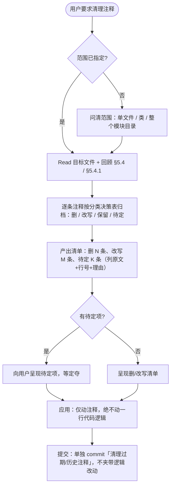

# 存量注释清理

## 定位与边界（三机制分工）

注释红线（什么注释该删）**唯一规则源是 `coding-standards-common` §5.4 + §5.4.1**，本 skill 不重新定义红线，只负责「对存量文件成批执行清理」这件事的怎么做。

> **清理 ≠ 字面匹配删除**：必须 **Read 每条注释、理解它在讲什么**，再做删 / 改写 / 保留判断。命中红线的删；啰嗦但有效的**改写成「一句话讲清」**（按 §5 各档最短表达）；函数体内除 §5.3 六类核心块外的行内注释默认清掉（靠拆函数 + 命名表达，见 §5 放置原则总纲）。目标是清完后**注释只落在 类 / 字段 / 方法声明上、且每条都是最短表达**，不是"把命中关键词的删掉、剩下不管"。

| 机制 | 触发时机 | 作用对象 |
|------|---------|---------|
| `coding-standards-common` §5.5 | 改代码时顺手 | 本次改动覆盖到的方法/代码块 |
| `check-comment-density.js` hook | 写入新内容（Write/Edit）warn | 本次**新增**文本 |
| **本 skill** | 用户主动要求清理 | 已写好的**存量**文件/类/模块全文 |

§5.5 的 D 已写明「同一文件大量历史垃圾注释需一次性清，单独开 PR 做注释清理」——本 skill 就是执行那条「单独清理」的标准流程。

---

## 触发场景

用户说以下任意一种，**必须**调用本 skill：

- 清理 / 精简这个文件（类、模块）的注释
- 把「vN 新增 / 版本变更 / 历史」这类注释删掉
- 注释太多 / 一堆废话注释 / 帮我按规范清一下注释
- clean up comments / strip stale comments

不触发：单纯写新代码（走 `coding-standards-common` + hook）、改逻辑时的顺手清理（走 §5.5）、用户只问「这注释要不要留」（直接按 §5.4 判定回答即可，不必走清理流程）。

---

## 多语言注释识别

清理对象是注释，按文件扩展名识别注释语法；红线判定与语言无关（§5.4 是跨语言的）。

| 注释形态 | 语言 |
|---------|------|
| `//` 行注释、`/* */` 块注释 | C/C++/Java/Kotlin/JS/TS/Go/Rust/C#/Swift/PHP/Scala |
| `/** */` doc 注释 | Java·Kotlin(javadoc/kdoc) / Rust(///) |
| `#` 行注释 | Python / Ruby / Shell / YAML |
| `--` 行注释 | SQL / Lua |
| `<!-- -->` | HTML / XML / Vue template |

**内嵌 SQL 的特例**：`.java` 等宿主语言文件里，字符串字面量内的 SQL（JDBC / 拼接 SQL）中的 `-- ...` 也算待清注释（§5.4）——清理时要专门扫字符串内部，不要因为「它在字符串里」就跳过。

**清理后若需重写保留项**：注释语言遵循 `coding-standards-common` §5.0（= 当前会话沟通语言），不沿袭原文件语言。

---

## 清理分类决策表

逐条注释按下表归档（红线条目本身见 §5.4 / §5.4.1，此处只给「存量遇到怎么处理」）：

| 归档 | 注释特征 | 处理 |
|------|---------|------|
| **删** | 变更标记 `[BUGFIX]`/`[DEPRECATED]`/`[ADDED]`/`[REWRITTEN]`/`[MODIFIED]`；注释里的日期；`vN 新增`/`vN 起`/`vN 及以前`/`vN 上线`/`vN 移除`；PR/Issue/Ticket 号；历史叙事（「原本用 X，后改为 Y」「之前有 bug」）；注释掉的死代码；废话（重复名/重复字面量）；空注释 | 整条删除 |
| **改写** | 过期注释（描述与当前实现不符）；私有方法/内部 helper 上方多段 Javadoc 讲契约演变史；行内 WHY 超 1 行；**啰嗦但有效的当前职责注释** | 过期→修正为当前职责；多段契约史→压成 1 行当前职责；多行 WHY→压成 1 行或删；**啰嗦的→Read 原文后压成「一句话讲清」**（类 1-3 行 / 方法 1-2 行 + 出入参 / 字段一行 / 核心块 1 行） |
| **保留** | 已经简洁、一句话讲清的当前职责；非显然 WHY（删了下个改代码的人会犯错）；公开 API 契约说明 | 原样保留——但仍要 Read 确认它确实是最短表达，不是"看着短其实是废话" |
| **函数体内注释** | 除 §5.3 六类核心块（业务规则判断 / 技术决策 / 魔法数字 / 容错降级 / 并发锁事务 / TODO）外的任何行内注释 | 默认删——函数体应靠拆函数 + 命名自解释（§5 放置原则总纲）；删不掉是因为函数该拆，标注「建议拆函数」让用户定，不靠注释续命 |
| **内嵌 SQL 字符串里的 `--` 注释** | 宿主语言字符串字面量里的 SQL（JDBC / 拼接 SQL）内部的 `-- ...`（§5.4） | 删 SQL 串内的 `--`；必要口径压成 1 行迁到拼接 SQL 之前的宿主语言注释（Java `//`）。SQL 串保持干净。**注意**：hook 剥离字符串后抓不到这种，清理时要专门扫 SQL 串内部 |
| **待定（问用户）** | 指向带版本号/日期的设计文档路径引用（如 `文档：docs/design/...-20260422-v3.md`）；语义模糊、删与留都说得通的 | 列出来让用户定：删 / 保留 / 改指 `-current.md` |

> **删除判定准绳（§5.4.1）**：删掉这条注释，下一个改这段代码的人会不会犯错？会则保留（短句），不会则删。

---

## 工作流

### 步骤要点

1. **圈定范围**：用户没指明就问——单文件 / 单类 / 整个模块目录。范围越界会放大 diff、增加冲突。
2. **逐条归档**：对范围内每条注释套分类决策表。
3. **呈现清单**：删了什么、改写成什么、待定项让用户拍板。**待定项不得擅自删**。
4. **应用清理**：
   - **只动注释，绝不改任何一行代码逻辑**——这是本 skill 最高红线。
   - 不顺手重排 import、不格式化未涉及的代码。
   - 改写保留项时用会话语言（§5.0）。
5. **提交纪律**（对齐 `git-commit-standards` + §5.5 D）：
   - 注释清理**单独 commit**，commit message 一句「清理过期 / 历史注释」即可，**不逐条罗列**删了哪些。
   - **禁止**在同一 commit 夹带逻辑修改。
   - 删除注释跟代码逻辑改动**不要混在一个 PR**。

---

## 安全红线

| 红线 | 说明 |
|------|------|
| 只动注释，不动逻辑 | 清理过程中绝不修改任何代码语句、表达式、签名 |
| 保留当前职责 + 非显然 WHY | 用 §5.4.1 判定准绳，宁可保留也不误删有价值的 WHY |
| 待定项必须问 | 设计文档路径引用等模糊项，列出来让用户定，不擅自删 |
| 不扩大范围 | 只清用户圈定的文件/类/模块，不顺手扫全仓 |
| 多语言按注释符 | 按扩展名识别注释语法，不把字符串字面量里的 `//` `#` 当注释 |

---

## 借鉴的通用工程立场（开源最佳实践）

本 skill 的清理取向与主流工程共识一致，§5.4 已编码这些原则，此处只点名出处便于团队对齐认知：

- **「注释解释 why，不复述 what」**——代码自解释的就别用注释翻译一遍（Clean Code / Google Style Guide 通用立场）。
- **「不要给烂代码写注释，重写它」**（Clean Code）——过期/误导注释比没有更糟。
- **「版本历史归 VCS」**——`git blame` / `git log` 已记录谁在何时改了什么，源码注释不再背变更日志。
- **「注释随代码同 PR 演进」**——注释清理与逻辑改动分开提交，保持每个 commit 单一意图。

---

## 与其它 skill 的关系

| Skill | 关系 |
|-------|------|
| `coding-standards-common` | 红线唯一规则源（§5.4 / §5.4.1 判什么该清；§5.5 顺手清理；§5.0 注释语言）。本 skill 只执行存量批量清理 |
| `bugfix-coding-style` | 存量 `[DEPRECATED]`/`[ADDED]` 标记顺手清理的边界由它承载；本 skill 是用户主动发起的成批版本 |
| `git-commit-standards` | 清理 commit 走其规范：单独 commit、不夹带逻辑、message 不罗列 |
| `daily-work-log` | 业务项目清理后按改动登记工作日志（归 🐛/✨ 视主诉） |
