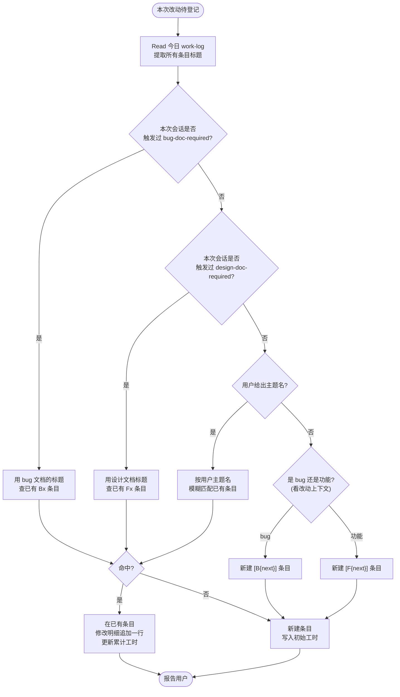
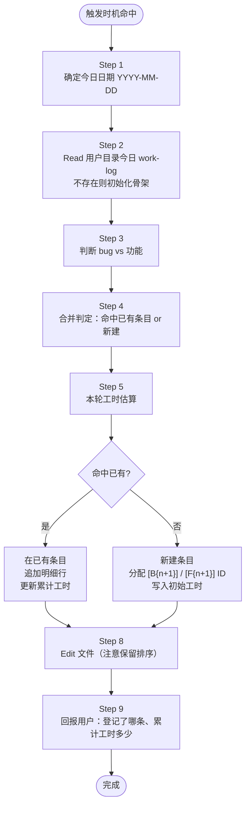

# 每日工作日志记录规范

## 核心原则

**每次对业务项目源码有实质改动（Edit/Write），就在用户文档目录 `{USER_DOCUMENTS}/ai-docs/{project}/work-log/{YYYY-MM-DD}.md` 追加或合并一条记录。**

工作日志记录的是个人工时与改动流水，属于**个人工作记录**，与 `bug-doc-required` / `design-doc-required` 等 AI 起草文档一样默认写入用户文档目录，**不写入项目仓库**，与项目代码、设计文档、bug 文档物理隔离。

不是记录 AI 对话内容；不是记录流水账；是**把"今天做了什么可以上交日报的工作"按 bug / 功能 分类沉淀**。

---

## 触发时机

> **批处理模式（默认）**：本 skill 在编码中**不主动打断**——改一次代码就跳出来登记日志会破坏主流程。默认采用**会话末批处理**：编码过程中只在内部跟踪改动列表，会话结束前一次性写入当天日志文件。详见下方「批处理模式约束」。

| 场景 | 触发 |
|---|---|
| 本会话完成了至少一次源码 Edit/Write（`.java` / `.kt` / `.ts` / `.py` / `.go` 等），且尚未登记 | ✅ 必须触发（**会话末批处理**，不在改动当时立即写入） |
| 用户说"记一下工作日志"/"写个日志"/"更新工作日志"/"记到日志"/"记录一下" | ✅ 必须触发（用户主动要求 → 立即执行） |
| 用户说"今天做了什么" / "回顾一下" | ✅ 必须触发（查询模式） |
| 会话结束前（收尾阶段）若本会话有源码改动未登记 | ✅ 强制回补 |
| 本会话只改了文档 / 配置 / 未动业务源码 | ❌ 不触发（交由 `dev-log`） |
| 改的是 `caseflow/` 自身 | ❌ 不触发（交由 `dev-log`） |

### 批处理模式约束

> 与 [CLAUDE.md § 改动规模 → 链路档位](../../CLAUDE.md#改动规模--链路档位sml-三档对照表) 配套使用。S 档(小改)仍可不写日志或一行带过;M / L 档启用本批处理模式。

| 时机 | 行为 |
|---|---|
| 编码中: 每次源码 Edit/Write 完成 | **不立即跳出来写日志**, 改动累积在内部上下文(记录: 时间 / 文件 / 类型: bug 修复 vs 功能开发 / 一句话动作描述) |
| 编码中: 用户主动说"记一下"/"写个日志" | **立即执行登记**, 这是用户主动要求 |
| 改完代码后 / 会话结束前 | **一次性写入当天日志**: 读 `{YYYY-MM-DD}.md` → 合并同 bug / 同功能多次改动 → 累计工时 → 写入磁盘 |
| 用户说"提交"/"commit" | 在 commit 前完成日志批处理(与 `git-commit-standards` 协同) |

**批处理的好处**：
- 编码主流程不被打断, 同一 bug 的 3 次修复合并为 1 条日志而不是 3 条
- 累计工时叠加更准(一次编码连续 25min, 比"5min×5 段"看着更真实)
- 同一功能的多轮迭代合并到同条目, 避免日志噪声

---

## 文件路径与命名

- **默认路径**：`{USER_DOCUMENTS}/ai-docs/{project}/work-log/{YYYY-MM-DD}.md`
  - Windows：`%USERPROFILE%\Documents\ai-docs\{project}\work-log\{YYYY-MM-DD}.md`
  - macOS / Linux：`~/Documents/ai-docs/{project}/work-log/{YYYY-MM-DD}.md`
  - 若系统无 Documents 目录，兜底 `~/ai-docs/{project}/work-log/{YYYY-MM-DD}.md`
  - `{project}` 取当前业务项目目录名（避免多个项目工作日志混在一起）
- **时间戳**：条目里的 `HH:MM` 用 24 小时制本地时间
- **目录不存在**：自动创建 `{USER_DOCUMENTS}/ai-docs/{project}/work-log/`
- **当日文件不存在**：按下方「文件骨架」初始化

### 写入前必须回显输出路径

与 `doc-index-required` 一致，写日志文件前向用户回显一行：

```text
工作日志输出路径：{用户目录默认 / 用户指定路径} -> {目标路径}
```

### 不再写入项目 docs/

工作日志属个人工作记录，**绝不写入业务项目 `docs/`，不入仓**。原 `docs/work-log/` 历史目录由用户决定如何处理（保留本地、迁移到用户目录、或删除），本 skill 不做自动迁移。

### 用户显式指定项目内路径的例外

仅当用户明确说「写到项目 docs/work-log/」/「上传到仓库」时，才允许落项目目录，且此时必须主动检查 `.gitignore` 是否已忽略 `docs/work-log/`，未忽略则按"用户指定项目路径"流程交由 `doc-index-required` 走 Phase-A/B（这是非默认路径）。

---

## 文件骨架（初始化模板）

```markdown
# 工作日志 · {YYYY-MM-DD}

> 按条目合并：同一 bug 多次修复追加到同一条目；同一功能多轮开发追加到同一条目；工时累计估算。

## 🐛 Bug 修复

（暂无）

## ✨ 功能开发

（暂无）
```

- 两个二级分区：`## 🐛 Bug 修复` / `## ✨ 功能开发`
- 分区下用 `### [B{n}]` 或 `### [F{n}]` 作为条目标题
- 条目 ID 全日递增（不跨日），首条 bug = B1、次条 = B2、首条功能 = F1、次条 = F2

---

## 条目模板

### Bug 条目

```markdown
### [B{n}] {bug 简要标题，≤ 30 字}

- **预估工时**：{累计 h}h
- **关联文档**：[docs/bug/{模块}/{bug 名}/{bug 名}.md](相对路径)
- **涉及文件**：
  - `src/main/java/path/to/File1.java`
  - `src/main/java/path/to/File2.java`
- **修改明细**：
  - `HH:MM` {一句话改动摘要，≤ 50 字}
  - `HH:MM` {一句话改动摘要}
```

### 功能条目

```markdown
### [F{n}] {功能简要标题，≤ 30 字}

- **预估工时**：{累计 h}h
- **关联文档**：[docs/design/{需求}/{需求}-{YYYYMMDD}-v{N}.md](相对路径)
- **涉及文件**：
  - `src/main/java/path/to/File1.java`
- **修改明细**：
  - `HH:MM` {摘要}
```

### 字段硬约束

- **简要标题** ≤ 30 字；禁止在标题里堆长描述
- **修改明细** 每条 ≤ 50 字；**一行一条**；不写"然后"、"接着"之类流水叙述
- **关联文档** 指向已有 design / bug doc；没有则写「无」
- **涉及文件** 用相对项目根的路径；≥ 8 个文件时只写 top 5 + `...等 N 个文件`

---

## 写入前：先读再写（防重复合并）

**每次触发时，Step 0 必须 Read 当天的日志文件，**提取所有已存在条目的 `### [Bx]/[Fx]` 标题，再决定本次是合并还是新建。

### 合并判定流



### 判定优先级（从高到低）

1. **bug-doc-required 已生成的 bug 文档** → 该 bug 文档标题就是 B 条目标题
2. **design-doc-required 已生成的设计文档** → 该设计文档需求名就是 F 条目标题
3. **用户显式说的主题** → 用"给我记到 XX 这个功能下"
4. **启发式判断** → 看 bug 信号（"修复"/"fix"/"报错"）还是功能信号（"加"/"新增"/"实现"）

**同名合并**：标题含义相同（允许用词小差异）就合并；完全相同更要合并。不确定时询问用户，不要盲建两条。

---

## bug 还是功能？（触发信号）

| 信号 | 分类 |
|---|---|
| 本会话触发过 `bug-doc-required` | 🐛 Bug 修复 |
| 有 `docs/bug/{...}/{bug 名}.md` 新建 / 编辑 | 🐛 Bug 修复 |
| 用户说「修复」「fix」「bug」「报错」「异常」「空列表」「不对」「有问题」 | 🐛 Bug 修复 |
| 改动主要是"让原本该工作的代码真正工作" | 🐛 Bug 修复 |
| 本会话触发过 `design-doc-required` 且是**新需求/新接口** | ✨ 功能开发 |
| 用户说「加个」「新增」「实现」「做一个」「feature」 | ✨ 功能开发 |
| 改动主要是"引入原本不存在的能力" | ✨ 功能开发 |
| 混合（既是 bug 也引入新字段）→ 主诉为准 | 按主诉分类 |

**重构/迁移**：默认归到 ✨ 功能开发，标题注明 `[重构]` 或 `[迁移]` 前缀。

---

## 预估工时算法

**累加式估算**：每次追加时，基于本轮改动规模再加一份，累计写到"预估工时"字段。

### 基础估值

| 本轮改动规模 | 基础工时 |
|---|---|
| 1 文件、改 1-5 行（纯 typo / 小改参数） | 0.25h |
| 1-2 文件、改 ≤ 20 行 | 0.5h |
| 3-5 文件、单模块内 | 1h |
| 6-10 文件 / 跨层（service + dao + dto） | 2h |
| > 10 文件 / 跨模块 / 含新增数据表字段（需改 DO/Mapper/DDL） | 3h |
| 跨项目（聚合层 + 业务工程 + caseflow 等 ≥ 2 个项目） | 4h |

### 叠加项（满足即 +）

| 条件 | 附加 |
|---|---|
| 本次还编写了设计文档 | +1h |
| 本次还编写了 bug 分析文档 | +1h |
| 本次还改了 skill 规范 | +0.5h |
| 本次包含跨服务联调核查 | +1h |
| 本次包含接口文档同步 | +0.5h |
| 方案迭代（先改一版、再换方案 A/B） | +0.5h × 迭代轮数 |

### 累计规则

```
新条目：本轮工时（基础 + 叠加）
追加：原累计 + 本轮工时（基础 + 叠加）
```

工时取整到 0.5h；单条目累计上限 8h，超过说明应拆成多条目（bug 太大应分子 bug，功能太大应分子任务）。

### 示例

- B1 首次登记：改了 5 个文件 + 写了 bug 文档 + 写了设计文档 → `1h + 1h + 1h = 3h`
- B1 第二次迭代：又改了 3 个文件 + 方案 A 迭代 1 轮 → `3h + 1h + 0.5h = 4.5h`
- B1 第三次：加 2 行 `@JsonProperty` 注解 → `4.5h + 0.25h ≈ 5h`

---

## 修改明细行的写法

### 要求

- **一行**：禁止跨行（markdown 里就是一个 `-` 列表项）
- **带时间戳**：`HH:MM`（本地时间，24 小时制）
- **动词开头**：改 / 加 / 删 / 抽 / 改名 / 重构 / 回滚 / 验证
- **对象具体**：文件名 或 类/方法名 或 字段名
- **≤ 50 字**

### 正面样例

```
- `14:32` 修 RepayConfirmService.java:142 过滤条件从 paymentType==4 切到 payChannelCode
- `15:05` 加 RepayTransactionAllocation.originalPayChannelCode 字段（L1 ACL 注解）
- `15:40` 删 inferRepayType（payMethod 白名单不再需要）
- `16:10` 方案 A 迭代：RepayTransactionResult 加 originalPayChannelCode 透传
- `16:30` 补 @JsonProperty 注解，避免泄漏到 /v2/order/write 报文
```

### 反面样例

```
❌ - 根据用户要求，分析了当前代码，发现存在多处问题，然后依次进行修改，首先改了 A 文件，然后...
   （叙述体、跨多句）
❌ - 修了一些东西
   （没具体对象）
❌ - 改代码
   （没动词对象，废话）
```

---

## 完整工作流（Step-by-step）



---

## 会话结束前的收尾检查

在会话明显进入收尾阶段（用户说"可以了"、"就这样"、"完成了"、"结束"等）时：

1. 扫描本会话的全部 Edit/Write 记录
2. 对照当天 work-log 看是否都已登记
3. 未登记的改动 → 走一次完整工作流，合并或新建条目
4. 回报：「今日日志已收尾，共登记 X 条 Bug / Y 条功能，累计 Zh」

**这是最后一次补登的机会。会话一旦结束就无法追溯。**

---

## 与其他 skill 的关系

```
design-doc-required / bug-doc-required
         ↓
pre-implementation-code-orientation
         ↓
{代码实际 Edit/Write}
         ↓
daily-work-log  ← 本 skill（每轮 Edit 后 或 会话结束前）
         ↓
git-commit-standards（可选，提交时）
         ↓
dev-log（仅 caseflow 项目：会话结束前）
```

- `dev-log` 是 caseflow 自身的变更日志，作用在 **插件仓库**
- `daily-work-log` 是业务项目的工作日志，作用在 **业务项目**
- 二者**不重叠**：改 caseflow 走 dev-log，改业务代码走 daily-work-log；若两者都改，两个 skill 都要触发

---

## 查询模式（用户问"今天做了什么"）

不是写入，是读取回报。

1. Read 今天的 work-log
2. 回报两个分区条目数 + 各自累计工时
3. 若用户追问细节 → 列出指定条目的修改明细
4. 若文件不存在或为空 → 明确回复「今天还没登记任何改动」

---

## 禁区

| 行为 | 为什么禁止 |
|---|---|
| 不读直接写，导致同一 bug 写了多条 | 违反"同主题合并"核心规则 |
| 记录"用户问了什么 AI 答了什么"的对话流水 | 本 skill 不是对话存档，是工作沉淀 |
| 记录失败尝试 / 废弃分支（除非本身是新 bug） | 工作日志不是 AI 调试记录 |
| 预估工时超过 8h / 单条目 | 说明主题太大，应拆子条目 |
| 修改明细跨行 / 段落叙述 | 违反"一行一条" |
| 为每次 Edit 新建条目（即使是同一 bug） | 违反"同 bug 合并" |
| 把工作日志写到业务项目 `docs/` 下（除非用户明确要求） | 与 bug/design 文档默认路径一致：AI 起草个人记录走用户文档目录，不入仓 |
| 把 skill/文档修改记到 daily-work-log | 错位；应走 dev-log |
| **未经用户明确指定却把日志落到项目内** | 个人工时记录不属于项目资产；必须默认走 `{USER_DOCUMENTS}/ai-docs/` |

---

## 自检清单（每次写入后）

- [ ] 文件路径是 `{USER_DOCUMENTS}/ai-docs/{project}/work-log/{YYYY-MM-DD}.md`（用户文档目录、个人记录），不是项目仓库
- [ ] 写入前已向用户回显输出路径
- [ ] 写入前 Read 了当天文件
- [ ] 同 bug / 同功能已合并到已有条目，没新建重复条目
- [ ] 修改明细一行一条、带时间戳、≤ 50 字
- [ ] 预估工时已累加到"预估工时"字段
- [ ] 关联文档链路准确（指向已有 bug / design doc）
- [ ] 条目 ID（B{n} / F{n}）按日递增，未跳号
- [ ] 回报用户：「登记到 [Bx] / [Fx]，累计 Xh」
