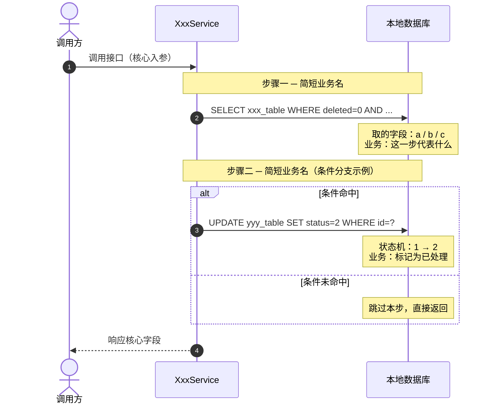

# 轻量功能设计文档（接口级）

> **适用范围**：在已有架构内新增 / 调整单接口、单接口的库表读写流程描述、入参出参微调、同模块内业务规则修正。
> **不适用**：新增数据库表、新增对外服务契约入口、跨服务/跨模块协作、复杂事务/分布式锁、状态机重设计。这些必须使用 `template.md` 完整模版。
>
> **职责定位**：本文档同时承担「设计意图」与「库表行为索引」两个角色 ——
> - 编码前：作为接口原子能力的设计意图，确认要动哪些表、按什么顺序、过滤规则是什么、失败行为如何
> - 编码后：作为库表行为索引，方便后续回归对应模块涉及的表，新增需求时快速判断现有表/接口是否支持
>
> **本文档不需要配套 `-coding.md`** —— 核心流程图 + 关键规则表 + 失败行为表已经覆盖编码所需的最小信息。
>
> **写作要点**：以「接口自身流程」为主轴，优先用一张图讲清本接口的入参校验、查询、判断、写表、返回；所有业务规则下沉到核心流程图节点 / Note 与规则表，不再单独展开类设计、分层、缓存、监控等章节。

---

## 变更记录

| 版本 | 日期 | 变更内容摘要 |
|------|------|--------------|
| v1 | YYYY-MM-DD | 初始版本 |

---

## 1. 代码入口

> 用文件链接定位关键入口。
> - 第一版（编码前）可写「待实现」，实施完成后回填真实行号
> - 多个入口/调用链时全部列出，按调用顺序排序

- **入口**：`{Service / Controller}#{方法名}` → `{相对路径}:{line}`
- **关键调用**：`{下游 Service / DAO}#{方法名}` → `{相对路径}:{line}`
- **目的（一句话）**：
- **是否写表**：是 / 否（全程只读）

---

## 2. 接口契约

> 只写核心字段，完整字段以代码 DTO 为准。无对外接口的内部方法可省略此节。

- **入口**：`{HTTP 方法} {路径}` 或 `{Service 内部方法签名}`
- **核心入参**：
  - `{字段名}: {类型}` — {说明 / 默认值 / 枚举}
- **核心出参**：
  - `{字段名}: {类型}` — {说明}

---

## 3. 核心流程图（接口自身流程 / 库表读写顺序）

> **【必填·Mermaid】** 用一张图讲清接口自己的执行路径：
> - 业务分支、异常路径、退款/下单/查询等自身流程优先用 `flowchart TD`
> - 库表读写顺序、事务边界、字段读写含义是核心时用 `sequenceDiagram`
>
> 使用 `sequenceDiagram` 时，每条关键 SQL 后面必须挂一条 `Note over DB`，说明：
> ① 过滤条件（WHERE 关键字段） ② 取了 / 写了哪些字段 ③ 业务上代表什么。
>
> - 复杂条件分支用 `alt / else` 表达
> - 可选步骤标注触发条件（如「仅 includeXxx=true 时」）
> - 全程只读的接口在文档头部已声明，核心图中不需要重复说明

---

## 4. 关键过滤/写入规则

> 把核心流程图里所有「非显然」的过滤条件、字段取值规则、与云端/规范的对齐点列成一张表。
> 这是后续回归 + 新需求判断「现有表/接口是否支持」的最快入口。
>
> 显然的常规过滤（如 `deleted=0`、主键查询）可以省略，只列业务含义强的规则。

| 表 | 操作 | 条件 / 字段规则 | 为什么 |
|----|------|---------------|-------|
| `xxx_table` | SELECT | `(return_flag IS NULL OR return_flag != 1)` | 已退商品被剔除，"可退"在商品粒度的核心判定 |
| `yyy_table` | UPDATE | `status: 1 → 2` | 状态机：处理中 → 完成 |
| `zzz_table` | INSERT | `created_at = NOW()` 由数据库默认值填充 | 避免应用层时间漂移 |

---

## 5. 失败行为

> 列出每个失败位置的明确行为。事务回滚 / 兜底返回 / rethrow 的语义必须明确。

| 失败位置 | 行为 |
|---------|------|
| 入参校验失败 | 抛 `{异常类}({错误码})`，事务直接结束 |
| 业务规则不满足（如订单不存在） | 抛 `{异常类}({错误码})` |
| 任一步骤 SQL 异常 | 事务整体不提交，rethrow，调用方收到异常 |
| 下游接口超时 | {兜底值 / 重试策略 / 降级行为} |

---

## 6. 升级到完整模版的触发条件

> 编码过程中如果出现以下任一情况，本文档**必须**升级为 `template.md` 完整模版（新建 vN+1）：
>
> - 发现需要新增数据库表 / 字段
> - 发现要拆/合接口、改对外契约（路径、HTTP 方法、入参语义）
> - 发现要新增 ≥3 个类、跨模块/跨服务协作
> - 发现需要分布式锁、补偿事务、消息异步
> - 发现要重新设计实体状态机
>
> 升级方式：以本轻量文档为草稿，按 `template.md` 章节逐节展开。

---

## 7. 修订记录

| 日期 | 修订摘要 |
|------|---------|
| YYYY-MM-DD | 首次落地 |
