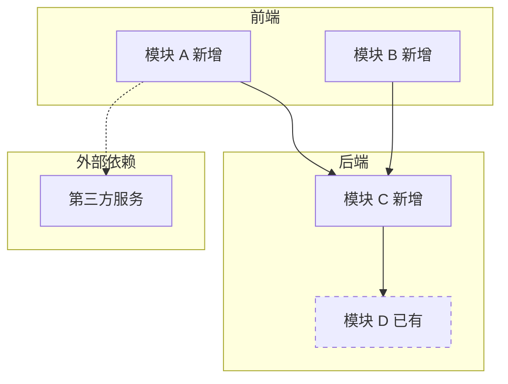
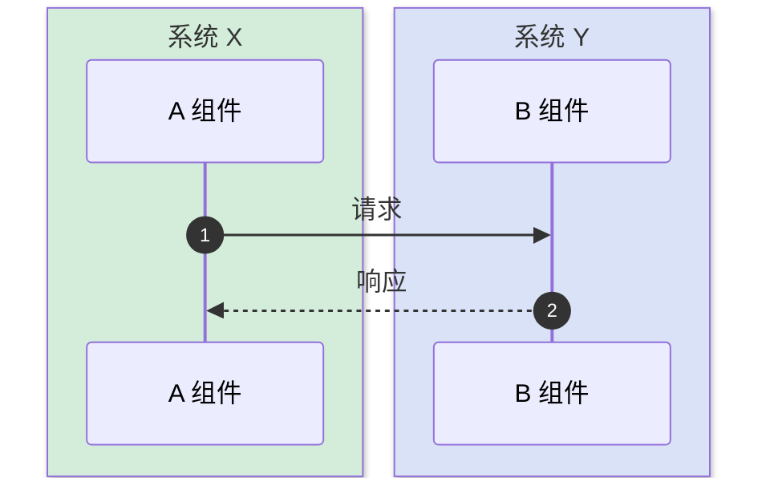

# 技术方案设计文档（技术 / 架构主导）

> **定位**：本模板服务**技术架构主导**的方案——协议选型、中间件接入、分布式系统、复杂模块拆分、客户端架构等。
> 核心是讲清「整体架构、模块职责、模块间交互」，而非线性流程。
>
> **不适用**：业务流程 / 状态流转 / 审批工单等业务主导场景，请使用 `template.md`。
>
> **写作原则**：
> - **不画一张大流程图**——技术方案的核心是组件拓扑，不是线性流程
> - 用一张架构图讲清模块边界与依赖方向
> - 每个模块独立一节说清职责
> - 关键交互拆成多张小时序图，每张只讲一件事
> - 接口字段级契约不写在本文档，单独生成 `{需求}-api-{YYYYMMDD}-v{N}.md`

---

## 变更记录

| 版本 | 日期 | 修改人 | 变更内容摘要 |
|------|------|--------|--------------|
| v1 | YYYY-MM-DD | | 初始版本 |

---

## 1. 目标与边界

- **要解决的问题**：
- **本次目标**：
- **不做什么**：
- **设计结论（一句话）**：

---

## 2. 整体架构

> **【必填·Mermaid】** 一张 `graph TD` 或 `graph LR`，展示模块边界与依赖方向。
>
> - **subgraph 分组**：按系统 / 服务 / 职责域分组（前端 / 后端 / 外部依赖等）
> - **节点样式**：新增模块用实线、已有模块用虚线 (`stroke-dasharray: 5 5`)、外部依赖单独成组
> - **依赖方向**：箭头表示「调用方向」或「数据流向」，关键边可加文字说明



---

## 3. 模块拆分与职责

> 每个模块独立一节，结构固定：定位、职责、上下游、关键设计点。
> **职责限制 3 条以内**——超过说明拆分粒度太粗。

### 3.1 {模块名}

- **定位**：（一句话）
- **职责**：
  - 职责 1
  - 职责 2
- **上游**（谁调用本模块）：
- **下游**（本模块调用谁）：
- **关键设计点**：
  - 协议 / 并发模型 / 状态管理 / 错误处理 / 性能取舍

### 3.2 {下一个模块}

（按上述结构填写）

---

## 4. 关键交互

> **多张小时序图**，每张只讲一个 critical path。**禁止把所有交互合并到一张大图**。
>
> 典型分类：
> - 启动 / 初始化交互
> - 核心业务路径交互（最频繁的）
> - 异常 / 退出 / 恢复交互
>
> 每张图前用一段文字交代「这张图讲什么、参与方、触发条件」。

### 4.1 {交互场景 A，例如「建立连接」}

> 触发：{何时发生}
> 参与方：{列出 actor / participant}



### 4.2 {交互场景 B，例如「数据传输」}

（按上述结构填写）

### 4.3 {异常 / 退出场景}

（按上述结构填写）

---

## 5. 核心业务规则

> 列编码时不能丢的规则。能在项目全集资料中查到、且本次不改变的基础规则不重复写。

| 规则 | 说明 |
|------|------|
| 规则 1 | |
| 规则 2 | |

---

## 6. 编码落点

> 设计文档只确认落点和职责，不展开方法伪代码。方法级细节放到 `-coding.md`。
>
> **必须用目录树结构展示**，禁止用扁平表格。每个文件末尾紧跟 `[新增] / [修改] / [不变]` 标注 + 一句话职责。
> - 同一根目录下的相关文件用一棵树展开，多模块或前后端混合时分多棵树
> - 树形比表格更能体现包/目录层级与归属，文件多时一眼看出模块划分
> - 无变更的目录可省略，只保留涉及本次方案的层级

```text
{module-or-package-root}/
├── {子包/子目录}/
│   ├── {ClassName}.{ext}        [新增] 一句话职责
│   └── {ClassName}.{ext}        [修改] 一句话职责（说明改了什么）
└── {ClassName}.{ext}            [不变] 一句话职责（仅引用，不改动）

{另一棵树：如前端 / 另一个服务 / 另一个 module}/
└── ...
```

### 调用关系说明

> 仅当调用关系本身是核心逻辑或不说明会误解时填写。能用文字说清就不用画图。

- `{入口}` → `{服务}` → `{DAO/下游}`：

---

## 7. 数据与依赖变更

> 只写本次新增、修改或依赖风险；项目已有表结构、字段字典、下游清单不重复粘贴。
> 接口字段级契约不写在本节——见 `{需求}-api-{YYYYMMDD}-v{N}.md`。

| 类型 | 是否变化 | 说明 |
|------|----------|------|
| 数据库表 / 字段 / 索引 | 无 / 有 | |
| DTO / VO / 枚举 | 无 / 有 | |
| 下游接口 / 外部依赖 | 无 / 有 | |
| 缓存 / 消息 / 锁 / 事务 | 无 / 有 | |

---

## 8. 风险与待确认

| 风险 / 待确认点 | 影响 | 处理方式 |
|----------------|------|----------|
| | | |

---

## 9. 验证要点

- **正常路径**：
- **异常路径**：
- **边界条件**：
- **回归范围**：
