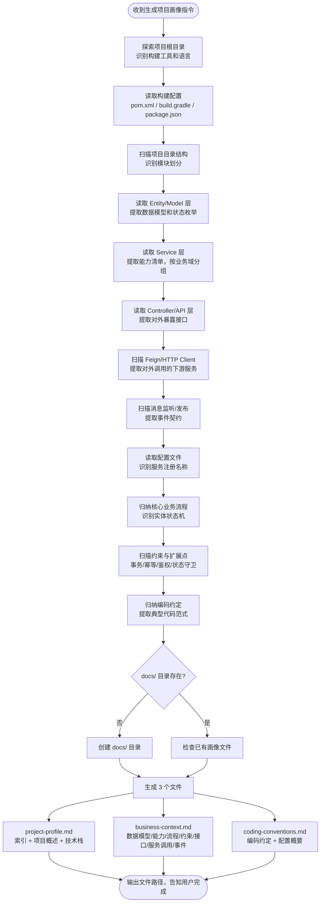

# 生成项目画像（Project Profile）

## 核心原则

**代码感知是一切 AI 辅助开发的基石。** 本 Skill 将项目代码转化为结构化 Markdown 文档，作为需求分析、方案设计、方案审查等后续环节的知识上下文。

核心思想：
- **不重复造轮子** — 让编码工具（Claude Code / Cursor / Windsurf 等）充当代码理解引擎，本 Skill 只定义输出规范
- **业务能力优先** — 画像不是技术档案，而是回答"这个系统能做什么、业务怎么跑"
- **图谱可拼接** — 每个微服务的画像是知识图谱的一个节点，通过标准化的服务交互和事件契约描述，多个画像可拼接为全局业务能力图谱

---

## 触发场景

用户说以下任意一种时，**必须**调用本 Skill：
- 生成项目画像 / generate project profile
- 扫描项目生成 Markdown / 生成项目 profile
- 为 AI Agent 准备项目上下文
- 更新 project-profile.md

---

## 与 init-project-docs 的关系

| 维度 | init-project-docs | generate-project-profile |
|------|-------------------|--------------------------|
| **目标读者** | 人（开发者阅读理解项目） | AI Agent（程序化消费知识上下文） |
| **输出文件** | 3 份文档（概要 + 架构 + 开发参考） | 3 份文档（索引 + 业务上下文 + 编码规范） |
| **侧重点** | 业务流程图、架构图、开发场景速查 | 结构化能力清单、服务交互契约、实体状态机 |
| **使用方式** | 人工阅读 | 注入 Agent Context / 向量化分片检索 / 多服务画像拼接为知识图谱 |

两者可以共存，不冲突。

---

## 执行流程



---

## 输出规范

### 物理拆文件 — 消灭幻觉的根因

**一个文件塞所有维度，LLM 会把无关信息"创造性关联"，产生幻觉。** 比如编码约定里的 `Result<T>` 包装模式，在做需求分析时可能被 AI 编出"当前已有统一退款结果包装类"的结论。

**解法：每个消费阶段只给它需要的那份文件，物理隔离无关信息。**

### 文件结构

```text
docs/
├── project-profile.md          ← 索引文件（轻量，每次都加载）
├── business-context.md         ← 业务上下文（需求分析 / 方案设计加载）
└── coding-conventions.md       ← 编码规范（代码生成阶段加载）
```

| 文件 | 消费阶段 | 内容 | 信噪比 |
|------|---------|------|--------|
| `project-profile.md` | 每次 | 项目概述 + 技术栈 + 指向其他文件的引用 | 极高（~500 token） |
| `business-context.md` | 需求分析 / 方案设计 | 数据模型与状态机 + 业务能力 + 业务流程 + 约束 + 接口 + 服务调用 + 事件 | 高（~3K-5K token，全是业务信息） |
| `coding-conventions.md` | 代码生成 | 编码约定 + 配置概要 | 高（~1K-2K token，全是编码规范） |

### 各文件包含的维度

**project-profile.md（索引）**

| # | 维度 | 说明 |
|---|------|------|
| 1 | 项目概述 | 项目名、用途、语言版本、模块列表、**服务注册名称** |
| 2 | 技术栈 | 框架、中间件、版本 |

**business-context.md（业务上下文）**

| # | 维度 | 数据来源 | 说明 |
|---|------|---------|------|
| 3 | 数据模型与状态机 | Entity + 枚举类 | 实体、核心字段、关联关系、**实体状态流转** |
| 4 | 业务能力清单 | Service 接口/类 | 按业务域分组，标注业务语义 |
| 5 | 核心业务流程 | Service 调用链推断 | 关键流程 + 状态变迁 + 事件。**每步附证据来源** |
| 6 | 关键约束与扩展点 | Service + AOP + 配置 | 事务边界、幂等点、鉴权、状态守卫、失败补偿 |
| 7 | 对外暴露接口 | Controller 层 | Method + URL + 入参 + 出参 |
| 8 | 对外调用服务 | FeignClient / HTTP Client | **本服务调用了谁** |
| 9 | 事件与消息契约 | MQ Listener + Publisher | 发布/消费的事件 |

**coding-conventions.md（编码规范）**

| # | 维度 | 数据来源 | 说明 |
|---|------|---------|------|
| 10 | 编码约定 | 代码归纳 | 命名规范、异常处理、通用基类 + 代码片段 |
| 11 | 配置概要 | application*.yml | **仅业务相关配置** |

### 模板文件

每个输出文件对应一个模板：
- `template.md` → 生成 `docs/project-profile.md`（索引）
- `business-context-template.md` → 生成 `docs/business-context.md`（业务上下文）
- `coding-conventions-template.md` → 生成 `docs/coding-conventions.md`（编码规范）

### 与 v1（旧版 10 维度）的映射

| v1 维度 | v2 去向 | 原因 |
|---------|---------|------|
| 3. 项目结构（目录树） | **删除** | AI 可自行 `ls`/`Glob`，目录树占 token 但不帮助理解业务 |
| 4. 分层架构 | **删除** | "DDD-lite / MVC"标签对需求分析无价值，编码约定中已含分层规则 |
| 5. 数据模型 | **升级为 3. 数据模型与状态机** | 增加实体状态枚举和状态流转 |
| 6. Service 能力清单 | **升级为 4. 业务能力清单** | 按业务域分组 + 业务语义标注 |
| 7. API 接口 | **升级为 7. 对外暴露接口** | 强调"对外暴露"语义，区分于调用下游 |
| 8. 外部依赖服务 | **拆分为 8 + 9** | 拆为"对外调用服务"（HTTP）和"事件契约"（MQ），为图谱拼接提供边 |
| 9. 配置概要 | **精简为 11. 配置概要** | 只保留业务配置，去掉 `server.port` 等噪音 |
| 10. 编码约定 | **保留为 10. 编码约定** | 不变 |
| （无） | **新增 5. 核心业务流程** | 回答"业务怎么跑"，附证据来源 |
| （无） | **新增 6. 关键约束与扩展点** | 回答"改这里容易炸在哪、改动半径多大" |

---

## 维度详细说明

### A 组：业务认知层 — 需求分析消费

A 组回答"这个系统是什么、能做什么业务、业务怎么跑、碰什么会炸"。是 AI 做需求影响分析的核心依据。

**维度 1 — 项目概述**

必须包含 **服务注册名称**（如 Spring Cloud 的 `spring.application.name`），这是跨服务图谱拼接的主键。

**维度 2 — 技术栈**

保持不变，用于方案设计阶段判断技术可行性。

**维度 3 — 数据模型与状态机**

v1 只列字段和关联。v2 增加**实体状态枚举**和**状态流转**：

```markdown
| 实体 | 状态枚举 | 流转路径 |
|------|---------|---------|
| Order | CREATED → PAID → SHIPPED → COMPLETED | 正常流程 |
| Order | PAID → REFUNDING → REFUNDED | 退款流程 |
| Order | CREATED → CANCELLED | 取消流程 |
```

**为什么关键**：退货需求的第一个问题就是"订单有哪些状态，退货应该插入到哪个状态之后"。没有状态机，AI 只能猜。

**维度 4 — 业务能力清单**

v1 按 Service 类列方法签名。v2 改为**按业务域分组**，每个能力附一句话业务语义：

```markdown
### 订单域
| 能力 | Service#Method | 说明 |
|------|---------------|------|
| 创建订单 | OrderService#placeOrder | 校验库存 → 锁库存 → 创建订单 → 发布 ORDER_CREATED 事件 |
| 取消订单 | OrderService#cancelOrder | 仅 CREATED 状态可取消 → 释放库存 → 发布 ORDER_CANCELLED |
| 查询订单 | OrderService#getOrderDetail | 支持按 ID / 用户 / 状态查询 |

### 支付域
| 能力 | Service#Method | 说明 |
|------|---------------|------|
| 发起支付 | PaymentService#createPayment | 调用第三方支付网关 → 更新订单状态为 PAID |
```

**为什么关键**：AI 看到"退货退款需求"时，能直接定位到订单域和支付域的现有能力，判断哪些能复用、哪些需新增。

**维度 5 — 核心业务流程（新增）**

用文字（非 Mermaid）简明描述 2-5 个核心业务流程，标注涉及的 Service、状态变迁和事件。**每个流程末尾必须附证据来源**：

```markdown
### 下单流程
1. 用户提交订单 → OrderController#placeOrder
2. OrderService 校验库存 → 调用 inventory-service 锁定库存
3. 创建 Order（状态 CREATED）→ 写入 t_order
4. 发布事件 ORDER_CREATED → 通知 notification-service

> 证据来源：OrderServiceImpl#placeOrder, InventoryFeignClient#lockStock, OrderCreatedProducer#send
```

**为什么关键**：这是连接所有维度的"胶水"。有了流程，AI 才能理解"退货退款"应该在哪个流程之后发生，涉及哪些 Service、改哪些状态、发什么事件。

**证据锚点规则**：维度 3（状态机）、4（能力清单）、5（业务流程）、6（约束）中涉及推断的内容，必须在段落末尾标注 `> 证据来源：{类名#方法名}` 或 `> 证据来源：{文件路径}`。这让下游 Agent 能区分"从代码中提取的事实"和"推断的结论"。

**维度 6 — 关键约束与扩展点（新增）**

回答"这个需求该插在哪、最容易炸在哪、改动半径有多大"：

```markdown
### 事务边界
| 方法 | 事务范围 | 说明 |
|------|---------|------|
| OrderService#placeOrder | 创建订单 + 订单明细在同一事务 | 库存锁定通过 Feign 调用，不在事务内 |
| PaymentService#handleCallback | 更新 Payment + 更新 Order 在同一事务 | 事件发布在事务提交后 |

### 幂等点
| 接口/方法 | 幂等键 | 机制 |
|-----------|--------|------|
| PaymentController#callback | paymentId | 数据库唯一索引 |
| OrderService#cancelOrder | orderId + status | 状态守卫（仅 CREATED 可取消） |

### 鉴权入口
| 接口 | 鉴权方式 | 说明 |
|------|---------|------|
| /api/orders/** | JWT Token | 通过 SecurityFilter 统一校验 |
| /api/internal/** | 服务间签名 | 仅内部调用，非用户接口 |

### 状态变更守卫
| 实体 | 守卫规则 | 违反后果 |
|------|---------|---------|
| Order | CREATED → CANCELLED 仅允许用户主动或超时 | 抛 IllegalStateException |
| Order | PAID 后不可直接 CANCELLED，必须走退款流程 | 抛 BusinessException |

### 外部依赖失败补偿
| 外部依赖 | 失败处理 | 说明 |
|---------|---------|------|
| inventory-service 锁库存 | 失败则订单创建失败，无需补偿 | 强依赖 |
| payment-gateway | 超时则标记 PENDING，定时任务轮询查询 | 最终一致 |

### 不可轻易改动的核心规则
- 订单金额一旦创建不可修改（审计要求）
- 支付回调必须验签（安全要求）
- ...

> 证据来源：OrderServiceImpl#placeOrder, SecurityConfig, PaymentCallbackController#callback
```

**为什么关键**：需求分析时，AI 不仅要知道"有什么能力"，还要知道"碰什么会炸"。退货需求必然涉及状态变更守卫、事务边界调整、新增幂等点，没有这个维度 AI 只能盲猜风险点。

### C 组：接口与交互 — 跨服务图谱的边

**维度 7 — 对外暴露接口**

沿用原 API 接口维度，但明确语义为"本服务对外暴露的能力"。

**维度 8 — 对外调用服务（从原"外部依赖"拆出）**

专门描述**本服务调用了哪些其他服务**：

```markdown
| 目标服务 | 调用方式 | 接口 | 用途 |
|---------|---------|------|------|
| inventory-service | Feign | POST /api/inventory/lock | 下单时锁定库存 |
| inventory-service | Feign | POST /api/inventory/release | 取消订单时释放库存 |
| payment-gateway | HTTP | POST /api/pay/create | 发起第三方支付 |
```

**为什么关键**：这是图谱的"出边"。AI 做退货需求分析时，能立刻知道 order-service 调了 inventory-service 和 payment-gateway，退货流程大概率也需要调这两个。

**维度 9 — 事件与消息契约（从原"外部依赖"拆出）**

```markdown
### 发布的事件
| Topic/Exchange | 事件类型 | Payload 关键字段 | 触发条件 |
|----------------|---------|-----------------|---------|
| order-events | ORDER_CREATED | orderId, userId, amount | 订单创建成功 |
| order-events | ORDER_PAID | orderId, paymentId | 支付回调成功 |
| order-events | ORDER_CANCELLED | orderId, reason | 用户取消订单 |

### 消费的事件
| Topic/Exchange | 事件类型 | 来源服务 | 处理逻辑 |
|----------------|---------|---------|---------|
| payment-events | PAYMENT_SUCCESS | payment-service | 更新订单状态为 PAID |
```

**为什么关键**：这是图谱的"事件边"。退货需求需要发布 ORDER_REFUNDED 事件，notification-service 可能需要消费它来发退款通知。没有事件契约，AI 不知道现有的事件体系怎么设计。

### D 组：编码规范 — 代码生成阶段消费

维度 10（编码约定）和维度 11（配置概要）在需求分析阶段价值低，但在方案设计和代码生成阶段需要。保留但降级到最后。

配置概要精简规则：**只保留业务相关配置**（功能开关、限额、重试次数、超时时间等），去掉 `server.port`、`spring.datasource.url` 等纯基础设施配置。

---

## 知识图谱拼接规范

### 图谱节点（每个微服务的 profile 是一个节点）

每个 profile 通过以下字段成为图谱节点：
- **节点 ID**：维度 1 中的服务注册名称（如 `order-service`）
- **节点能力**：维度 4（业务能力清单）
- **节点数据模型**：维度 3（数据模型与状态机）

### 图谱边（服务间关系）

| 边类型 | 数据来源 | 方向 |
|--------|---------|------|
| **同步调用** | 维度 8（对外调用服务）→ 目标服务的维度 7（对外暴露接口） | A → B |
| **事件驱动** | 维度 9 发布侧 → 维度 9 消费侧 | A ⇢ B（虚线表示异步） |
| **共享概念** | 维度 3 中出现相同实体名或外键引用 | A ⇔ B（双向） |

### 拼接示例

```text
order-service                   payment-service               inventory-service
┌─────────────────┐             ┌──────────────────┐          ┌──────────────────┐
│ 维度4: 创建订单   │──Feign──→ │ 维度6: POST /pay  │          │ 维度6: POST /lock │
│ 维度4: 取消订单   │──Feign──→ │                    │←Feign── │                    │
│ 维度8: ORDER_PAID │⇠ 事件 ⇠  │ 维度8: PAY_SUCCESS │          │                    │
│ 维度8: ORDER_CREATED│⇢ 事件 ⇢ │                    │          │ 维度8: ORDER_CREATED│
│                   │──Feign──→ │                    │          │ (消费→扣减库存)     │
└─────────────────┘             └──────────────────┘          └──────────────────┘
```

**退货需求影响分析时，AI 可以沿着这些边自动推导**：
1. 退货需要退款 → 沿同步调用边找到 payment-service
2. 退货需要归还库存 → 沿同步调用边找到 inventory-service
3. 退货需要通知用户 → 沿事件边找到 notification-service（消费 ORDER_REFUNDED）

---

## 编码约定维度（维度 10）采集指南

这个维度需要从代码中**归纳**，不是简单提取。重点关注：

1. **异常处理模式** — 项目用统一异常类还是 Result 包装？怎么抛、怎么捕？
2. **返回值包装** — 用 `Result<T>` / `ResponseEntity` / 裸返回？
3. **参数校验方式** — JSR303 注解 / 手动校验 / AOP？
4. **日志规范** — log 变量命名、日志级别使用习惯
5. **通用基类/工具类** — BaseEntity / BaseService / 自定义工具类
6. **命名习惯** — DTO/VO/Request/Response 后缀规则

**必须附 2-3 个从项目中提取的真实代码片段**，展示项目的"标准写法"。

---

## 质量标准

- **业务可理解**：非技术人员读到维度 4-5 也能理解系统做什么
- **AI 友好**：表格优先，避免大段叙述；每个维度可独立被向量化分片
- **图谱可拼接**：维度 1 有服务注册名、维度 8-9 有明确的服务名引用
- **证据可追溯**：推断型维度（3-6）附证据来源锚点，标注关键类名和方法名
- **信息完整**：找不到的维度标注「未检测到」，不要编造
- **脱敏处理**：密码、密钥、Token 等敏感配置值用 `***` 替代
- **可验证**：每个维度的数据都能追溯到具体文件路径
- **可增量更新**：文档头部记录生成时间，便于判断是否过期
- **精简干练**：不输出对需求分析无价值的信息（纯目录树、纯基础设施配置等）

---

## 语言与框架适配

本 Skill **不限定语言和框架**。根据项目实际情况调整：

| 项目类型 | 构建配置 | 数据模型来源 | Service 来源 | API 来源 | 服务调用来源 | 事件来源 |
|---------|---------|-------------|-------------|---------|-------------|---------|
| Java Spring | pom.xml | @Entity / @Table | @Service 类 | @RestController | @FeignClient / RestTemplate | @RabbitListener / @KafkaListener |
| Java MyBatis | pom.xml | Mapper XML / Entity | @Service 类 | @RestController | @FeignClient / RestTemplate | @RabbitListener |
| Node.js | package.json | Prisma / Mongoose | service/ 目录 | router/ / controller/ | axios / fetch 调用 | event emitter / MQ consumer |
| Python Django | requirements.txt | models.py | views.py / services/ | urls.py | requests / httpx | celery tasks |
| Go | go.mod | model/ 目录 | service/ 目录 | handler/ / router/ | HTTP client | goroutine / channel |
| Vue/React | package.json | 不适用 | store/ / composables/ | api/ 目录 | 不适用 | 不适用 |

**前端项目**：跳过维度 3（数据模型）、5（业务流程）、7（对外调用）、8（事件契约），标注「不适用」。

---

## 探索策略

1. **先读构建配置**（pom.xml / package.json），确定语言、框架、模块结构
2. **读配置文件**确认服务注册名称（`spring.application.name`），这是图谱节点 ID
3. **Entity 层完整读取**，字段信息不能遗漏，**额外扫描枚举类**找状态定义
4. **Service 层优先读接口**（`I*.java`），按业务域分组，减少 token 消耗
5. **Controller 层重点读注解和方法签名**，不需要读方法体
6. **扫描 Feign / RestTemplate / HTTP Client**，提取对外调用清单
7. **扫描 MQ Listener / Publisher**，提取事件契约
8. **从 Service 实现中推断核心业务流程**，关注状态变更和事件发布点
9. **扫描约束与扩展点**：`@Transactional` 找事务边界、唯一索引/幂等键、`SecurityConfig`/Filter 找鉴权入口、状态守卫（`if status != XXX throw`）、外部调用的重试/降级/补偿逻辑
10. **编码约定需要读 2-3 个典型实现类的完整代码**，才能归纳出模式
11. **配置文件只提取业务相关项**，跳过基础设施配置

---

## Mermaid 语法强制规范

- 节点/边标签含 `=`、`,`、`/`、`<`、`>`、`(`、`)`、`[`、`]`、`:` 时**必须加引号**
- `<` `>` 改用文字（如：大于、小于、请求体、响应体）
- 不使用 emoji
- `classDiagram` 方法名不含中文

---

## 注意事项

1. 本 Skill 属于**分析类**，不进入功能开发或 bug 修复链路
2. 生成完成后**不需要**触发 `design-doc-required`
3. 如项目已有画像文件，询问用户是覆盖还是跳过
4. **多服务/Monorepo 项目**：每个可独立部署的服务生成独立的 3 份文件，不合并。可选生成聚合索引文件
5. **单体多模块项目**（所有模块共同部署为一个服务）：生成一份统一 profile
6. 前端项目跳过不适用的维度，标注「不适用」
7. **业务流程描述用编号列表，不用 Mermaid**（流程图在 init-project-docs 中画，这里追求精简可检索）
8. 维度 8-9 中引用的目标服务名必须与对方 profile 的服务注册名称一致，这是图谱拼接的前提
9. **推断型内容必须附证据来源**，格式：`> 证据来源：{ClassName#methodName}` 或 `> 证据来源：{file_path}`
