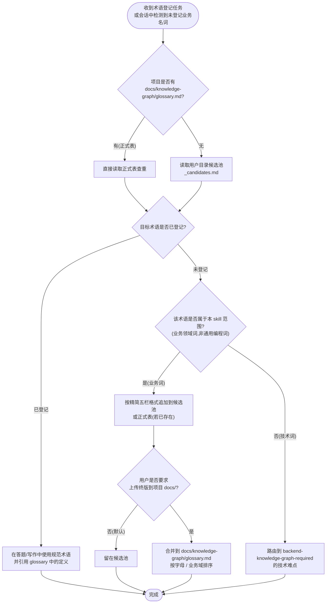

# 业务术语强制登记

## 定位

**本 skill 是 AI Agent 把 PRD/需求/设计文档中的"业务领域名词"对齐到"代码内部命名"的唯一权威源。** 没有它,AI 在新需求分析时会反复在「退货 vs 退款」、「订单 vs 流水」、「分摊 vs 分配」、「快照 vs 引用」之间踩坑,也无法做后续场景匹配 / 反向影响分析。

目标:让 AI 在分析任何业务需求前先回答清楚——

- PRD 里的"X"在本项目代码里叫什么(类名 / 表名 / 枚举 / 字段)
- 这个术语是否有同义词、近义词、过期叫法
- 这个术语对应的核心业务场景与代码坐标在哪

不处理:通用编程概念(线程 / 缓存 / 事务 / 子进程)、批量项目初始化术语表(走 `init-project-docs` 的 07_glossary.md)。

---

## BLOCKING 触发清单(写前 / 答前拦截)

下列任一场景命中即必须**第一时间**调起本 skill,先做术语登记或引用,再继续答题或落盘。错过即流程违反。

| 触发场景 | 命中信号 | 必做动作 |
|---|---|---|
| **用户提供 PRD / 需求 / 设计文档,其中含 ≥1 个业务领域名词** | 文档里出现订单 / 优惠券 / 退款 / 分摊 / 流水 / 快照 / 对账 / 充值 / 提现 / 库存等业务名词 | 答题前先扫一遍,查 glossary 是否已登记;**未登记**必须候选追加 |
| **会话中用户与 AI 对同一名词使用不同字面** | 用户说「退货」AI 答「退款」、用户说「分摊」AI 答「分配」、用户说「日结」AI 答「对账」 | 立即停下对齐到规范术语,在 glossary 增加同义词条目 |
| **AI 完成代码调查发现 ≥1 个业务术语 ↔ 代码命名映射** | 调查结论里出现具体实体类 / 表名 / 枚举 / 字段名,且这些名字与用户所用业务名词对应关系尚未登记 | 同回合候选追加,字段含中文名 / 英文标识 / 一行定义 / 关联代码坐标 |
| **用户主动要求** | 「补术语」「整理术语表」「建 glossary」「维护术语映射」 | 先读现有 glossary + 候选池,再补充正式表 |
| **即将 Write/Edit 描述业务场景 / 业务流程 / 业务规则的 .md** | 设计文档 / bug 文档 / orientation 文档 / scenarios/ 卡片含业务名词 | 写文档前先检查 glossary,缺失术语先候选追加再下笔 |

> **常见误判反例**:
> - ❌ "用户只是问业务流程,没让我补术语,所以不用触发" → **错**,业务名词出现即触发
> - ❌ "这是通用 IT 词汇(订单 / 优惠券),不需要登记" → **错**,本项目里业务名词的具体含义、关联代码、状态枚举可能与通用语义不同
> - ❌ "项目里没有 glossary.md,所以 skill 不适用" → **错**,没有就先写候选池
> - ❌ "用户用了'退货'我用'退款',意思一样不用纠正" → **错**,字面不一致即触发对齐,术语对齐是 Agent 后续场景匹配 / 反向索引的前提
> - ❌ "init-project-docs 里已有 07_glossary.md 了,不用本 skill" → **错**,07_glossary.md 是项目初始化批量生成,日常会话级补登仍走本 skill 的精简表

---

## 范围与边界

### 本 skill 负责

- **业务领域名词**:订单 / 优惠券 / 退款 / 分摊 / 流水 / 快照 / 对账 / 充值 / 提现 / 库存 / 渠道 / 商户 / 商品 / SKU / 营销 / 优惠 / 会员 / 积分等领域名词
- **业务术语 ↔ 代码命名映射**:中文名 ↔ 类名 / 表名 / 枚举 / 字段
- **同义词归一**:用户口语化表达 ↔ 项目规范术语
- **过期叫法标记**:历史命名 → 当前规范命名

### 本 skill 不负责(归其他 skill)

| 不负责的内容 | 归属 skill |
|---|---|
| 通用编程概念(线程 / 缓存 / 事务 / 子进程 / 并发) | `backend-knowledge-graph-required` 的"技术难点" |
| 批量项目初始化时一次性生成完整术语表 | `init-project-docs` 的 `templates/07_glossary.md` |
| 表关系 / SQL 查询逻辑 / 状态机定义 | `backend-knowledge-graph-required` |

---

## 输出路径(双轨)

### 候选池(默认,日常会话级)

```text
{USER_DOCUMENTS}/ai-docs/{project}/glossary/_candidates.md
```

未来正式上传到项目 `docs/` 前,所有日常补登先落候选池。

### 正式版(用户明确要求"上传终版"或项目已有正式表时)

```text
{project}/docs/knowledge-graph/glossary.md
```

`{project}` = 当前业务项目根目录。若项目已有 `docs/knowledge-graph/glossary.md`,日常补登可直接维护正式版,不必先经候选池。

### 路径解析规则

1. Windows:`%USERPROFILE%\Documents\ai-docs\{project}\glossary\...`
2. macOS / Linux:`~/Documents/ai-docs/{project}/glossary/...`
3. 无 Documents 目录时兜底 `~/ai-docs/{project}/glossary/...`
4. `{project}` 取被分析项目目录名(不一定 = 当前 cwd,与 `backend-knowledge-graph-required` 同样规则)

---

## 候选池格式(精简五栏 + 元数据)

候选池 `_candidates.md` 文件首部:

```markdown
# {project} 业务术语候选池

> 由 glossary-required skill 自动维护。整理时合并到 docs/knowledge-graph/glossary.md。

| 中文名 | 英文 / 代码标识 | 一行定义 | 同义词 / 旧叫法 | 关联代码坐标 |
|---|---|---|---|---|
| 退款 | Refund / `RefundOrder` | 用户按退款规则全额或部分退回,产生 RefundOrder + RefundFlow 记录 | 退货(口语) / pay-back(过期) | `src/main/java/.../refund/...` |
| 分摊 | Allocation / `OrderAllocation` | 订单总金额按规则拆分到多个商户/账户 | 分配(口语) | `OrderAllocationService.java` |
| 流水 | Flow / `*_flow` 表 | 资金 / 库存 / 状态变更的不可篡改追加日志 | journal(过期) / log(歧义) | `payment_flow`, `refund_flow` |
```

### 字段语义

| 字段 | 必填 | 说明 |
|---|---|---|
| 中文名 | 是 | 项目内部规范的中文名,**不是**用户随手输入的口语 |
| 英文 / 代码标识 | 是 | 类名 / 表名 / 枚举名 / 字段名,有多个时用 `/` 分隔 |
| 一行定义 | 是 | 一句话讲清"是什么 + 关键特征",长定义放正式 glossary.md |
| 同义词 / 旧叫法 | 否 | 包括用户口语化表达、历史命名、易混淆名;用 `/` 分隔并标注类别(口语/过期/歧义) |
| 关联代码坐标 | 否 | 主要实体的文件路径或 `file:line`,便于 AI 后续 Read 验证 |

---

## 正式 glossary.md 格式

正式版在候选池基础上补充"业务规则要点"和"反例(不要混淆什么)"两栏。模板见 `template.md`。

---

## 执行流程



---

## 会话末批处理（M / L 档不打断编码）

> 与 [CLAUDE.md § 改动规模 → 链路档位](../../CLAUDE.md#改动规模--链路档位sml-三档对照表) 配套使用。S 档(小改)跳过本 skill;M / L 档启用**会话末批处理模式**——编码过程中不打断主流程, 只往候选池追加, 会话结束前一次性整理。

### 批处理模式约束

| 时机 | 行为 |
|---|---|
| 编码中: 检测到未登记业务术语 / 同义词错位 | **只往候选池 `_candidates.md` 追加一行**, 不打断编码、不主动跳出讨论术语定义、不要求用户立即确认 |
| 编码中: AI 自己使用业务术语前 | 默认沿用代码命名 / 设计文档同款术语; 若与候选池冲突, 一句话标注「(候选: X)」即可继续 |
| 改完代码后 / 会话结束前 | **一次性整理候选池**: 合并重复候选 / 补齐定义 / 同义词归一 / 询问用户是否升级到正式 `glossary.md` |

### 候选池追加最小动作（编码中执行）

```markdown
<!-- _candidates.md 追加一行即可,不需要完整五栏 -->
| 退货 | 同义词→退款 | 用户口语 | (待补) | (待补) | 2026-05-12 编码会话 |
```

完整五栏定义在会话末再补——编码当时只要"埋点不丢"即可。

### 会话末整理动作（用户说"提交"前必走）

1. 读 `_candidates.md` 当前会话追加部分
2. 按候选池格式补齐: 英文标识 / 一行定义 / 同义词反向索引 / 关联代码坐标
3. 询问用户: 「本次会话发现 N 条新术语候选, 是否升级到正式 glossary.md? 还是先留在候选池?」
4. 用户确认 → 按用户选择执行升级或保留

### 例外（仍需立即打断的场景）

- 用户**主动问**术语定义 / 同义词归一时
- 用户与 AI 出现**严重术语错位**导致后续讨论可能基于错误前提时(如 AI 误以为"退货"=物理退货, 实际 = 退款)
- PRD / 设计文档 review 阶段(术语必须当回合对齐, 不能延迟到编码末)

---

## 同义词对齐规则

当用户与 AI 对同一概念使用不同字面时,**AI 必须主动对齐到规范术语**,不可继续沿用不一致表述。对齐规则:

1. **以代码命名为准**:正式术语 = 代码里实际用的名字(如 `RefundOrder` → 中文规范名「退款」)
2. **用户口语化表达**:登记为「同义词 / 旧叫法」,标注 `(口语)`
3. **历史命名**:登记为「同义词 / 旧叫法」,标注 `(过期)`,并在定义里说明替代
4. **歧义命名**:有歧义的旧名(如 `log` 在不同上下文指流水/日志/审计)必须标注 `(歧义)`,定义里写明使用的具体语义

对齐后,AI 在后续答题中**只用规范术语**,但在解释时可用「(用户说的「退货」=本项目术语「退款」)」形式做映射,以免用户困惑。

---

## 与其他 skill 的协作

| 上游 / 平级 skill | 协作关系 |
|---|---|
| `init-project-docs`(批量) | 项目首次初始化时由 init-project-docs 一次性产出 `07_glossary.md`(完整版);本 skill 负责后续日常对话级增量补登 |
| `design-doc-required` | 设计文档撰写前必查 glossary,新增术语必候选;设计文档使用规范术语写作 |
| `bug-doc-required` | bug 分析涉及业务名词时同样查 glossary;新发现术语候选 |
| `business-logic-orientation` | 现状梳理时大量出现业务术语,必须同步更新 glossary 候选 |
| `backend-knowledge-graph-required` | 表 / 枚举 / 状态机沉淀时附带的中文业务名也走 glossary;技术难点术语**不**走本 skill |
| `reverse-index-required` | 反向索引使用规范术语命名条目,术语未登记时先经本 skill 登记再写反向索引 |

---

## 自检清单(写前 / 写后)

写前:

- [ ] 已读取项目 glossary.md(或候选池),完成查重
- [ ] 待登记术语属于业务领域名词,不是通用编程概念
- [ ] 中文名 = 项目规范名(以代码命名为准),不是用户口语
- [ ] 英文 / 代码标识有具体类 / 表 / 枚举对应,不是凭空发明
- [ ] 一行定义讲清"是什么 + 关键特征",不超过 1 行

写后:

- [ ] 候选池(或正式表)新增条目格式正确(五栏齐全)
- [ ] 同义词字段标注了类别(口语/过期/歧义)
- [ ] 答题或文档中已替换为规范术语,不再使用用户口语
- [ ] 必要时已在 commit body / PR description 提示"glossary 新增 N 条候选"

---

## 红线

1. 凭空发明业务术语:必须基于代码 / DDL / PRD 中真实出现过的名字
2. 把通用编程概念塞进 glossary:线程 / 缓存 / 事务等归 backend-knowledge-graph 的技术难点
3. 把同一术语在不同服务里的不同叫法混登:本项目内只登记本项目规范叫法,不混入其它服务的命名
4. 用户用口语 AI 也跟着用口语:必须主动对齐到规范术语
5. 候选池写成长篇定义:候选池保持精简五栏,长定义留给正式表
6. 不查重就追加:同一术语已存在时只补充字段,不另起一行
