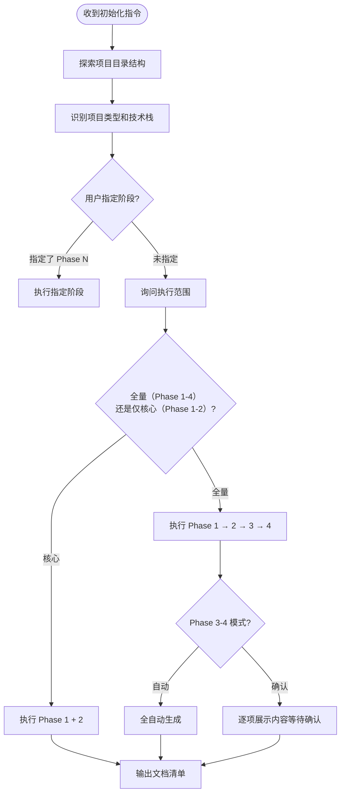

# 项目知识图谱初始化

## 触发场景

用户说以下任意一种时，**必须**调用本 skill：
- 初始化项目文档 / 生成知识图谱
- 分析项目能力 / 分析项目架构
- 生成项目概要 / 架构分析
- 生成开发参考文档
- init project docs / analyze project / knowledge graph

---

## 核心理念：渐进式构建

知识图谱不是一次性生成的，而是分 4 个阶段逐步丰富。每个阶段的文档为下一阶段提供上下文。

| 阶段 | 生成内容 | 数据来源 | 默认模式 |
|---|---|---|---|
| Phase 1 | 项目概要 + 架构总览 + 架构约束 | 扫描代码结构 + 构建文件 | 自动 |
| Phase 2 | 模块地图 + 数据模型 + API 总表 + 前后端映射 | 扫描 Controller/Entity/Mapper | 自动 |
| Phase 3 | 业务流程 + 术语表 + 重构计划 + 变更记录 | AI 分析 + **人工确认** | 可选自动/确认 |
| Phase 4 | 模块深度文档 + 技能卡（Flutter/Vue/Spring Cloud） | 逐模块深度扫描 | 可选自动/确认 |

---

## 输出根目录（统一到用户目录知识库）

**本 skill 生成的全部知识图谱文档默认写入用户目录知识库，不再写入项目 `docs/`，避免污染源项目仓库。** 与 `design-doc-required` / `bug-doc-required` / `business-logic-orientation` 的默认输出根保持一致。

| 项 | 值 |
|---|---|
| 输出根 `{KG_ROOT}` | `{USER_DOCUMENTS}/ai-docs/{project}/` |
| 与 design / bug / orientation 的关系 | 同一个 `ai-docs/{project}/` 知识库下平级共存（`design/`、`bug/`、`orientation/`、`work-log/` 等是兄弟目录） |
| 项目 `docs/` | **不写入**。知识图谱不再随项目仓库分发，避免污染源项目 |

下文所有路径中的 `{KG_ROOT}/` 一律指 `{USER_DOCUMENTS}/ai-docs/{project}/`。**知识图谱文档之间互相引用一律使用相对文件名**（如 `01_architecture_overview.md`、`modules/{module}.md`），不写 `docs/` 前缀，使整套文档与所在根解耦。

> **兼容历史项目：** 若某项目此前已把知识图谱生成在 `docs/`，由用户自行迁移到 `{KG_ROOT}/`；本 skill 默认只读写 `{KG_ROOT}/`。

---

## 执行流程



---

## Phase 1：核心文档（全自动）

### 扫描内容

1. 读取 `pom.xml` / `build.gradle` / `pubspec.yaml` — 获取技术栈和依赖
2. 探索项目目录结构 — 识别分层模式
3. 读取 Controller 层 — 获取对外 API 清单
4. 读取 Service 接口层（`I*.java`，不读 impl）— 获取业务能力清单
5. 读取 Component 层 — 获取可复用组件
6. 读取 Configuration/Interceptor 层 — 获取横切关注点

### 生成文档

| 文档 | 路径 | 模板 |
|---|---|---|
| 项目概要 | `{KG_ROOT}/00_project_overview.md` | `templates/00_project_overview.md` |
| 架构总览 | `{KG_ROOT}/01_architecture_overview.md` | `templates/01_architecture_overview.md` |
| 架构约束 | `{KG_ROOT}/08_constraints_and_rules.md` | `templates/08_constraints_and_rules.md` |

### 项目概要（00）章节

参考 `templates/00_project_overview.md`：
1. **项目定位** — 一句话描述服务职责
2. **技术栈** — 语言、框架、中间件版本
3. **主要业务模块** — 按业务域分组
4. **关键业务链路** — 主链路概要（2-4 条）
5. **全局技术约定** — API 格式、金额单位、时间格式
6. **文档导航** — 指向其余 10 份文档的索引

### 架构总览（01）章节

参考 `templates/01_architecture_overview.md`：
1. **项目分层结构** — 根据实际项目类型选择（Spring Boot / Flutter / Vue）
2. **依赖方向** — 层间依赖规则
3. **服务清单** — 微服务项目列出所有服务
4. **跨端数据流向** — 数据在各层/服务间的流动
5. **全局约定** — 统一规则

### 架构约束（08）章节

参考 `templates/08_constraints_and_rules.md`：
1. **分层红线** — 绝对禁止的行为
2. **依赖方向** — 不可反转的规则
3. **命名规范** — 各类型的命名约定
4. **数据类型约定** — 金额/时间/状态等
5. **新增代码 Checklist** — 提交前自检

---

## Phase 2：映射文档（全自动）

### 扫描内容

1. 读取 Entity/Model 层 — 获取核心领域模型和表结构
2. 读取 Mapper/DAO 层 — 获取数据访问能力
3. 读取 Controller 的端点注解 — 获取完整 API 清单
4. 读取 Stream/Listener 层 — 获取异步事件处理
5. （Flutter）读取 features/ 目录 + pages — 获取页面清单

### 生成文档

| 文档 | 路径 | 模板 |
|---|---|---|
| 模块地图 | `{KG_ROOT}/02_module_map.md` | `templates/02_module_map.md` |
| 数据模型 | `{KG_ROOT}/04_data_model_map.md` | `templates/04_data_model_map.md` |
| API 总表 | `{KG_ROOT}/05_api_map.md` | `templates/05_api_map.md` |
| 前后端映射 | `{KG_ROOT}/06_frontend_backend_mapping.md` | `templates/06_frontend_backend_mapping.md` |

### 开发参考手册

同时生成 `{KG_ROOT}/development-reference.md`（参考 `development-reference-template.md`），包含：
1. **业务域全景** — 按域列出能力边界
2. **新增需求决策指南** — 代码放哪层的决策表
3. **Controller 端点全表** — 完整端点清单
4. **Service 能力矩阵** — 核心 Service 依赖和职责
5. **Component 组件能力** — 可复用组件清单
6. **数据模型与 Mapper** — 核心表关系和查询规则
7. **异步事件与消息流** — 消费者清单和事件场景
8. **外部服务依赖** — Feign 客户端清单
9. **横切关注点** — 分布式锁、审计、线程池等
10. **常见开发场景速查** — 高频场景分步指南

> **注意**：development-reference 需要**深度分析**，需读取 Service impl、Component 实现、Stream handler、Configuration 类的实际代码。

---

## Phase 3：流程与术语（可选自动/确认）

> **此阶段的内容无法纯靠代码推断**，默认需人工确认。用户可选择自动模式（AI 尽力推断，生成后用户审阅）。

### 生成文档

| 文档 | 路径 | 模板 | 说明 |
|---|---|---|---|
| 业务流程 | `{KG_ROOT}/03_business_flow_map.md` | `templates/03_business_flow_map.md` | 核心业务流程清单和概要 |
| 术语表 | `{KG_ROOT}/07_glossary.md` | `templates/07_glossary.md` | 业务术语定义 |
| 重构计划 | `{KG_ROOT}/09_refactor_plan.md` | `templates/09_refactor_plan.md` | 重构路线和进度跟踪 |
| 变更记录 | `{KG_ROOT}/10_change_log.md` | `templates/10_change_log.md` | ADR 风格变更记录 |

### 自动模式行为

- AI 从代码中推断业务流程（分析 Controller 调用链、Service 方法间调用）
- AI 从类名/方法名/注释中提取业务术语
- 重构计划基于 Phase 1 的架构约束分析生成建议
- 变更记录初始化为"知识图谱建立"一条
- **生成后提示用户审阅，标注"以下内容需要人工校验"**

### 确认模式行为

- 逐份文档展示 AI 推断的内容
- 等待用户确认、修改或补充
- 用户确认后写入文件

---

## Phase 4：模块深度文档（可选自动/确认）

### 前置条件

Phase 1-2 已完成（需要 `{KG_ROOT}/02_module_map.md` 中的模块清单）。

### 生成文档

#### 模块文档

为 `{KG_ROOT}/02_module_map.md` 中的每个模块生成深度文档：

路径：`{KG_ROOT}/modules/{module}.md`
模板：`templates/module_template.md`

每份模块文档包含 10 节：
1. 模块目标
2. 用户入口
3. 代码结构（关键文件路径和职责）
4. 后端结构（服务名、端口、端点列表）
5. 数据结构（表结构 + 状态机）
6. 核心流程（关键业务流程步骤）
7. 关键规则（规则 ID + 描述 + 实现位置）
8. 依赖关系（依赖 / 被依赖）
9. 常见问题
10. 改动建议

#### 技能卡（按项目类型按需生成）

| 项目类型 | 技能卡 | 路径 | 模板 |
|---|---|---|---|
| Flutter | Flutter 技能卡 | `{KG_ROOT}/skills/flutter_skill.md` | `templates/flutter_skill.md` |
| Vue | Vue 技能卡 | `{KG_ROOT}/skills/vue_skill.md` | `templates/vue_skill.md` |
| Spring Cloud/Boot | Spring Cloud 技能卡 | `{KG_ROOT}/skills/springcloud_skill.md` | `templates/springcloud_skill.md` |

技能卡包含：分层职责、命名规范、AI 代码生成规则、当前重构状态。

### 自动模式行为

- 逐模块扫描代码，自动填充 10 节内容
- 常见问题和改动建议基于 AI 分析生成
- 生成后提示用户审阅

### 确认模式行为

- 列出所有待生成的模块，用户选择要生成哪些
- 逐模块展示内容，等待确认

---

## 文档存储结构

生成完成后，用户目录知识库 `{KG_ROOT}/`（= `{USER_DOCUMENTS}/ai-docs/{project}/`）结构如下：

```
{KG_ROOT}/                          ← {USER_DOCUMENTS}/ai-docs/{project}/
├── 00_project_overview.md         ← AI 入口（Phase 1）
├── 01_architecture_overview.md    ← 系统分层（Phase 1）
├── 02_module_map.md               ← 模块一览（Phase 2）
├── 03_business_flow_map.md        ← 业务流程（Phase 3）
├── 04_data_model_map.md           ← 数据模型（Phase 2）
├── 05_api_map.md                  ← API 接口（Phase 2）
├── 06_frontend_backend_mapping.md ← 前后端映射（Phase 2）
├── 07_glossary.md                 ← 术语表（Phase 3）
├── 08_constraints_and_rules.md    ← 架构红线（Phase 1）
├── 09_refactor_plan.md            ← 重构计划（Phase 3）
├── 10_change_log.md               ← 变更记录（Phase 3）
├── development-reference.md       ← 开发参考（Phase 2）
│
├── skills/                        ← 技能卡（Phase 4）
│   ├── flutter_skill.md
│   ├── vue_skill.md
│   └── springcloud_skill.md
│
└── modules/                       ← 模块深度文档（Phase 4）
    ├── {module_a}.md
    ├── {module_b}.md
    └── ...
```

---

## Mermaid 语法强制规范

> 来源：caseflow Mermaid 规范

- 节点/边标签含 `=`、`,`、`/`、`<`、`>`、`(`、`)`、`[`、`]`、`:` 时**必须加引号**
- `<` `>` 改用文字（如：大于、小于、请求体、响应体）
- 不使用 emoji
- `classDiagram` 方法名不含中文

---

## 文档质量标准

- **AI 友好**：每份文档开头有"快速索引"，让 AI 读一次就能定位关键信息
- **业务优先**：先写业务能力和流程，后写技术细节
- **可维护**：文档头部注明"基于代码自动分析生成，如有结构调整请运行 project-docs-update 同步"
- **简洁**：表格优先，避免大段叙述；每个 Service 职责用 1-2 句话概括

---

## 注意事项

1. 探索阶段优先读 **service 接口文件**（`I*.java`），不读 `impl`，避免无效 token 消耗
2. 若项目使用 Kotlin + Java 混合，两个目录都要探索
3. Mapper/DAO 层只需列出实体名和关键查询方法，不需要列出所有 CRUD
4. 生成完成后，**不需要**触发 `design-doc-required`（本 skill 属于分析类，非开发类）
5. **development-reference 需要深度分析**：需读取 Service impl、Component 实现、Stream handler、Configuration 类的实际代码
6. development-reference 的"常见开发场景速查"应根据项目实际业务域定制，不要照搬模板示例
7. Phase 3-4 生成的文档标注"以下内容基于 AI 推断，请人工校验"
8. 已存在的文档不覆盖，提示用户是否更新（可调用 `project-docs-update`）
9. 生成完成后触发 `doc-index-required` Phase-B 更新索引

---

## 与其他 Skill 的关系

| Skill | 关系 |
|---|---|
| `project-docs-update` | 本 skill 完成初始化后，后续维护由 `project-docs-update` 负责 |
| `doc-index-required` | 生成文档后自动触发 Phase-B 更新索引 |
| `business-logic-orientation` | Phase 4 模块文档可复用其产出的梳理结果 |
| `design-doc-required` | **不触发**——本 skill 属于分析类 |
| `arch-lint` | Phase 1 的架构约束可为 `arch-lint` 提供检查规则基线 |
