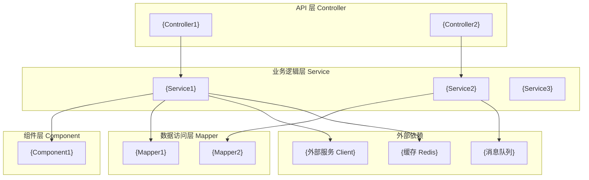
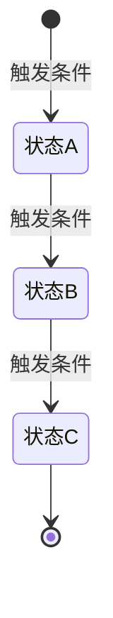

# {项目名称} — 架构能力分析

> **文档类型**：架构能力分析（Controller / Service / Mapper 三层）
> **生成方式**：基于 service 层自动分析 | **最后更新**：{YYYY-MM-DD}

---

## 快速索引

| 章节 | 内容 |
|------|------|
| [分层架构总览](#分层架构总览) | 各层职责与调用关系 |
| [Controller 层](#controller-层api-层) | 对外接口清单与职责 |
| [Service 层](#service-层业务逻辑层) | 业务接口清单与核心方法 |
| [Mapper 层](#mapperdao-层数据访问层) | 数据实体与查询能力 |
| [领域模型](#领域模型) | 核心实体 ER 图 |
| [组件层](#组件层) | 核心计算/通信组件 |
| [状态机](#状态机) | 核心实体状态流转 |

---

## 分层架构总览



---

## Controller 层（API 层）

### {Controller1}

**职责**：{一句话描述该 Controller 的职责范围}
**基础路径**：`/{base-path}`

| 方法 | 路径 | 入参 | 返回 | 说明 |
|------|------|------|------|------|
| POST | `/{endpoint1}` | `{RequestDto}` | `{ResponseDto}` | {说明} |
| POST | `/{endpoint2}` | `{RequestDto}` | `{ResponseDto}` | {说明} |

---

## Service 层（业务逻辑层）

> 格式：接口名 → 职责描述 → 核心方法（方法签名不含实现）

### {IService1}

**职责**：{该 Service 负责的业务域，1-2 句话}

**核心方法**：

| 方法名 | 参数 | 返回 | 说明 |
|--------|------|------|------|
| `{methodName}` | `{Param}` | `{Return}` | {说明} |

---

## Mapper/DAO 层（数据访问层）

| Mapper 接口 | 对应实体 | 关键查询能力 |
|-------------|---------|------------|
| `{Mapper1}` | `{Entity1}` | {按 XX 查询；批量查询；分页} |
| `{Mapper2}` | `{Entity2}` | {按 XX 查询} |

---

## 领域模型

```mermaid
erDiagram
    {Entity1} ||--o{ {Entity2} : "包含"
    {Entity1} ||--o{ {Entity3} : "产生"
    {Entity2} }o--o{ {Entity4} : "{关联表名}"
```

**核心实体说明**：

| 实体 | 对应表 | 说明 |
|------|--------|------|
| `{Entity1}` | `{table_name}` | {说明} |

---

## 组件层

| 组件名 | 职责 |
|--------|------|
| `{Component1}` | {职责描述} |
| `{Component2}` | {职责描述} |

---

## 状态机

### {核心实体} 状态流转


