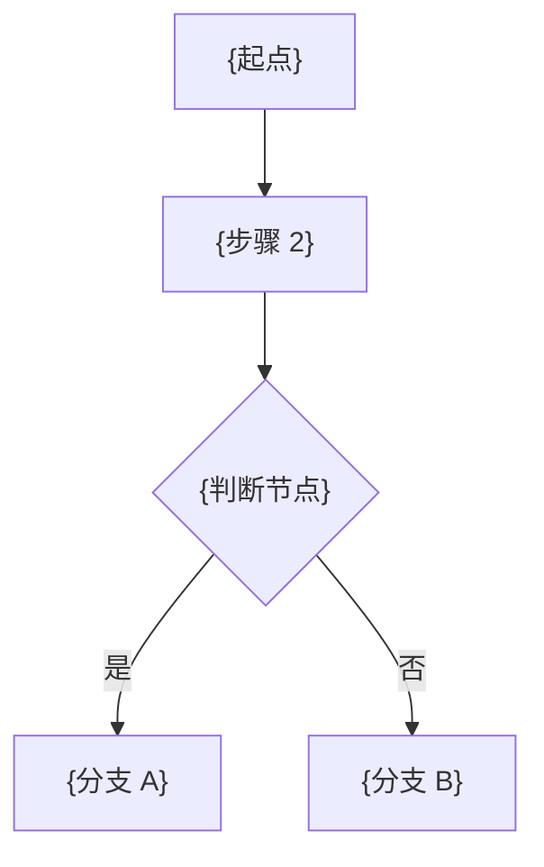
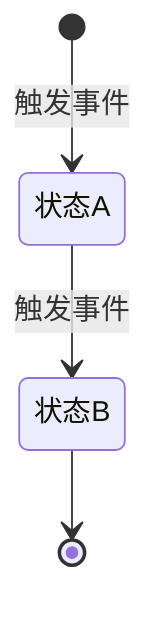

# {项目名称}

> {一句话描述：本服务是 XX 系统的 XX 核心服务，负责 XX 全生命周期管理}
>
> **文档类型**：项目概要 | **生成方式**：基于 service 层自动分析 | **最后更新**：{YYYY-MM-DD}

---

## 快速索引

| 章节 | 内容 |
|------|------|
| [项目定位](#项目定位) | 职责边界、所属系统 |
| [技术栈](#技术栈) | 语言、框架、中间件 |
| [业务能力](#业务能力) | 按业务域分组的功能清单 |
| [核心业务流程](#核心业务流程) | 主链路 Mermaid 流程图 |
| [外部依赖](#外部服务依赖) | 依赖的下游服务 |
| [消息事件](#消息事件) | 发布/订阅的事件列表 |
| [API 接口一览](#api-接口一览) | 对外 HTTP 接口清单 |

---

## 项目定位

**所属系统**：{系统名称}
**服务角色**：{服务提供者 / 消费者 / 聚合层}
**职责边界**：{本服务负责什么，明确不负责什么}

---

## 技术栈

| 类别 | 技术 | 版本 |
|------|------|------|
| 语言 | Java / Kotlin | {版本} |
| 框架 | Spring Boot | {版本} |
| 数据库 | {数据库} | - |
| 缓存 | Redis | - |
| 消息队列 | {MQ} | - |
| 服务发现 | {注册中心} | - |
| ORM | MyBatis / JPA | - |

---

## 业务能力

### {业务域 1：例如 订单管理}

- {能力 1}
- {能力 2}
- {能力 3}

### {业务域 2：例如 支付管理}

- {能力 1}
- {能力 2}

### {业务域 3：例如 退款管理}

- {能力 1}
- {能力 2}

---

## 核心业务流程

### {主流程 1 名称}

### {主流程 2 名称：状态机}

---

## 外部服务依赖

| 服务名 | 用途 |
|--------|------|
| {service-client-name} | {用途描述} |

---

## 消息事件

| 事件名 | 类型 | 说明 |
|--------|------|------|
| {EventName} | 发布/订阅 | {说明} |

---

## API 接口一览

### {Controller 名称} `/{base-path}`

| 方法 | 路径 | 说明 |
|------|------|------|
| POST | `/{endpoint}` | {说明} |
