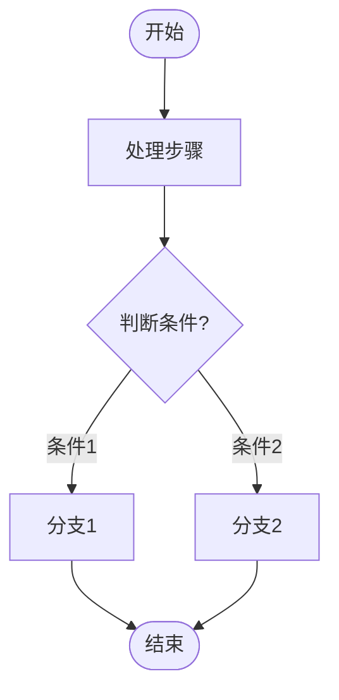
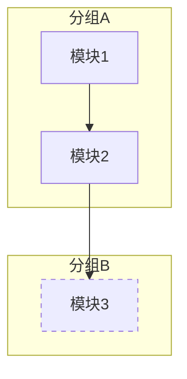
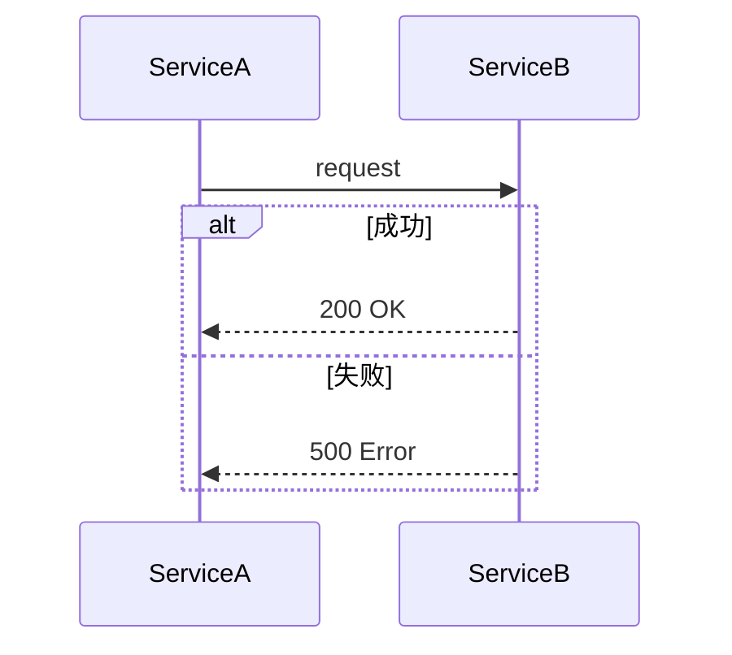
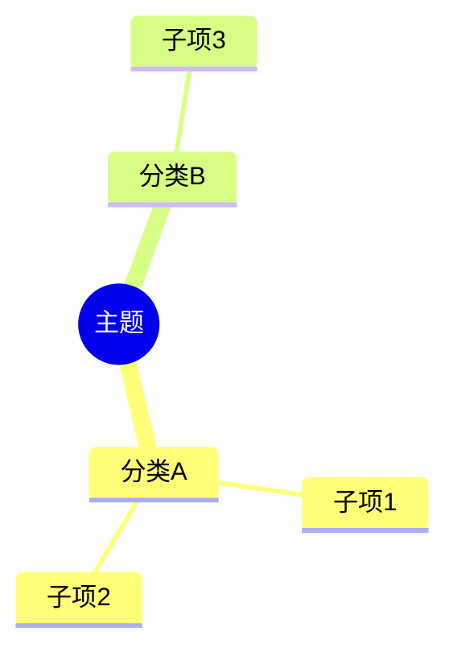
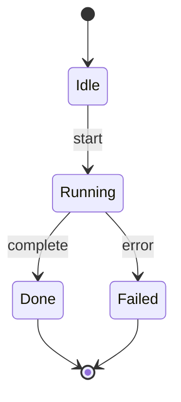
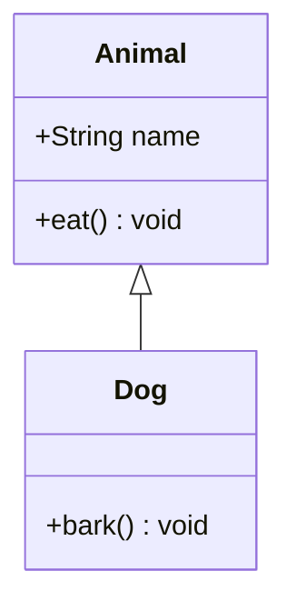

# Markdown 编写规范

## 概述

以下规则覆盖 Markdown 文档中的 Mermaid 图表、表格、代码块等结构化内容的编写规范。**生成任何包含 Mermaid 的 Markdown 内容时必须遵守，不得以任何理由绕过。**

<HARD-GATE>
在生成或修改任何 Mermaid 代码块之前，必须先完成本规范的检查。每个 Mermaid 代码块在写入文件前必须通过「第 1 节致命错误清单」的逐项排查。
</HARD-GATE>

---

## 1. Mermaid 致命错误清单

以下错误会导致 Mermaid 渲染器直接报错或产生乱图，**生成每个 Mermaid 代码块后必须逐项检查**：

### 1.1 禁止使用 Emoji

Mermaid 解析器不支持 Unicode Emoji 字符，包括但不限于：

| 禁止字符 | 替代写法 |
|---------|---------|
| 🆕 ✅ ❌ 🔧 ♻️ | `[新建]` `[已完成]` `[失败]` `[改造]` `[复用]` |
| 1️⃣ 2️⃣ 3️⃣ | `1.` `2.` `3.` |
| ⚠️ 🚀 📦 | `[警告]` `[启动]` `[包]` |

```
错误: A["🆕 新建模块"]
正确: A["新建模块"]
正确: A["模块A [新建]"]
```

### 1.2 特殊字符必须用引号包裹

节点文本中包含以下字符时，**整个文本必须用双引号包裹**：

- 中文括号 `（）`、中文逗号 `，`、中文分号 `；`
- 英文括号 `()`（与节点形状语法冲突）
- 冒号 `:`（与某些图类型关键字冲突）
- 斜杠 `/`、等号 `=`

```
错误: A{Planning: 需要规划？}
正确: A{"Planning: 需要规划?"}

错误: B[格式化输出（SSE/同步）]
正确: B["格式化输出 SSE/同步"]
```

### 1.3 `<br/>` 适用范围

| 图类型 | `<br/>` 支持 | 替代方案 |
|--------|-------------|---------|
| graph / flowchart 节点文本 | 支持 | - |
| sequenceDiagram 参与者/消息 | **不支持** | 用 `\n` 或缩短文本 |
| mindmap 节点 | **不支持** | 拆成子节点 |
| stateDiagram 状态名 | **不支持** | 用短名称 |
| subgraph 标题 | 支持 | - |
| 连线标签 `-->\|text\|` | **不支持** | 用短文本 |

### 1.4 mindmap 专项规则

mindmap 是 Mermaid 中语法最严格的图类型：

```
规则1: 缩进必须用空格，且同级节点缩进量一致（推荐 2 或 4 空格）
规则2: 节点文本中不能有冒号、括号等特殊字符
规则3: 节点文本不支持 <br/> 换行
规则4: 根节点用 root((文本)) 或 root(文本)
规则5: 如果节点文本包含特殊字符，需要移除或替换为普通文字
```

```
错误:
  mindmap
    root((系统架构))
      模块A: 用户管理
      模块B（订单）

正确:
  mindmap
    root((系统架构))
      模块A 用户管理
      模块B 订单
```

### 1.5 subgraph 命名规则

```
规则: subgraph 的显示名必须用双引号包裹，ID 用英文无空格
```

```
错误: subgraph 领域层 llm-domain
正确: subgraph Domain["领域层 llm-domain"]
```

### 1.6 连线标签规则

```
规则: 连线标签中包含特殊字符时，必须用双引号包裹
```

```
错误: A -->|达到 maxIterations 或 timeout| B
正确: A -->|"达到maxIterations或timeout"| B
```

### 1.7 sequenceDiagram 专项规则

```
规则1: 参与者名中不能包含 <br/> ，用短名 + alias 代替
规则2: 消息文本中的特殊字符需要注意转义
规则3: alt/opt/loop 块的描述文本保持简短
规则4: 尖括号 < > 在消息文本中需要用 HTML 实体或避免使用
```

```
错误:
  participant C as Controller<br/>(Agent/Secretary)

正确:
  participant C as Controller
  Note over C: Agent/Secretary
```

### 1.8 节点 ID 规则

```
规则: 节点 ID 只能包含字母、数字、下划线，不能以数字开头
```

```
错误: 1-input["Input"]
正确: INPUT["Input"]
正确: step1_input["Input"]
```

---

## 2. Mermaid 各图类型正确骨架

> 详细语法速查见辅助文件 `mermaid-syntax-ref.md`

### 2.1 flowchart（流程图）— 最常用



### 2.2 graph（模块关系图）



### 2.3 sequenceDiagram（时序图）



### 2.4 mindmap（思维导图）



### 2.5 stateDiagram（状态图）



### 2.6 classDiagram（类图）



---

## 3. Mermaid 自检清单

**每个 Mermaid 代码块写入文件前，必须逐项确认：**

- [ ] 无 Emoji 字符（搜索所有 Unicode Emoji）
- [ ] 含特殊字符的节点文本已用双引号包裹
- [ ] 节点 ID 仅含字母、数字、下划线
- [ ] subgraph 使用 `ID["显示名"]` 格式
- [ ] `<br/>` 仅用在 flowchart/graph 节点文本中
- [ ] mindmap 节点文本无冒号、括号等特殊字符
- [ ] sequenceDiagram 参与者名无 `<br/>`
- [ ] 连线标签中有特殊字符时已用双引号包裹
- [ ] 缩进一致（同级节点对齐）

---

## 4. 表格编写规范

### 4.1 何时用表格 vs 列表

| 场景 | 推荐格式 |
|------|---------|
| 多维度对比（每项有 2+ 属性） | 表格 |
| 简单枚举（每项只有名称和描述） | 列表 |
| 配置项说明（字段/类型/默认值/说明） | 表格 |
| 步骤流程（有先后顺序） | 有序列表 |

### 4.2 表格格式规则

- 表头必须有分隔行（`|---|---|`）
- 每列对齐方式：左对齐 `|:---|`、居中 `|:---:|`、右对齐 `|---:|`
- 单元格内容不换行，过长内容用简写 + 脚注
- 表格前后各空一行

---

## 5. 代码块编写规范

### 5.1 语言标注

- 所有代码块必须标注语言：` ```java `、` ```sql `、` ```mermaid `
- 纯文本输出用 ` ```text `，不要用无标注的 ` ``` `
- 配置文件：` ```yaml `、` ```json `、` ```properties `

### 5.2 代码块内容

- 代码块中不要包含行号（由渲染器自动添加）
- Java 代码块中包含完整的 package 和 import 声明（接口设计章节）
- SQL 代码块中关键字大写：`SELECT`、`FROM`、`WHERE`

---

## 6. 标题与文档结构规范

### 6.1 标题层级

- `#` 仅用于文档标题，全文只出现一次
- `##` 用于一级章节编号：`## 1. 基本信息`
- `###` 用于二级章节：`### 1.1 子章节`
- `####` 用于三级章节（尽量避免超过 4 级）

### 6.2 章节之间

- 一级章节（`##`）之间用 `---` 分隔线
- 二级章节（`###`）之间用空行分隔，不加分隔线
- 章节标题后必须有一个空行再写内容

### 6.3 目录结构复核（TOC Review — 结构性改动完成后必过一遍）

<HARD-GATE>
完成 Markdown 文件的写入或较大范围修改后（首次创建、章节新增/删除、章节移动/合并/重组），必须先过一遍目录复核，再把文件视为完成。不得跳过。
</HARD-GATE>

#### 6.3.1 触发条件

以下任一情况触发一次目录复核：

- 新建任何结构化 Markdown 文件（非单段说明性短文）
- 对现有 Markdown 文件新增、删除或重命名 `##` / `###` 章节
- 对现有 Markdown 文件做章节移动、合并、拆分、重组

轻微修改（段落文字调整、错别字、补充代码示例、列表项增减）**无需**触发。

#### 6.3.2 复核步骤

**第一步：列出当前目录快照**

用 Grep 列出所有 `^## ` 与 `^### ` 行，形成当前 TOC 快照，肉眼扫一遍整体结构。

**第二步：对照下表逐项排查**

| 检查项 | 问题信号 | 处理方式 |
|-------|---------|---------|
| 分类混杂 | 平坦章节列表里混入不同性质的内容（如搭建 / 日常开发 / 报错排查 / 附录 都挤在同级 `##` 下） | 拆成 Part I/II/III 或按场景分组，顶部加读者分流导航 |
| 内容重复 | 两个章节内容高度重叠或标题语义相近 | 合并，只保留一份，另一份用锚点链接指向 |
| 标题重复 | 同一文件多个章节用完全相同的标题（多个"配置"/"说明"/"示例"/"错误现象"） | 加唯一前缀（"X 的配置"/"Y 的配置"），或按父子关系下沉到更深层级 |
| 层级断层 | 出现 `##` 直接跳到 `####`，中间缺 `###` | 补全中间层级，或把深层标题降级为粗体段落 |
| 编号错乱 | 手动编号的章节顺序/数字对不上（如"1. xxx / 3. yyy"） | 重新编号，或统一改为无编号 |
| 命名风格不统一 | 兄弟章节有的带编号、有的不带；有的描述性、有的纯名词 | 统一为一种风格 |
| 单章节超长 | 某个 `##` 的内容超过全文 40%，读者难以定位子部分 | 拆成多个平级章节，或下沉到子文档并在原处留链接 |
| 交叉引用失效 | 正文提到"见第 N 节" / "详见 Y" / markdown 锚点链接，但编号已变或锚点已失效 | 全文扫描所有"第 X 节 / Section Y / 详见 Z / `#anchor`"，同步更新 |
| 超过 4 级嵌套 | 出现 `#####` 及以上 | 降级为列表项或粗体段落，或把父章节拆出平级章节 |

**第三步：判断是否需要顶部「快速导航」**

出现以下信号之一时，顶部加一个快速导航块，让不同身份的读者直接跳转：

- `##` 章节数 ≥ 8
- 读者有明显分类（新人 vs 老手、开发 vs 排错、前端 vs 后端）
- 部分章节是独立速查条目（如错误速查表、命令速查表）

导航块示例：

````markdown
## 快速导航

- **新人入职 / 首次搭建** → [Part I. 环境搭建](#part-i-环境搭建)
- **日常开发** → [Part II. 开发流程](#part-ii-开发流程)
- **报错排查** → [Part III. 报错速查](#part-iii-报错速查)
````

#### 6.3.3 复核自检清单

文件写入前必须逐项确认：

- [ ] 章节按语义分类组织，同类聚集（非散乱平列）
- [ ] 无重复或近义标题（或已加唯一前缀做区分）
- [ ] 无层级断层（`##` → `####` 之间必有 `###`）
- [ ] 手动编号连续且顺序正确（或统一去编号）
- [ ] 兄弟章节命名风格一致（全带编号 / 全不带；全描述句 / 全名词）
- [ ] 所有"见第 X 节 / Section Y / 详见 Z"交叉引用指向真实存在的章节
- [ ] 所有 markdown 锚点链接（`[文本](#anchor)`）的 anchor 与当前标题匹配
- [ ] 章节数 ≥ 8 的文档顶部有快速导航
- [ ] 最终层级不超过 4 级（h4），更深的已下沉为列表/段落

---

## 7. 与其他 Skill 的协作关系

| Skill | 协作方式 |
|-------|---------|
| `design-doc-required` | 设计文档中的 Mermaid 图表必须遵守本规范；设计文档要求哪些图是必须的由 design-doc-required 决定，图怎么写由本规范决定 |
| `bug-doc-required` | Bug 文档中的调用链 Mermaid 图遵守本规范 |
| `init-project-docs` | 项目文档中的架构图遵守本规范 |

**职责分工：**
- **其他 Skill** 决定「要画什么图」「在文档的哪个章节」
- **本 Skill** 决定「图怎么画才不出错」

---

## 红色警告

以下想法出现时立即停止，回到自检清单：

| 想法 | 正确处理 |
|------|---------|
| "加个 Emoji 更直观" | Mermaid 不支持 Emoji，用文本标记替代 |
| "这个图很简单，不用检查" | 越简单越容易忽略引号包裹 |
| "mindmap 里加个冒号分隔" | mindmap 不支持冒号，用空格或拆子节点 |
| "用 `<br/>` 换行更好看" | 先确认图类型是否支持 |
| "节点名用中文更清楚" | 中文节点名可以，但 ID 必须用英文 |
