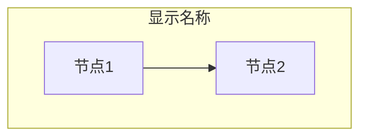
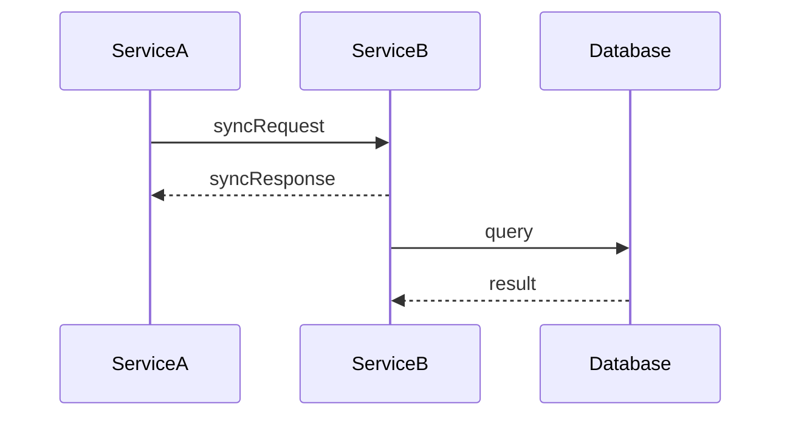
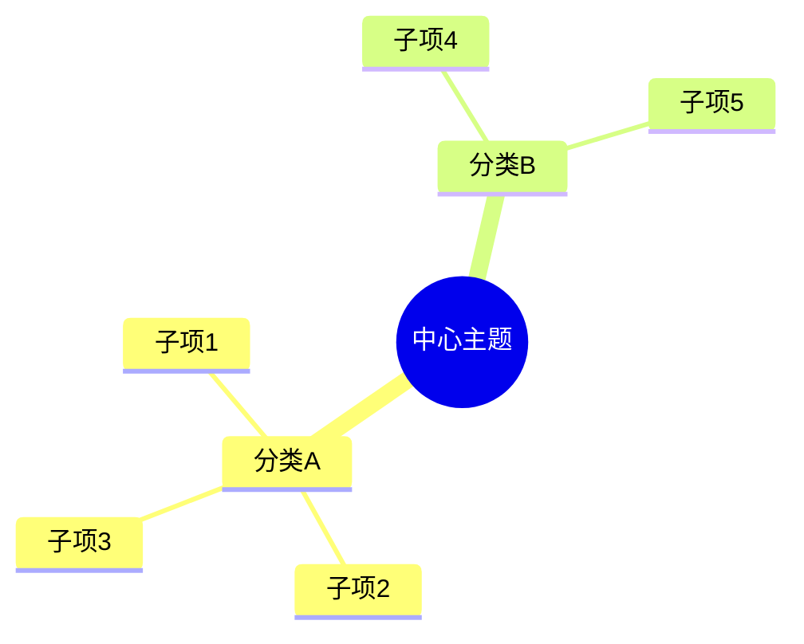
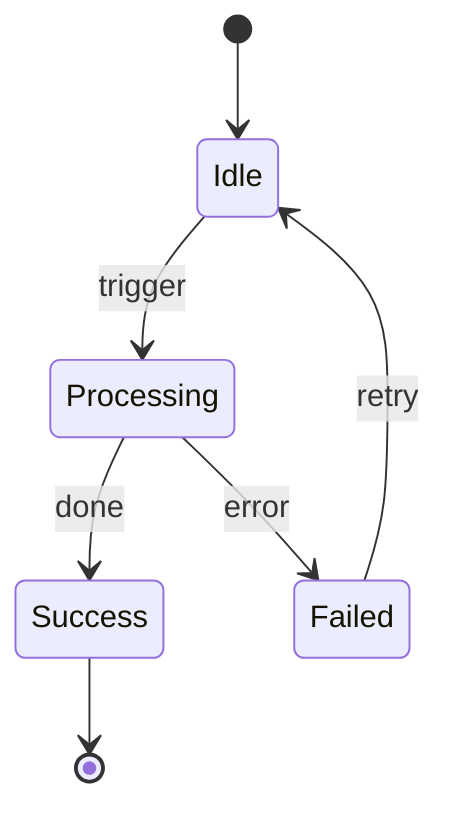
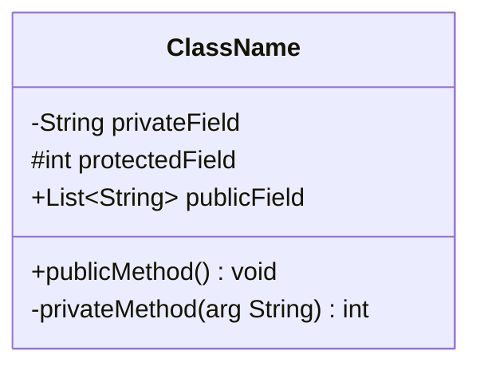

# Mermaid 语法速查手册

> 本文件为 `markdown-writing-standards` 的辅助资源，供生成 Mermaid 图表时快速查阅。

---

## 1. flowchart / graph

### 节点形状

```
A["矩形"]         ← 最常用，双引号包裹文本
B("圆角矩形")
C(["体育场形"])    ← 常用于 开始/结束
D{"菱形"}          ← 判断/条件
E[/"平行四边形"/]
F[("圆柱形")]      ← 数据库
G(("圆形"))
H{{"六边形"}}
```

### 连线类型

```
A --> B            实线箭头
A --- B            实线无箭头
A -.-> B           虚线箭头
A -.- B            虚线无箭头
A ==> B            粗线箭头
A -->|"标签"| B    带标签的连线（特殊字符需引号）
A -- "标签" --> B  另一种带标签写法
```

### subgraph



- ID 必须英文无空格
- 显示名必须双引号包裹
- `end` 关键字独占一行

### 样式

```
style A fill:#e1f5fe,stroke:#333,stroke-width:2px
style B stroke-dasharray: 5 5                      ← 虚线边框

classDef highlight fill:#ff0,stroke:#333
class A,B highlight                                ← 批量应用样式
```

### 方向

| 关键字 | 方向 |
|--------|------|
| `TD` / `TB` | 上到下 |
| `BT` | 下到上 |
| `LR` | 左到右 |
| `RL` | 右到左 |

---

## 2. sequenceDiagram

### 基础结构



### 消息类型

```
A->>B: text        实线实箭头（同步请求）
A-->>B: text       虚线实箭头（同步响应）
A-)B: text         实线开箭头（异步消息）
A--)B: text        虚线开箭头（异步响应）
```

### 控制块

```
alt 条件描述
    A->>B: 分支1
else 其他条件
    A->>B: 分支2
end

opt 可选条件
    A->>B: 可选操作
end

loop 循环描述
    A->>B: 重复操作
end

par 并行描述
    A->>B: 操作1
and
    A->>C: 操作2
end
```

### Note

```
Note over A: 单参与者备注
Note over A,B: 跨参与者备注
Note left of A: 左侧备注
Note right of A: 右侧备注
```

---

## 3. mindmap

### 基础结构



### 关键限制

- **缩进决定层级**：必须用空格，同级缩进量一致
- **节点文本纯净**：不支持 `<br/>`、冒号、括号等特殊字符
- **根节点形状**：`root((圆形))` 或 `root(圆角)` 或 `root[方形]`
- **不支持连线标签**：层级关系由缩进自动推断
- **不支持样式**：无法用 style 或 classDef

### 节点形状（Mermaid v10.9+）

```
根节点:     root((圆形))
方形:       id["文本"]  或直接写文本
圆角:       id("文本")
爆炸形:     id))"文本"((
云朵形:     id)"文本"(
六边形:     id{{"文本"}}
```

> 注意：并非所有渲染器都支持 mindmap 节点形状，**推荐使用纯文本节点**以保证兼容性。

---

## 4. stateDiagram-v2

### 基础结构



### 复合状态

```
state "复合状态名" as Composite {
    [*] --> SubA
    SubA --> SubB
    SubB --> [*]
}
```

### 分支与合并

```
state fork_state <<fork>>
state join_state <<join>>

Idle --> fork_state
fork_state --> TaskA
fork_state --> TaskB
TaskA --> join_state
TaskB --> join_state
join_state --> Done
```

### Note

```
Idle: 这是状态描述
note right of Idle: 这是备注
```

---

## 5. classDiagram

### 基础结构



### 可见性符号

| 符号 | 含义 |
|------|------|
| `+` | public |
| `-` | private |
| `#` | protected |
| `~` | package |

### 关系类型

```
A <|-- B           继承（B extends A）
A <|.. B           实现（B implements A）
A *-- B            组合
A o-- B            聚合
A --> B            关联
A ..> B            依赖
A -- B             链接
```

### 泛型

```
class List~T~ {
    +add(item T) void
    +get(index int) T
}
```

> 注意：Mermaid 中泛型用 `~T~` 表示，不能用 `<T>`（尖括号会被解析为 HTML）

---

## 6. 通用注意事项

### 字符转义速查

| 字符 | 问题 | 解决方案 |
|------|------|---------|
| `"` | 与节点文本引号冲突 | 用 `&quot;` 或避免使用 |
| `<` `>` | 被解析为 HTML | 用 `&lt;` `&gt;` 或避免使用 |
| `#` | 部分上下文被解析为注释 | 用 `&num;` 或用引号包裹 |
| `&` | 被解析为 HTML 实体开始 | 用 `&amp;` |
| `{}` | 与节点形状语法冲突 | 用引号包裹整个文本 |

### 常见渲染器差异

| 特性 | GitHub | GitLab | VS Code Preview | Typora |
|------|--------|--------|-----------------|--------|
| mindmap | 支持 | 支持 | 需插件 | 支持 |
| stateDiagram-v2 | 支持 | 支持 | 需插件 | 支持 |
| classDiagram | 支持 | 支持 | 需插件 | 支持 |
| 主题/样式 | 有限 | 有限 | 完整 | 完整 |
| `<br/>` 换行 | 支持 | 支持 | 支持 | 支持 |
