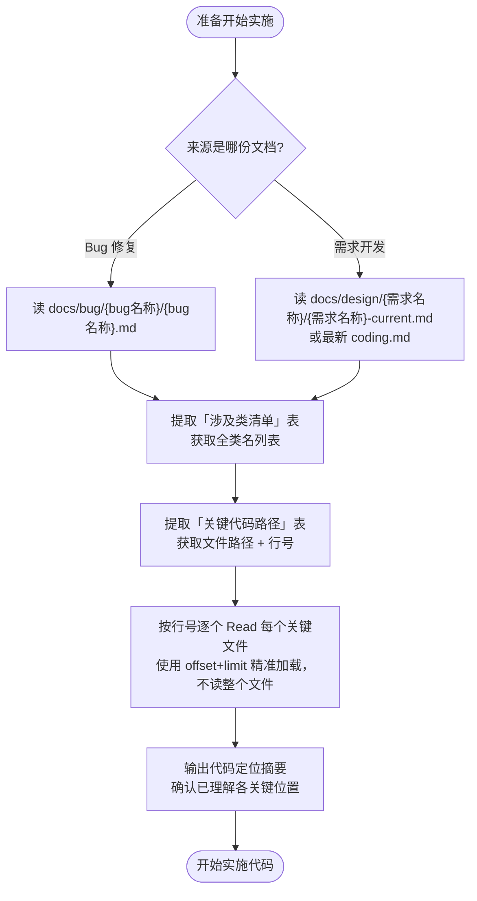

# 实施前代码定位

## 核心原则

**分析/设计阶段已将代码坐标固化在文档中。实施阶段必须先消费这些坐标，禁止重新扫描。**

---

## 执行流程



---

## 执行步骤详解

### 第一步：确认来源文档

询问或从上下文判断本次实施对应的是：
- Bug 修复 → `docs/bug/{bug名称}/{bug名称}.md`
- 需求开发 → `docs/design/{需求名称}/` 下的 `current.md` 或最新 `coding.md`

### 第二步：提取涉及类清单

从文档的「涉及类清单」表读取所有全类名，转换为文件路径：

```
全类名 → 文件路径规则：
com.kpaygroup.pos.order.modules.service.v1.impl.OrderV1ServiceImpl
    → kpay-pos-order-manage-server/src/main/java/
      com/kpaygroup/pos/order/modules/service/v1/impl/OrderV1ServiceImpl.java
```

### 第三步：提取关键代码路径

从文档的「关键代码路径」表读取每一行的：
- 文件路径
- 行号
- 说明（理解该位置的重要性）

### 第四步：按坐标精准 Read

对每个关键位置，使用 `offset` + `limit` 加载目标行附近的代码：

```
行号 5642，读前后 50 行：
  Read(file, offset=5620, limit=80)
```

**不允许读整个文件**，除非文件本身很小（小于 100 行）。

### 第五步：输出代码定位摘要

完成所有 Read 后，输出如下格式的摘要，再开始实施：

```
已定位代码，关键位置确认：

1. OrderV1ServiceImpl:5616  queryOrderAllDataToB() — 入口，调用 queryOrderToB 后进 handleOrderRelationData
2. OrderV1ServiceImpl:5642  handleOrderRelationData() — 核心问题方法，10个并行Future + allOf.join()
3. PosOrderMapper.kt:184    queryOrderToB() — 主订单查询，无 deleted 过滤，无数据量上限
4. PosOrderMapperExtend.xml:798  queryOrderToB SQL — WHERE store_id AND order_time BETWEEN，缺索引风险

准备实施：[修复方案简述]
```

---

## 禁止行为

| 行为 | 原因 |
|---|---|
| 跳过本 skill 直接开始写代码 | 文档中已有坐标，重复扫描是浪费 |
| 用 Glob/Grep 重新搜索已在文档中的类 | 文档的涉及类清单就是为了避免这一步 |
| 读整个大文件 | 用 offset+limit 精准加载，保护上下文窗口 |
| 凭记忆判断代码位置 | 代码可能已被他人修改，必须实际 Read 确认 |

---

## 与其他 Skill 的位置关系

```
bug-doc-required / design-doc-required
        ↓ 文档写完，坐标已固化
pre-implementation-code-orientation   ← 本 skill
        ↓ 代码已定位，上下文已加载
java-coding-standards（开始写代码）
        ↓
git-commit-standards（提交）
```
