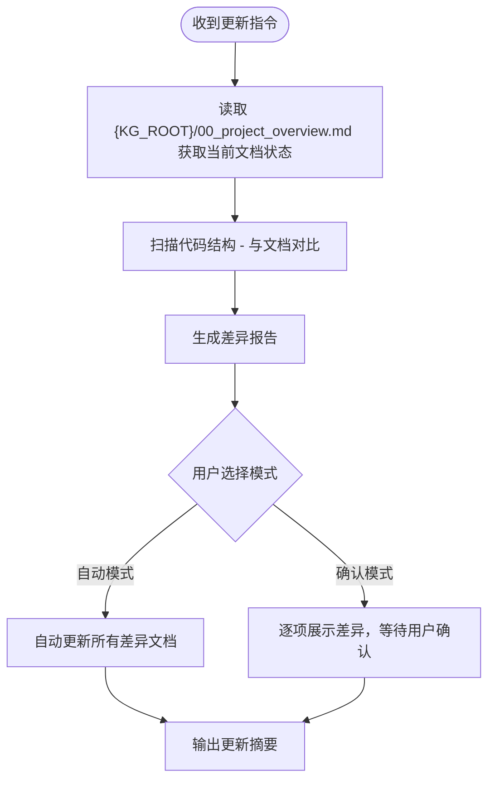

# 知识图谱持续维护

## 触发场景

用户说以下任意一种时，**必须**调用本 skill：
- 更新项目文档 / update project docs
- 同步知识图谱 / sync knowledge graph
- 文档和代码不一致了
- 帮我检查文档是否过时

**智能提醒**（非强制，建议性触发）：
- 当 `git-commit-standards` 检测到 commit 涉及新增 Controller/Service/Mapper/Entity 时，提醒用户运行本 skill
- 当 `design-doc-required` 的设计文档涉及新增模块时，提醒用户初始化模块文档

---

## 前置条件

用户目录知识库 `{KG_ROOT}/`（= `{USER_DOCUMENTS}/ai-docs/{project}/`）下已存在知识图谱文档（通过 `init-project-docs` 生成）。
若 `{KG_ROOT}/00_project_overview.md` 不存在，提示用户先运行 `init-project-docs`。

> 知识图谱统一存放在用户目录知识库，不再写入项目 `docs/`。下文 `{KG_ROOT}/` 一律指 `{USER_DOCUMENTS}/ai-docs/{project}/`。

---

## 执行流程



---

## 差异检测规则

### 检测项 1：模块变更

**扫描**：Controller/Service 包结构（Java）或 features/ 目录（Flutter）
**对比**：`{KG_ROOT}/02_module_map.md`
**触发更新条件**：
- 新增了模块（包/目录）但文档未记录
- 文档记录的模块在代码中已不存在
- 模块状态发生变化（如从 ⚠️ 变为 ✅）

### 检测项 2：API 变更

**扫描**：Controller 层的 `@RequestMapping` 等注解
**对比**：`{KG_ROOT}/05_api_map.md`
**触发更新条件**：
- 新增了 API 端点但文档未记录
- 已有端点的路径/方法/参数发生变化
- 端点被删除但文档仍存在

### 检测项 3：数据模型变更

**扫描**：Entity/Model 类、Mapper XML、建表语句
**对比**：`{KG_ROOT}/04_data_model_map.md`
**触发更新条件**：
- 新增了数据表/实体但文档未记录
- 已有表新增或删除了字段
- 字段类型或约束发生变化

### 检测项 4：前后端映射变更

**扫描**：综合 Controller + 前端页面/路由
**对比**：`{KG_ROOT}/06_frontend_backend_mapping.md`
**触发更新条件**：
- 新页面引用了已有接口
- 接口被新的页面使用

### 检测项 5：架构约束一致性

**扫描**：项目实际的分层结构和依赖关系
**对比**：`{KG_ROOT}/08_constraints_and_rules.md`
**触发更新条件**：
- 项目采用了新的架构模式
- 命名规范发生变化

---

## 输出格式

### 差异报告

| 文档 | 变更类型 | 具体内容 | 优先级 |
|---|---|---|---|
| `02_module_map.md` | 新增 | 发现新模块 {name} 未记录 | 高 |
| `05_api_map.md` | 新增 | POST /api/xxx 未记录 | 高 |
| `04_data_model_map.md` | 变更 | {table}.{field} 类型已变更 | 中 |

### 更新摘要

```
扫描完成：
- 检查文档数：{N}
- 需要更新：{N} 份
- 已自动更新：{N} 份
- 需人工确认：{N} 份（业务流程/术语类文档）
```

---

## 自动 vs 确认模式

| 文档 | 默认模式 | 原因 |
|---|---|---|
| `02_module_map.md` | 自动 | 可从代码结构推断 |
| `04_data_model_map.md` | 自动 | 可从 Entity/DDL 推断 |
| `05_api_map.md` | 自动 | 可从 Controller 注解推断 |
| `06_frontend_backend_mapping.md` | 自动 | 可从代码引用关系推断 |
| `00_project_overview.md` | 确认 | 项目定位需人工判断 |
| `03_business_flow_map.md` | 确认 | 业务流程需人工确认 |
| `07_glossary.md` | 确认 | 术语含义需人工确认 |
| `08_constraints_and_rules.md` | 确认 | 架构规则需人工决策 |
| `09_refactor_plan.md` | 确认 | 重构计划需人工决策 |
| `10_change_log.md` | 自动 | 追加格式固定 |

---

## Mermaid 语法规范

> 来源：caseflow Mermaid 规范

- 节点/边标签含 `=`、`,`、`/`、`<`、`>`、`(`、`)`、`[`、`]`、`:` 时**必须加引号**
- `<` `>` 改用文字
- 不使用 emoji
- `classDiagram` 方法名不含中文

---

## 与其他 Skill 的关系

- **不触发** `design-doc-required`（本 skill 属于文档维护类，非开发类）
- 更新 `{KG_ROOT}/` 下文件后，自动触发 `doc-index-required` Phase-B 更新索引
- 可被 `init-project-docs` 的后续维护阶段调用
