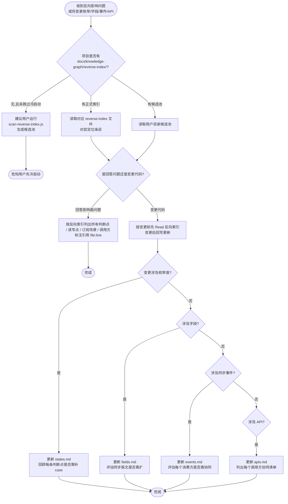

# 反向影响索引强制维护

## 定位

**本 skill 是 AI Agent 回答「新增 / 修改 X 会破坏哪些旧逻辑」类反向影响问题的唯一权威源。** 没有它,AI 只能临时全仓 grep,不仅慢、还会漏掉隐式判断点(如 SQL where 条件中的字面量、字符串比较、配置文件)。反向索引把这些"代码里的隐式知识"显式化,是 PRD/设计 → 工时 + 影响面分析智能体的命门。

目标:让 AI 在分析任何"新增状态 / 加字段 / 加事件 / 加 API"类需求前先回答清楚——

- **states**:这个枚举值在代码里有哪些 if / switch / SQL where / equals 判断点?新增态时哪些点必须补判断?
- **fields**:这个字段在代码里有哪些读 / 写点?加字段后是否需要扩同步报文?哪些 SQL 要扩 select / insert?
- **events**:这个同步事件订阅了哪些业务场景?新业务场景需要不需要触发?报文字段够不够?
- **apis**:这个 API 被哪些方调用?改 API 出参 / 入参时哪些调用方需要协同?

不处理:表关系 / SQL 查询逻辑(走 `backend-knowledge-graph-required`)、业务术语映射(走 `glossary-required`)。

---

## BLOCKING 触发清单(写前 / 答前拦截)

| 触发场景 | 命中信号 | 必做动作 |
|---|---|---|
| **用户问反向影响类问题** | 「加这个状态会破坏哪些旧逻辑」「这个字段哪里在用」「事件订阅清单」「这个 API 谁在调」「改这个会影响什么」 | 先读对应 reverse-index/{states\|fields\|events\|apis}.md 给出引用清单,再回答 |
| **AI 即将 Edit/Write 枚举定义文件** | 文件含 `enum SomeStatus { ... }` 或 Java enum 类、TS const enum | 先读 `states.md` 看有哪些判断点;改完后必同步更新 |
| **AI 即将 Edit/Write DTO/Entity 字段定义** | 新增 / 删除 / 重命名字段、改字段类型 | 先读 `fields.md` 看读写点;改完后必同步 |
| **AI 即将 Edit/Write 同步事件 payload 定义** | 改 SyncEvent / Event 类、改 MQ message 结构、改同步报文 | 先读 `events.md` 看订阅场景;改完后必同步 |
| **AI 即将 Edit/Write API endpoint 定义** | 新增 / 修改 / 删除 Controller endpoint、Spring `@RequestMapping` 等 | 先读 `apis.md` 看调用方;改完后必同步 |
| **AI 完成 ≥1 项以上变更后** | 上述 4 类变更落地后 | 同回合内必更新对应反向索引 |
| **项目存在反向索引文件** | `docs/knowledge-graph/reverse-index/` 或 `ai-docs/{project}/knowledge-graph/reverse-index/_candidates.md` | 编码前必读;变更后必回写 |
| **用户主动要求** | 「建反向索引」「扫反向影响」「生成 reverse index」「冷启动反向索引」 | 引导跑 `hooks/scan-reverse-index.js` 后再人工修订 |

> **常见误判反例**:
> - ❌ "我用 grep 现场扫一下就行,不用建反向索引" → **错**,grep 漏字符串字面量、SQL where 条件、配置文件;反向索引必须显式登记
> - ❌ "只是改一个字段类型,不影响业务,不用更新反向索引" → **错**,字段类型改了读写点的解析逻辑可能受影响,必须同步
> - ❌ "项目没建反向索引,所以 skill 不适用" → **错**,没建就先跑冷启动扫描脚本生成候选池
> - ❌ "这个改动是跨服务的,反向索引不用建" → **错**,**单服务内**的反向影响仍走本 skill;服务间调用方在本服务侧的 `apis.md` 仍要登记
> - ❌ "新增枚举值不破坏旧逻辑,因为旧代码不会命中新值" → **错**,这正是反向索引要回答的问题——旧代码的 `default:` 分支、漏 case、SQL `IN (...)` 列表都可能因新值出错,必须显式扫描

---

## 4 类反向索引文件结构

每类索引一个文件,落在以下路径(双轨):

```text
# 候选池(默认,日常会话级)
{USER_DOCUMENTS}/ai-docs/{project}/knowledge-graph/reverse-index/_candidates.md
{USER_DOCUMENTS}/ai-docs/{project}/knowledge-graph/reverse-index/states.md
{USER_DOCUMENTS}/ai-docs/{project}/knowledge-graph/reverse-index/fields.md
{USER_DOCUMENTS}/ai-docs/{project}/knowledge-graph/reverse-index/events.md
{USER_DOCUMENTS}/ai-docs/{project}/knowledge-graph/reverse-index/apis.md

# 正式版(用户明确要求"上传终版"或项目已有正式索引时)
{project}/docs/knowledge-graph/reverse-index/states.md
{project}/docs/knowledge-graph/reverse-index/fields.md
{project}/docs/knowledge-graph/reverse-index/events.md
{project}/docs/knowledge-graph/reverse-index/apis.md
```

### states.md(枚举/状态值反向索引)

每个枚举类一个 H2,枚举值表格:

```markdown
## OrderStatus(订单状态)

定义位置:`src/main/java/com/example/order/OrderStatus.java`

| 枚举值 | 判断点(file:line) | 判断语义 | 新增态时是否需要补判断 |
|---|---|---|---|
| PENDING | `OrderService.java:142` (canCancel) | 仅 PENDING 可取消 | 是(新中间态可能也需要可取消) |
| PAID | `OrderService.java:178` (canRefund) | 仅 PAID 可发起退款 | 是 |
| PAID | `OrderSyncJob.java:88` (shouldSync) | 仅 PAID 触发订单同步到云端 | 是 |
| PAID | `OrderQueryDao.java:55` SQL `WHERE status = 'PAID'` | 报表只统计 PAID 订单 | 是(新成功态可能也要纳入统计) |
```

**关键约束**:
- 每行必须带 `file:line`,Read 可达
- "判断语义"要写**业务规则**,不是重复代码
- "新增态时是否需要补判断"是 AI 后续答影响面问题的核心字段,必填

### fields.md(字段读写点反向索引)

每个表 / Entity 一个 H2,字段表格:

```markdown
## order 表 / `Order` 实体

定义位置:`src/main/resources/ddl/order.sql` + `Order.java`

| 字段名 | 读点(file:line) | 写点(file:line) | 同步报文是否包含 | 备注 |
|---|---|---|---|---|
| `total_amount` | `OrderReport.java:42` 报表汇总 | `OrderService.java:88` 创建订单 / `RefundService.java:120` 退款扣减 | 是(OrderSyncEvent.totalAmount) | 改字段需同步报表口径与云端报文 |
| `currency` | `OrderExportService.java:33` 导出 | `OrderCreateService.java:55` 默认 CNY | 否 | 加字段时若涉及多币种需扩同步 |
```

### events.md(同步事件反向索引)

每个事件类型一个 H2:

```markdown
## OrderSyncEvent(订单云端同步事件)

事件定义:`src/main/java/com/example/sync/OrderSyncEvent.java`

**订阅场景**:
- 创建订单成功后 — `OrderCreateService.java:200` 触发
- 订单完成后 — `OrderCompleteService.java:88` 触发
- 订单作废后 — `OrderVoidService.java:55` 触发

**报文字段**:`orderId, totalAmount, status, createdAt`

**消费方**:
- 云端 / `cloud-order-receiver` 接口 `/api/order/sync`
- 报表服务 / `report-service` 订阅 MQ topic `order.sync`

**新业务场景接入清单(回答"新场景是否需要扩订阅"的关键)**:
- ✅ 已覆盖:订单创建 / 完成 / 作废
- ❌ 未覆盖:订单退款 / 订单部分退款(目前走 `RefundSyncEvent`)
- ⚠️ 可能需扩展:订单改价 / 订单超时关闭(尚未上线,新增时需评估)

**报文字段缺漏审视**:加新字段时,云端 receiver 是否能识别?若否,需先扩 receiver 再扩报文。
```

### apis.md(API 调用方反向索引)

每个 API 一个 H2:

```markdown
## POST /api/order/refund

定义位置:`OrderRefundController.java:45`

**请求**:`RefundRequest { orderId, amount, channel }`
**响应**:`RefundResponse { refundFlowId, status }`

**调用方**:
- 前端 H5（经网关转发）`/refund/submit` — 用户主动退款
- 内部聚合层 / `order-aggregate-service` `/refund/proxy` — 透传调用
- 定时任务 / `RefundRetryJob.java:120` — 失败重试

**入参 / 出参变更影响**:
- 改 `RefundRequest`:前端 H5 + 聚合层必须同步;聚合层透传不改字段名时无感
- 改 `RefundResponse`:前端 + 聚合层都要协同

**幂等性**:`orderId + amount + channel` 哈希作为幂等键,重复提交返回原退款流水
```

---

## 候选池 `_candidates.md` 格式

冷启动扫描脚本未覆盖的部分(字符串字面量、SQL `IN ('A','B')`、配置文件)由本 skill 在会话中发现时手工追加:

```markdown
# {project} 反向索引候选池

| 类型 | 主键 | 待补充信息 | 来源 | 备注 |
|---|---|---|---|---|
| state | OrderStatus.PAID | 判断点 `OrderExportService.java:88` SQL `IN ('PAID','REFUNDED')` | 用户提问中发现 | 扫描脚本未识别 SQL 字符串字面量 |
| event | OrderSyncEvent | 新订阅场景:订单改价 | 设计文档评审 | 实现完成后补到 events.md |
```

---

## 冷启动扫描脚本

```bash
# 扫描整个项目
node ${CLAUDE_PLUGIN_ROOT}/hooks/scan-reverse-index.js --project=. --output=./docs/knowledge-graph/reverse-index/

# 仅扫描特定语言
node ${CLAUDE_PLUGIN_ROOT}/hooks/scan-reverse-index.js --project=. --lang=java
node ${CLAUDE_PLUGIN_ROOT}/hooks/scan-reverse-index.js --project=. --lang=ts

# 输出到用户目录候选池
node ${CLAUDE_PLUGIN_ROOT}/hooks/scan-reverse-index.js --project=. --output=user-candidates
```

**扫描器能力(V1)**:
- 识别 Java / TS 中的 enum 定义
- 识别 enum 引用点(`EnumName.VALUE`)
- 识别 switch case / if / equals 判断
- 识别 SQL where 字面量(单引号字符串 + 已知枚举值的字面对应)
- 输出结构化 markdown 到 4 个反向索引文件

**扫描器局限(V1,需人工补)**:
- 不识别动态枚举(运行时根据配置生成)
- 不识别字段在配置文件 / properties / yaml 的引用
- 不识别同步事件订阅关系(需人工标注)
- 不识别服务间调用方(需人工补到本服务侧 `apis.md` 候选区)
- **不识别 Java / Kotlin / TS switch case 内部裸值**(`case PAID:` 形式省略了 enum 前缀,只识别 `EnumName.PAID` 形式);请人工补到候选区
- 不识别枚举的 `name()` / `valueOf()` / `Enum.values()` 反射式判断
- SQL 字面量识别仅匹配单引号 `'PAID'` 加常见 where/in/select 语境,有假阴性

V2 计划:增加 AST 解析(基于 ts-morph / java-parser),提升识别精度。

---

## 增量维护规则

冷启动后,反向索引必须随代码改动**同回合**更新。规则:

| 改动类型 | 必更新文件 | 更新动作 |
|---|---|---|
| 新增枚举值 | `states.md` | 在该枚举 H2 下新增行,**「新增态时是否需要补判断」列必填**——AI 应该在改动同时回顾每条已有判断点是否需要补 case |
| 删除枚举值 | `states.md` | 删除对应行;若删除是因为业务下线,标注 `(deprecated YYYY-MM-DD)` 保留 1 个版本周期再清 |
| 修改枚举值业务语义 | `states.md` | 更新「判断语义」列;同步检查所有判断点是否仍合理 |
| 新增字段 | `fields.md` | 在该表 H2 下新增行;读 / 写点开始为空,随业务接入逐步填充 |
| 修改字段类型 / 改名 | `fields.md` | 必须同步所有读写点的解析代码;反向索引行更新 |
| 新增同步事件类型 | `events.md` | 新建 H2;订阅场景 / 报文字段 / 消费方 / 接入清单 4 节齐全 |
| 修改事件 payload | `events.md` | 更新报文字段;**必须**评估每个消费方是否需协同升级 |
| 新增 API endpoint | `apis.md` | 新建 H2;调用方初始为空,接入后补 |
| 修改 API 入参 / 出参 | `apis.md` | 更新请求 / 响应结构;**必须**列出每个调用方协同清单 |

**核心约束**:改动落地的同一回合就必须更新反向索引,**严禁延迟到下次会话**——上下文一旦丢失,反向索引重做成本极高。

---

## 会话末批处理(M / L 档不打断编码)

> 与 [CLAUDE.md § 改动规模 → 链路档位](../../CLAUDE.md#改动规模--链路档位sml-三档对照表) 配套使用。本 skill 在 M / L 档启用**会话末批处理模式**——编码过程中不打断主流程, 只往候选池追加, 会话结束前一次性整理入正式索引。

### 批处理模式约束

| 时机 | 行为 |
|---|---|
| 编码中: 即将改 / 已改枚举值 / 字段定义 / 同步事件 payload / API endpoint | **只往候选池 `_pending.md` 追加一行**, 标记"待整理": 改动类型 / 枚举或字段名 / 变化方向(新增/删除/改语义) / 改动时刻 |
| 编码中: 用户问反向影响问题(「加这个状态破坏什么」) | **查询模式仍立即响应** —— 这是用户主动问, 不算"打断" |
| 改完代码后 / 会话结束前 | **一次性整理候选池**: 把改动落实到正式 `states.md` / `fields.md` / `events.md` / `apis.md` |

### 候选池追加最小动作(编码中执行)

```markdown
<!-- knowledge-graph/reverse-index/_pending.md 追加一行即可 -->
| 2026-05-12 14:23 | states | OrderStatus | 新增 | 增加 `PARTIAL_REFUNDED` 态; 待整理: 复核 OrderQueryService.findByStatus / RefundReportService 等判断点 |
```

字段:时刻 / 索引类型 / 实体 / 改动方向 / 待整理动作。会话末 AI 按这些行回到 SKILL.md「执行流程」逐条整理入正式索引。

### 会话末整理动作(用户说"提交"前必走)

1. 读 `_pending.md` 当前会话追加部分
2. 逐行整理到对应 `states.md` / `fields.md` / `events.md` / `apis.md`
3. 对 states 新增值: 回顾每条已有判断点是否需要补 case(强制) — 这是 reverse-index 的核心增量价值
4. 整理完毕后从 `_pending.md` 删掉已处理行
5. 回报用户: 「本回合 N 条反向索引更新已整理入正式索引: states.md +M 行, fields.md +K 行, ...」

### 例外(仍需立即打断的场景)

- 用户**主动问**反向影响("这个改动会破坏哪些?") — 查询模式立即响应
- 改动的是**高风险枚举 / 字段**(订单状态机 / 退款状态 / 金额字段) — 即使编码中也立即查 reverse-index 评估风险
- bug 修复 / 紧急生产问题排查 — 立即查索引定位影响面

---

## 执行流程



---

## 与其他 skill 的协作

| skill | 协作关系 |
|---|---|
| `backend-knowledge-graph-required` | 表关系 / 状态机 / 原子能力沉淀正向图谱;**反向索引**(谁判断了这个状态、谁读写了这个字段)归本 skill,二者互补 |
| `glossary-required` | 反向索引条目使用规范术语命名;术语未登记时先经 glossary-required |
| `design-doc-required` | 设计文档「影响面」节必引用反向索引,不能凭空说"不影响" |
| `bug-doc-required` | bug 根因分析涉及"为什么旧代码漏判这个状态"时,根因表必引用 states.md |
| `pre-implementation-code-orientation` | 实施前从设计文档拿到代码坐标后,**额外读取**反向索引中相关条目,确保改完同步回写 |
| `solution-review-required` | 方案审视时必检查方案是否考虑了反向索引中的冲击点 |

---

## 自检清单

写前(查询):

- [ ] 已读取项目 reverse-index 对应文件(states / fields / events / apis)
- [ ] 已对症定位到目标枚举 / 字段 / 事件 / API 的条目
- [ ] 引用清单完整,无遗漏 file:line

变更前:

- [ ] 已读取改动目标对应反向索引行
- [ ] 已识别"补 case 需求"——所有已存在的判断点是否需要适配新枚举值

变更后:

- [ ] 反向索引已同步回写(同一回合)
- [ ] 新增条目带 file:line
- [ ] 「新增态时是否需要补判断」字段已逐条复核
- [ ] 同步事件 payload 改动时已列消费方协同清单
- [ ] API 改动时已列调用方协同清单

---

## 红线

1. 改了枚举 / 字段 / 事件 / API 但不更新反向索引:同回合不更新即流程违反
2. 用 grep 临时扫,不沉淀到反向索引文件:反向索引必须显式登记到 markdown
3. 反向索引行无 `file:line`:无 file:line = 不可验证 = 不可信
4. "新增态时是否需要补判断"列填空:这是反向索引价值最高的字段,空 = 形同未填
5. 服务间调用方在本服务侧的 `apis.md` 仍要登记:本 skill 管单服务视角,不遗漏调用方
6. 把表关系 / SQL 模板塞进反向索引:那归 `backend-knowledge-graph-required`
