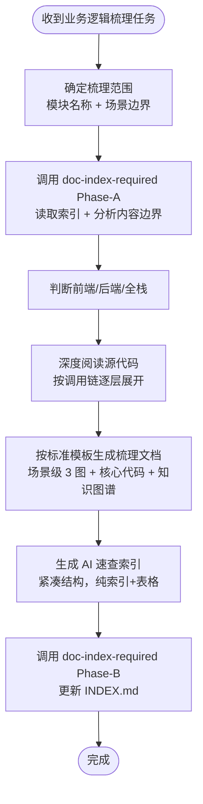

# 业务逻辑现状梳理规范

## 核心原则

**重构/复写/迁移现有业务前，必须先产出「业务逻辑梳理文档」和「AI 速查索引」，禁止在未充分理解现状的情况下动手改代码。**

本 skill 的目标是让三类读者都能快速获取所需信息：

| 读者 | 核心诉求 | 对应产出 |
|------|---------|---------|
| 开发 | 快速回顾甚至复写逻辑，精准定位代码 | 梳理文档（完整版） + AI 速查索引 |
| 产品/业务 | 快速了解业务流程和规则 | 梳理文档中的流程图、泳道图、业务规则表 |
| AI | 快速检索代码坐标、理解逻辑、减少上下文消耗 | AI 速查索引（紧凑版） |

---

## 执行流程



---

## 文档目录结构

> **v1.20 起：** 现状梳理默认写入用户目录知识库 `{USER_DOCUMENTS}/ai-docs/{project}/orientation/`，由 `doc-index-required` Phase-A/B 管控；用户明确指定项目路径或要求上传终版时才进入 `{项目根}/docs/orientation/`。

```
{ROOT}/orientation/                              ← {ROOT} = {USER_DOCUMENTS}/ai-docs/{project} 或 {项目根}/docs
  INDEX.md                                       ← 子索引，由 doc-index-required Phase-B 维护
  {业务模块名}/
    {业务模块名}-现状梳理.md                      ← 完整梳理文档（人类阅读，不带日期）
    {业务模块名}-ai-ref.md                        ← AI 速查索引（AI 阅读，可覆盖更新）
    snapshots/                                   ← 仅重大基线 / 重构启动锚点 / 用户明确要求时建
      {业务模块名}-现状梳理-{YYYYMMDD}.md
```

**命名规则：**
- 梳理文档默认**不带日期**，始终反映最新代码现状，随代码变更直接覆盖更新
- AI 速查索引同样不带日期，始终反映最新状态
- 仅重大重构启动锚点 / 基线快照 / 用户明确要求 / 非 Git 管理时才在 `snapshots/` 下建带日期版本
- 若同根下已有同模块的 `design/{业务模块名}/` 设计文档，本梳理文档放在 `orientation/{业务模块名}/`（与 design 目录平级，不混在一起）

**路径硬约束：** 路径中禁止 `{agent}/`、`{YYYY-MM-DD}/` 层；同一模块的现状梳理始终更新同一份 `-现状梳理.md`，不为日常迭代新建带日期的副本。

---

## 梳理范围确认（第一步）

开始梳理前，必须与用户确认：

| 确认项 | 说明 |
|--------|------|
| 模块/功能名称 | 如「退款退货」「支付结算」「订单履约」 |
| 场景边界 | 按「维度 A x 维度 B x 维度 C」的组合矩阵列出所有场景 |
| 技术栈类型 | 前端 / 后端 / 全栈（决定必选章节） |
| 梳理目的 | 重构 / 迁移 / 回归测试 / 新人 onboarding（影响详细程度） |

---

## 标准章节结构（完整梳理文档）

### 前端/后端通用章节（必选）

```
# {业务模块} 现状梳理

## 1. 场景总览矩阵
## 2. 核心代码索引
## 3. 各场景详细分析           ← 每个场景/场景组包含 3 图 + 核心代码
## 4. 知识图谱
## 5. 业务规则速查表
## 6. 代码核实差异说明
## 7. 回归测试检查表
```

### 后端附加章节（后端/全栈时必选）

```
## B1. 数据库表清单与 ER 图
## B2. 表操作矩阵（场景 x 表 x 操作）
## B3. 表状态扭转明细
## B4. 事务边界与并发控制
## B5. SQL / ORM 关键查询清单
```

---

## 各章节详细规范

### 1. 场景总览矩阵

**必须用表格**，按维度组合列出所有场景，标注关键差异：

| # | 维度 A | 维度 B | 维度 C | 关键差异 | 图组 |
|---|--------|--------|--------|---------|------|
| 1 | ... | ... | ... | ... | A 组 |

**规范：**
- 场景相似时合并为同一图组，差异通过标注表说明
- 图组编号从 A 开始，用于后续章节引用

同时必须包含一张**场景决策树**（Mermaid flowchart），让读者快速定位当前场景：

```
flowchart TD
    ROOT --> Q1{"维度A?"}
    Q1 -->|"值1"| Q2{"维度B?"}
    Q1 -->|"值2"| Q3{"维度B?"}
    ...
```

### 2. 核心代码索引

#### 2.1 文件清单

**必须用表格**，列出所有涉及的源文件：

| 层 | 文件路径 | 核心类 | 行数 | 职责 |
|----|---------|--------|------|------|
| ... | ... | ... | ... | ... |

**规范：**
- 文件路径从模块根目录开始（如 `lib/features/refund/...` 或 `src/main/java/...`）
- 行数通过实际读取确认，用于判断复杂度
- 按架构分层排列（Presentation > Application > Data > Domain）

#### 2.2 关键方法速查

**必须用表格**，列出所有关键方法的精确行号：

| 方法签名 | 文件 | 行号 | 关联场景 |
|---------|------|------|---------|
| ... | ... | ... | ... |

**规范：**
- 行号通过 Grep/Read 确认，禁止估算
- 关联场景标注该方法在哪些场景中被调用

### 3. 各场景详细分析

**每个场景组必须包含以下内容：**

#### 3.1 三图（必选）

| 图类型 | Mermaid 语法 | 侧重点 |
|--------|-------------|--------|
| 时序图 | `sequenceDiagram` | 组件间消息传递顺序、请求/响应、分支条件 |
| 流程图 | `flowchart TD` | 完整决策路径、条件分支、异常处理走向、代码行号标注 |
| 泳道图 | `flowchart LR` + `subgraph` | 按架构层级划分，展示跨层调用关系 |

**图中标注要求：**
- 流程图中关键节点必须标注 `文件名:行号`
- 时序图中用 `rect rgb(...)` 高亮事务边界或关键阶段
- 时序图中属于同一服务/系统的参与者必须用 `box rgb(...) 服务名称` 包裹分组（如「本机内网服务」「云端支付系统」「外部依赖」）
- 时序图中所有接口调用（HTTP / RPC / TCP 等）必须标注实际接口地址，禁止根据方法名推测路径，必须通过 Grep/Read 找到端点定义确认
- 泳道图中 `subgraph` 标题用中文标注层级名称

#### 3.2 场景差异标注（当同组包含多个场景时）

使用对照表标注同组场景的差异：

| 维度 | 场景 X | 场景 Y |
|------|--------|--------|
| ... | ... | ... |

#### 3.3 核心代码片段

提取该场景最关键的代码段（通常 10-30 行），标注来源文件和行号。目的是让开发者无需跳转 IDE 即可理解核心逻辑。

**规范：**
- 代码块标注语言和来源：`dart`、`java` 等
- 代码上方注释标注文件路径和行号范围
- 只提取核心逻辑，省略 debugPrint/日志等无关代码
- 补充简要文字说明代码的业务含义

### 4. 知识图谱

**必须包含以下图表（按需选择，至少包含前 3 项）：**

| 图表 | Mermaid 语法 | 用途 | 必选 |
|------|-------------|------|------|
| 实体关系图 | `graph TD` | 核心数据实体及其关联 | 是 |
| 状态机图 | `stateDiagram-v2` | 关键实体的状态流转 | 是 |
| 调用链图 | `graph LR` | 从入口到底层的完整调用链，标注方法行号 | 是 |
| 数据流图 | `graph TB` | 输入数据 -> 计算节点 -> 写入操作 -> 同步操作 | 推荐 |
| 组合关系图 | `graph LR` | 复杂场景如何由简单场景组合而成 | 按需 |

### 5. 业务规则速查表

**必须用表格**，将散落在代码中的业务规则集中整理：

| 规则名称 | 规则描述 | 代码位置 | 适用场景 |
|---------|---------|---------|---------|
| ... | ... | 文件:行号 | ... |

涵盖但不限于：
- 金额计算公式
- 状态判定条件
- 校验规则
- 优先级逻辑
- 强制约束（如费用强制选中）

### 6. 代码核实差异说明

梳理过程中，将文档描述与实际代码对比，记录所有发现的差异：

| # | 文档/预期描述 | 实际代码 | 影响 |
|---|-------------|---------|------|
| ... | ... | ... | ... |

若无差异也要明确说明「已核实 N 项，均与代码一致」。

### 7. 回归测试检查表

按场景组分类，列出所有需要回归验证的检查项：

- [ ] 场景描述：预期行为
- [ ] ...

---

## 后端附加章节规范

### B1. 数据库表清单与 ER 图

**表格列出所有涉及的表：**

| 表名 | 操作类型 | 说明 |
|------|---------|------|
| ... | INSERT / UPDATE / SELECT / DELETE | ... |

**ER 图使用 Mermaid `erDiagram` 或 `graph TD`：**
- 标注表间外键/关联关系
- 标注核心字段

### B2. 表操作矩阵

按场景 x 表维度，标注每个场景对每张表的操作：

| 步骤 | 表 | 操作 | 场景 1 | 场景 2 | ... | 行号 |
|------|-----|------|--------|--------|-----|------|
| 1 | orders | INSERT | Y | Y | ... | 1950 |

### B3. 表状态扭转明细

**每个有状态流转的表字段，必须整理状态机图 + 变更明细表：**

状态机图（`stateDiagram-v2`）：展示所有合法的状态转换路径。

变更明细表：

| 表.字段 | 原值 | 新值 | 触发条件 | 代码位置 |
|---------|------|------|---------|---------|
| orders.orderState | 6 | 7 | 整单退款成功 | file:line |
| orders.orderState | 7 | 6 | KPay 退款回滚 | file:line |

### B4. 事务边界与并发控制

用表格列出所有事务操作：

| 事务范围 | 包含操作 | 隔离级别 | 失败策略 | 代码位置 |
|---------|---------|---------|---------|---------|
| ... | ... | ... | 回滚/重试/忽略 | file:line |

### B5. SQL / ORM 关键查询清单

将关键查询提取为独立清单：

```sql
-- 查询名称 | 来源文件:行号
SELECT ...
FROM ...
WHERE ...
```

---

## AI 速查索引规范

**AI 速查索引是独立文件**（`{模块名}-ai-ref.md`），结构紧凑，无冗余描述，专为 AI 快速检索设计。

### 设计原则

| 原则 | 说明 |
|------|------|
| 紧凑 | 无背景叙述、无过渡段落，纯表格+代码块+决策树 |
| 精准 | 所有行号经过验证，所有方法签名完整 |
| 自包含 | AI 读取此文件后即可定位所有相关代码，无需再读完整梳理文档 |
| 可覆盖 | 不带日期版本号，代码变更后直接更新 |

### 标准章节

```
# {业务模块} AI 速查索引

> 自动生成于 {YYYY-MM-DD}，对应梳理文档：{链接}
> 代码变更后可直接覆盖更新此文件

## 1. 场景决策树
## 2. 文件索引
## 3. 方法索引
## 4. 调用链索引
## 5. 表操作索引（后端）
## 6. 状态扭转索引（后端）
## 7. 业务规则索引
```

#### AI 索引 - 1. 场景决策树

直接复用梳理文档中的 Mermaid 决策树。

#### AI 索引 - 2. 文件索引

极简表格，一行一个文件：

| 文件 | 类 | 职责(10字内) | 行数 |
|------|-----|------------|------|
| `path/to/file` | ClassName | 一句话 | 500 |

#### AI 索引 - 3. 方法索引

极简表格，一行一个方法：

| 方法 | 文件 | 行 | 入参 | 出参 | 场景 |
|------|------|---|------|------|------|
| `methodName()` | file.dart | 33 | orderId: int | bool | 1,2,5 |

#### AI 索引 - 4. 调用链索引

每个场景一行，用 `->` 箭头表示调用链：

```
场景1(现金整单): Screen -> handleConfirmRefund:33 -> confirmRefund:300 -> processSelectedItemsRefund:1646 -> db.transaction -> updateOriginalOrderRefundStatus:112 -> pushOrderData -> allocateAndPersist
```

#### AI 索引 - 5. 表操作索引（后端）

极简矩阵：

| 表 | 场景1 | 场景2 | ... |
|----|-------|-------|-----|
| orders | I+U | I | ... |

I=INSERT, U=UPDATE, D=DELETE, S=SELECT, -=不涉及

#### AI 索引 - 6. 状态扭转索引（后端）

一行一个扭转：

| 表.字段 | 原值 | 新值 | 触发 | 代码 |
|---------|------|------|------|------|
| orders.orderState | 6 | 7 | 整单退款 | file:1980 |

#### AI 索引 - 7. 业务规则索引

一行一条规则：

| 规则 | 公式/条件 | 代码 |
|------|---------|------|
| 退款总额优先级1 | canRefundableAmountTotal != null -> 直接使用 | refund_state.dart:170 |

---

## 代码阅读规范

梳理过程中，必须实际阅读源代码，禁止仅依赖文档或注释：

| 规则 | 说明 |
|------|------|
| 逐层展开 | 从入口方法开始，沿调用链逐层 Read，不跳跃 |
| 行号验证 | 所有记录的行号必须通过 Grep/Read 确认 |
| 接口地址验证 | 所有 HTTP/RPC/TCP 等接口调用必须通过 Grep/Read 找到端点定义（如 Endpoint 枚举、路由注解、URL 常量）确认实际路径，禁止根据方法名推测接口地址 |
| 差异记录 | 发现代码与注释/文档不一致时，以代码为准并记录差异 |
| 并行探索 | 可使用多个 Agent 并行探索不同代码路径，提高效率 |
| 最小读取 | 使用 offset+limit 精准读取，不整文件读取 |

---

## 与其他 Skill 的协作关系

| Skill | 何时调用 |
|-------|---------|
| `doc-index-required` | **Phase-A**：创建文档前调用（读索引 + 边界分析）；**Phase-B**：文档写完后再次调用（更新索引） |
| `markdown-writing-standards` | 生成 Mermaid 图表时，遵循语法规范 |
| `design-doc-required` | 梳理完成后，若进入重构设计阶段，须调用此 skill 创建重构设计文档 |
| `pre-implementation-code-orientation` | 重构设计文档确认后，开始写代码前调用 |
| `dev-log` | 本次会话对 team-standards 有变更时调用 |

---

## 红色警告

| 想法 | 正确处理 |
|------|----------|
| "代码我很熟，不用梳理" | 梳理的目的不只是给自己看，还要给产品/AI/新人看 |
| "画一种图就够了" | 时序图看交互、流程图看决策、泳道图看分层，3 图各有侧重，缺一不可 |
| "行号差不多就行" | 行号必须精准，AI 依赖行号做 offset+limit 精准跳转 |
| "AI 读完整文档就行，不用单独索引" | 完整文档上下文消耗大，AI 速查索引节省 70%+ token |
| "先改代码，改完再梳理" | 梳理是为了理解现状，改完代码后现状已变，梳理失去意义 |
| "后端不用记录表状态扭转" | 表状态扭转是回归测试最核心的验证点，必须记录 |
| "不用核实代码，文档说的就是对的" | 必须以代码为准，文档可能过时或不准确 |
| "接口路径根据方法名猜就行" | 必须通过 Grep 找到 Endpoint 枚举/路由注解/URL 常量确认实际路径，方法名和接口路径经常不一致 |
| "时序图对象平铺就行，不用分组" | 属于同一服务/系统的参与者必须用 box 包裹，否则读者无法区分内部调用和跨系统调用 |
| "场景太多，挑几个重要的画就行" | 所有场景都要覆盖，遗漏场景在回归时就是 bug |
