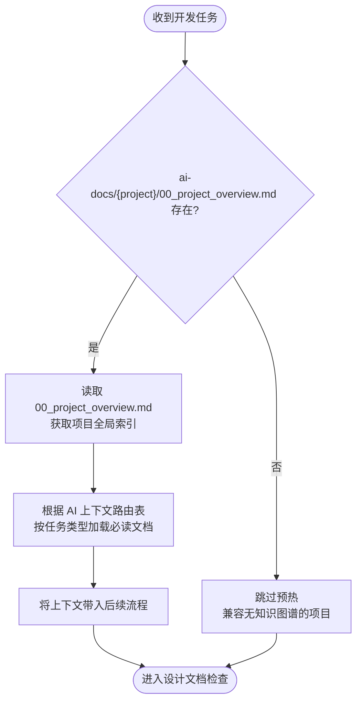
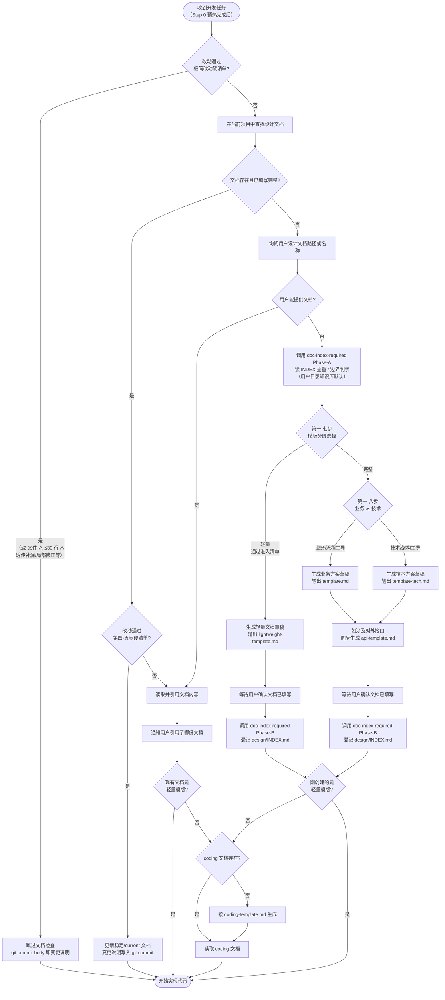

# 开发前设计文档强制检查

## 核心原则

**禁止在没有设计文档的情况下分析方案、讨论架构或编写任何实现代码。**

这不是建议，是强制要求。无论任务看起来多简单，也无论用户是要求「分析」还是「实现」，都必须先完成设计文档检查。

**所有设计文档中的架构图、流程图、模块关系图必须使用 Mermaid 语法绘制，禁止使用 ASCII art 或纯文本框图。**

<HARD-GATE>
Do NOT analyze implementation approaches, discuss architecture, propose solutions, evaluate feasibility, or write any code until the design document check below is complete. This applies even when the user only asks for analysis or architectural discussion — design doc check comes FIRST, before any response about implementation.

Do NOT write any implementation code (Edit/Write .java, .ts, .py, etc.) until BOTH the design document AND the corresponding coding summary document (-coding.md) have been created and confirmed. The coding document is NOT optional — it is the second mandatory gate before any code change.
</HARD-GATE>

---

## Step 0：知识图谱上下文预热

**在执行设计文档检查之前，先加载项目知识图谱上下文，避免后续全量扫码。**



### 执行规则

1. 检查用户目录知识库 `{USER_DOCUMENTS}/ai-docs/{project}/00_project_overview.md` 是否存在（知识图谱由 `init-project-docs` 统一生成在用户目录，不再在项目 `docs/`）
2. **若存在**：
   - 读取该文件（约 3KB），获取项目概要 + 文档导航 + AI 上下文路由表
   - 根据路由表中的「按任务类型加载」，读取当前任务对应的**必读文档**（通常 2-3 份）
   - **按需文档不在此时加载**，留到实施阶段碰到具体问题时再读
3. **若不存在**：跳过本步骤，直接进入设计文档检查（兼容没有知识图谱的项目）

### 任务类型判断

| 用户意图 | 任务类型 | 路由表对应行 |
|---|---|---|
| 新增功能、新建接口 | 新功能开发 | `01_architecture` + `02_module_map` + `05_api_map` |
| 修复 Bug、处理异常 | Bug 修复 | `08_constraints` + `modules/{模块}` |
| 重构、迁移、优化架构 | 重构/迁移 | `08_constraints` + `09_refactor_plan` + `skills/{tech}` |
| 修改接口入参出参 | 接口变更 | `05_api_map` + `06_frontend_backend_mapping` |
| 加表、改字段 | 数据库变更 | `04_data_model_map` + `08_constraints` |

> **注意**：Step 0 只负责加载上下文，不替代后续的设计文档检查。预热完成后，正常进入下方流程。

---

## 执行流程



---

## 文档目录结构规范

AI 生成的设计文档默认存放在**用户文档目录的项目知识库** `{USER_DOCUMENTS}/ai-docs/{project}/design/`，不直接写入项目 `docs/design/`。用户确认终版后，可自行上传到项目 `docs/design/` 或明确指定项目内路径让 AI 写入。

> **v1.20 起的关键变化：** 用户目录不再是「草稿堆」。`{USER_DOCUMENTS}/ai-docs/{project}/design/` 与项目 `docs/design/` 享有同等的索引体系（INDEX.md + 主题目录），**必须经过 `doc-index-required` Phase-A 查重和 Phase-B 登记**。
>
> **路径硬约束：** 路径中禁止 `{agent}/`、`{YYYY-MM-DD}/` 层；文件名禁止带日期后缀；同一需求始终更新 `{需求名称}-current.md`，不为日常迭代新建 `-vN` 快照。

### 用户目录知识库（默认）与项目 docs/（终版）共用结构

```
{ROOT}/design/                              ← {ROOT} = {USER_DOCUMENTS}/ai-docs/{project} 或 {项目根}/docs
  INDEX.md                                  ← 子索引，由 doc-index-required Phase-B 维护
  {需求名称}/                                ← 顶层需求目录
    {需求名称}-current.md                    ← 默认稳定文档（业务方案 / 技术方案）
    {需求名称}-api-current.md                ← 接口文档（如涉及对外接口）
    {需求名称}-coding.md                     ← 完整模版对应的当前编码摘要（仅完整模版需要）
    snapshots/                               ← 仅重大基线 / 发布快照 / 用户明确要求时创建
      {需求名称}-{YYYYMMDD}-v{N}.md
      {需求名称}-api-{YYYYMMDD}-v{N}.md
    {子模块名称}/                            ← 子模块目录（当本需求是更大架构的一部分时）
      {子模块名称}-current.md
      snapshots/
        {子模块名称}-{YYYYMMDD}-v{N}.md
```

**示例：**
```
docs/design/
  通用智能体架构/                            ← 顶层架构设计
    通用智能体架构-current.md
    多平台模型路由层/                         ← 子模块，归属于通用智能体架构
      多平台模型路由层-current.md
      多平台模型路由层-coding.md
  用户权限管理/                              ← 独立需求
    用户权限管理-current.md
    用户权限管理-coding.md
```

### 目录层级规则

| 规则 | 说明 |
|------|------|
| **独立需求** | 直接在 `docs/design/` 下创建顶层目录 |
| **子模块/子功能** | 如果本需求属于某个已有架构设计的一部分，**必须创建独立子目录**（`docs/design/{父需求}/{子模块名}/`），**禁止**将子模块文件直接放在父需求目录下与父文档混在一起 |
| **最大嵌套深度** | 不超过 2 层（`docs/design/{父需求}/{子模块}/`），避免目录过深 |
| **归属判断标准** | 见下方「目录归属分析」步骤 |

### 命名规则

| 部分 | 规则 | 示例 |
|------|------|------|
| 需求名称 | 与需求/功能名一致，禁止缩写 | `用户权限管理` |
| 稳定文档 | Git 管理下默认使用 `{需求名称}-current.md` 或用户指定的稳定文件名 | `用户权限管理-current.md` |
| 编码摘要 | 完整模版对应 `{需求名称}-coding.md`，随稳定文档同步 | `用户权限管理-coding.md` |
| 快照文档 | 仅重大基线/发布快照/用户明确要求/非 Git 管理场景使用 `YYYYMMDD-vN` | `用户权限管理-20260330-v1.md` |

### 版本更新原则

- **Git 管理下的项目正式文档默认直接更新稳定文档**，历史由 git commit / PR diff / blame 负责，不靠不断复制 `v1/v2/v3` 文件留痕。
- 只有以下情况才新建版本快照：用户目录草稿尚未进入 Git、重大架构基线或发布基线、用户明确要求保留快照、文档不在 Git 管理范围内。
- 微小错别字、格式修正、普通迭代和常规需求调整均直接修改稳定文档，并在 commit body 写清楚变更原因。

---

## 步骤详解

### 第一步：查找设计文档

在以下两个根下按以下优先级查找（**项目 `docs/` 命中优先**，未命中再查用户目录知识库）：

| 优先级 | 根 | 路径 |
|---|---|---|
| 1 | 项目终版 | `{项目根}/docs/design/` |
| 2 | 用户目录知识库 | `{USER_DOCUMENTS}/ai-docs/{project}/design/` |

每个根内按以下顺序查找：

1. 询问用户本次开发对应的**需求名称**
2. 在 `{ROOT}/{需求名称}/` 目录下优先查找 `{需求名称}-current.md` 或用户指定的稳定文档
3. 若完整模版命中，同时查找 `{需求名称}-coding.md`
4. 若未找到稳定文档，再查找 `snapshots/` 或目录内最新 `YYYYMMDD-vN` 快照作为参考
5. 若顶层未找到，**递归搜索子目录**（如 `{ROOT}/{父需求}/{需求名称}/`）
6. 若两个根都不存在该目录，则认为文档缺失，进入第一·五步（目录归属分析）后再进入第三步

### 第一·五步：目录归属分析

文档缺失需要新建时，**在创建目录前必须先分析目录归属**：

1. **扫描 `design/` 下所有已有目录**（同时读取项目 `docs/design/INDEX.md` 与用户目录 `ai-docs/{project}/design/INDEX.md` 获取各需求摘要）
2. **判断本次需求是否属于某个已有架构/系统设计的子模块**，判断依据：

| 判断维度 | 归属为子模块的信号 | 保持独立的信号 |
|---------|------------------|--------------|
| **功能依赖** | 本需求实现的功能是已有架构的组成部分 | 本需求可独立运行，无父架构 |
| **接口引用** | 本需求实现的接口定义在已有架构文档中 | 本需求自定义全部接口 |
| **文档提及** | 已有架构文档的「功能范围」或「后续扩展」明确提到本需求 | 无任何文档提及 |
| **模块归属** | 本需求的代码位于已有架构相同的 Maven 模块内 | 本需求位于独立模块 |

3. **判定结果处理**：
   - **属于子模块** → 目录路径为 `docs/design/{父需求}/{子模块名}/`，告知用户归属原因
   - **独立需求** → 目录路径为 `docs/design/{需求名称}/`
   - **不确定** → 列出候选父目录及判断理由，让用户决定

> **示例：** 新建「多平台模型路由层」设计文档时，扫描发现「通用智能体架构」的功能范围和后续扩展章节明确提到了模型路由，且代码位于同一个 `llm-domain` 模块 → 判定为子模块 → 建议路径 `docs/design/通用智能体架构/多平台模型路由层/`

### 第一·七步：模版分级选择（轻量 vs 完整）

**目录确定后、输出模版前，必须先决定本次用「轻量模版」还是「完整模版」。** 直接用完整模版处理小接口、或用轻量模版偷懒做大改造，都属于流程错位。

#### 模版定位

| 模版 | 文件 | 适用场景 | 配套 coding.md | 配套 api-doc |
|------|------|---------|----------------|------------|
| **轻量** | `lightweight-template.md` | 单接口的自身流程 / 库表读写流程描述、已有架构内的接口新增/调整、入参出参微调 | **不需要** | 不需要（接口契约写在第 2 节） |
| **完整-业务** | `template.md` | **业务/流程主导**：订单状态、退款流程、审批工单、业务规则改造等 | **需要** | 涉及对外接口必填 |
| **完整-技术** | `template-tech.md` | **技术/架构主导**：协议选型、中间件接入、分布式系统、复杂模块拆分、客户端架构 | **需要** | 涉及对外接口必填 |

> **完整模版的二级判定见第一·八步。**

#### 准入硬清单（命中**所有**项才允许走轻量分支）

只要任意一项 ❌，立即升级到完整模版。**严禁口头判定「差不多就走轻量」。**

- [ ] **不**新增数据库表
- [ ] **不**新增字段（仅读取现有字段）或字段变更属于纯枚举值扩充
- [ ] **不**新增对外服务契约入口（HTTP 路径 / Feign 方法）
- [ ] **不**改既有对外接口的入参/出参语义（字段重命名、含义变化）
- [ ] **不**跨服务、不跨模块协作（只在当前模块内）
- [ ] **不**引入新的中间件/消息队列/分布式锁/补偿事务
- [ ] **不**新增 ≥3 个类（顶多 1-2 个新类）
- [ ] **不**重新设计实体状态机（在已有状态机内增减状态算扩充，不算重设计）
- [ ] 改动核心可由「核心流程图 + 库表过滤规则表 + 失败行为表」完整描述

#### 判定边界示例

✅ 走轻量：
- 给「获取可退商品」接口加一个 `includeMergeTable` 入参，控制是否聚合联台兄弟订单
- 把订单查询的 `WHERE` 条件多加一个过滤项，剔除某种特殊状态
- 在已有 Service 加一个查询方法，本质是按新条件读现有表

❌ 必须用完整模版：
- 新建「积分账户」表 + 配套接口（**新增表**）
- 把「订单创建」从同步改为消息异步推送（**引入消息队列**）
- 引入分布式锁防止重复退款（**新增分布式锁**）
- 设计三方对账的全新接口契约（**新增对外契约**）

#### 决策动作

1. 对照硬清单逐项判定
2. **轻量分支**：输出 `lightweight-template.md`，告知用户填写要点 + 升级触发条件
3. **完整分支**：进入下方第一·八步选择业务 vs 技术，再输出对应模版

> **决策必须显式告知用户：** 必须先回复"判定为【轻量/完整】模版，原因：xxx"，再输出模版。**不允许默默选择。**

---

### 第一·八步：完整模版的二级判定（业务 vs 技术）

**仅在完整分支触发**。决定用 `template.md`（业务）还是 `template-tech.md`（技术）。

#### 关键词触发

| 信号词出现 | 倾向模版 |
|---|---|
| 订单 / 状态机 / 审批 / 工单 / 退款 / 业务规则 / 流程改造 / 校验逻辑 | **业务**（`template.md`） |
| 协议 / WebRTC / WebSocket / 消息队列 / 缓存 / 分布式锁 / 网关 / SSO / 路由层 / 客户端架构 / 中间件 / SDK 接入 / P2P | **技术**（`template-tech.md`） |

#### 本质区别

| 维度 | 业务方案 | 技术方案 |
|---|---|---|
| 核心载体 | 一张主流程图（线性、有判断分支） | 一张架构图 + 多张交互小图（拓扑） |
| 关键章节 | 核心流程、核心业务规则 | 整体架构、模块拆分与职责、关键交互 |
| 阅读视角 | 业务流程怎么走 | 模块怎么拆、对象怎么协作 |
| 失败信号 | 流程图节点超过 12 个仍线性走完 | 把所有交互合并成一张大 sequenceDiagram |

#### 决策动作

1. 提取用户描述中的关键词，匹配上方信号词表
2. 不确定时**不允许默默选择**——列出"业务/技术"两种倾向 + 各自后续章节差异，让用户拍板
3. 拍板后回复"判定为【完整-业务】或【完整-技术】模版，原因：xxx"，再输出对应模版

---

### 第二步：文档存在时

**先识别文档类型**（看文件头部声明 / 目录结构）：

- **轻量文档**（基于 `lightweight-template.md`）：直接读取该文档作为编码依据，**不需要** coding.md
- **完整文档**（基于 `template.md` 业务方案 或 `template-tech.md` 技术方案）：检查是否同时存在对应的编码摘要文档（`-coding.md`）和接口文档（`-api-current.md`）

完整文档的 coding.md 处理：

- **存在 `{需求名称}-coding.md` 或对应 `-coding.md`**：优先读取编码摘要文档，以节省 token、降低幻觉风险
- **不存在 `-coding.md`**：读取完整文档，并在读取后**自动生成**对应的编码摘要文档

在开始编码前明确告知用户：

> "已读取编码摘要：`docs/design/{需求名称}/{文件名}-coding.md`
> 本次实现依据：
> - 核心业务规则：XXX
> - 涉及类（全类名）：XXX
> - 关键约束：XXX
> 如有不符，请告知我，我将先更新稳定设计文档；只有重大基线或非 Git 管理场景才创建版本快照。"

### 第三步：文档不存在时

**禁止直接开始编码。** 执行以下步骤：

1. 告知用户未找到对应需求的设计文档
2. 询问是否有已有文档需要手动指定路径
3. 若无文档，确定输出根（默认用户目录知识库 `{USER_DOCUMENTS}/ai-docs/{project}/design/`；用户明确指定 `docs/...` 时用项目 `docs/design/`），并执行 `doc-index-required` 的**输出路径回显**
4. **调用 `doc-index-required` Phase-A**（读取顶层 INDEX + design/INDEX，分析内容边界，判断是新建主题目录还是补充到已有 `-current.md`）；用户目录与项目 docs/ 同等执行
5. **执行第一·七步模版分级选择**
6. 按对应模版生成稳定文档（`{需求名称}-current.md`）；不为首次创建动作建带日期的 v1 快照

---

#### 轻量分支引导（命中第一·七步轻量准入清单）

> **本次改动判定为【轻量级】，按接口级模版处理。**
>
> 请按以下步骤操作：
> 1. 默认创建到用户目录知识库：`{USER_DOCUMENTS}/ai-docs/{project}/design/{需求名称}/`
> 2. 创建/更新文件：`{需求名称}-current.md`（首次创建即用 -current 命名，**不带日期后缀、不建 v1**）
> 3. 参考 `lightweight-template.md`，至少完成以下章节：
>    - 第 1 节：代码入口（先写"待实现"也可以）
>    - 第 2 节：接口契约（核心入参/出参）
>    - 第 3 节：核心流程图（接口自身流程 / 库表读写顺序，必填 1 张 Mermaid flowchart 或 sequenceDiagram）
>    - 第 4 节：关键过滤/写入规则
>    - 第 5 节：失败行为
> 4. 文档写完后调用 `doc-index-required` Phase-B 登记到 `{USER_DOCUMENTS}/ai-docs/{project}/design/INDEX.md`
> 5. 草稿确认后告知我文件路径，我将读取后开始实现；终版是否上传到项目 `docs/` 由用户自行决定
> 6. **本分支无需生成 `-coding.md`**

模板文件位于：`skills/design-doc-required/lightweight-template.md`

---

#### 完整-业务分支引导（第一·八步判定为业务/流程主导）

> **本次改动判定为【完整-业务】，按 `template.md` 处理。**
>
> 请按以下步骤操作：
> 1. 默认创建到用户目录知识库：`{USER_DOCUMENTS}/ai-docs/{project}/design/{需求名称}/`
> 2. 创建/更新文件：`{需求名称}-current.md`（首次创建即用 -current 命名）
> 3. 参考模板填写内容（至少完成以下章节）：
>    - 第 1 节：目标与边界
>    - 第 2 节：核心流程（必填 1 张 Mermaid 核心图）
>    - 第 3 节：核心业务规则
>    - 第 4 节：编码落点（目录树结构）
>    - 第 6 节：风险与待确认
> 4. **如涉及对外接口**：同步生成 `{需求名称}-api-current.md`，按 `api-template.md` 填写字段级契约
> 5. 文档写完后调用 `doc-index-required` Phase-B 登记到 `{USER_DOCUMENTS}/ai-docs/{project}/design/INDEX.md`
> 6. 草稿确认后告知我文件路径，我将读取后开始实现；终版是否上传到项目 `docs/` 由用户自行决定

模板文件位于：`skills/design-doc-required/template.md`（业务方案）+ `api-template.md`（接口文档）

---

#### 完整-技术分支引导（第一·八步判定为技术/架构主导）

> **本次改动判定为【完整-技术】，按 `template-tech.md` 处理。**
>
> 请按以下步骤操作：
> 1. 默认创建到用户目录知识库：`{USER_DOCUMENTS}/ai-docs/{project}/design/{需求名称}/`
> 2. 创建/更新文件：`{需求名称}-current.md`（首次创建即用 -current 命名）
> 3. 参考模板填写内容（至少完成以下章节）：
>    - 第 1 节：目标与边界
>    - 第 2 节：整体架构（必填 1 张架构图，subgraph 分组）
>    - 第 3 节：模块拆分与职责（每模块独立小节）
>    - 第 4 节：关键交互（多张小时序图，禁合并大图）
>    - 第 5 节：核心业务规则
>    - 第 6 节：编码落点（目录树结构）
>    - 第 8 节：风险与待确认
> 4. **如涉及对外接口**：同步生成 `{需求名称}-api-current.md`，按 `api-template.md` 填写字段级契约
> 5. 文档写完后调用 `doc-index-required` Phase-B 登记到 `{USER_DOCUMENTS}/ai-docs/{project}/design/INDEX.md`
> 6. 草稿确认后告知我文件路径，我将读取后开始实现；终版是否上传到项目 `docs/` 由用户自行决定

模板文件位于：`skills/design-doc-required/template-tech.md`（技术方案）+ `api-template.md`（接口文档）

### 第三·五步：文档写完后更新索引

文档写完后**必须**调用 `doc-index-required` Phase-B 登记/更新索引，**用户目录知识库与项目 `docs/` 同等执行**：

- 默认目标：`{USER_DOCUMENTS}/ai-docs/{project}/design/INDEX.md`
- 用户指定项目内路径时：`{项目根}/docs/design/INDEX.md`

新建主题目录时，Phase-B 还会检查并更新顶层 `INDEX.md`（确保 `design/` 子目录条目存在）。

---

### 第四步：生成编码摘要文档（编码前第二道门禁）

> **本步仅适用于完整模版（基于 `template.md` 业务方案 或 `template-tech.md` 技术方案）。** 轻量模版（基于 `lightweight-template.md`）不需要 coding.md，核心流程图 + 规则表已经覆盖编码所需信息，跳过本步直接进入实现。

**编码摘要文档是完整文档编码前的第二道强制门禁。** 设计文档确认后、第一行实现代码之前，必须确保 `-coding.md` 存在。若不存在，立即按 `coding-template.md` 生成。

> **禁止在 `-coding.md` 缺失的情况下开始编码（完整模版分支）。** 即使用户催促"直接写代码"，也必须先完成本步。

文件命名：
- Git 管理下的稳定文档默认使用 `{需求名称}-coding.md`
- 版本快照场景才使用 `{需求名称}-{YYYYMMDD}-v{N}-coding.md`（与快照文档对应）

#### 三类文档的职责边界

| 内容 | 设计文档（业务/技术方案） | 接口文档（api-template.md） | 编码文档（coding-template.md） |
|------|----------------------|--------------------------|---------------------------|
| 目标、边界、设计结论 | 保留 | 不写 | 摘要引用 |
| 核心流程图 / 架构图 / 交互图 | 保留 | 不写 | 不重复 |
| 接口入口列表 | 不写 | 保留接口清单 | 保留接口入口指针（指向 api-doc） |
| 接口字段级契约 / 错误码 / 示例 | **不写** | **保留**（唯一权威载体） | 不重复 |
| 核心业务规则 | 保留 | 不写 | 保留并可展开实现约束 |
| 编码落点 + 一句话职责 | 保留（目录树） | 不写 | 展开方法签名和操作步骤 |
| 数据/依赖变化 | 只写本次变化 | 不写 | 展开字段级、调用级细节 |
| 风险与验证要点 | 保留 | 不写 | 转换为测试/异常处理要点 |

**原则：**
- **设计文档**回答"为什么这样做、核心流程/架构是什么、风险在哪里、代码大概落哪"
- **接口文档**回答"每个对外接口的契约长什么样"
- **编码文档**回答"每个方法怎么写"

#### 生成规则

从完整文档中提取以下内容填入编码文档（章节号按业务模版 `template.md` / 技术模版 `template-tech.md` 各自实际章节定位）：

- 变更记录 → 精简为一行摘要
- 目标与边界 → 精简为设计结论和不做什么
- 核心流程（业务）/ 整体架构 + 模块拆分 + 关键交互（技术） → 提取关键步骤、模块职责、关键交互摘要
- 核心业务规则 → 原文提取
- 编码落点 → 提取**全路径**填入「涉及类清单」，补充方法签名和职责
- 数据与依赖变更 → 提取本次变化的关键字段、事务、下游调用
- 风险与验证 → 提取异常处理、边界条件和测试要点
- 接口入口 → 仅列「方法 + 路径 + 实现类#方法」指针；字段级契约**不复制**，留给 api-doc 承担

**全路径要求：** 编码落点中所有类/文件必须使用完整路径（包路径或文件路径），禁止只写短类名，以便精准定位代码文件。

---

### 第四·五步：轻量修订（小修直接更新稳定文档）

**适用场景：** 设计文档已存在、本次改动属于该文档覆盖范围内的修正/对齐/删冗余，引入"新建快照 + coding.md"的成本明显大于收益。Git 管理下这类改动默认**直接更新稳定/current 文档**，变更原因写入 commit body；不再为了留痕在文档末尾追加流水，也不新建版本号、不新建 coding.md。

#### 准入硬清单（必须全部 ✅ 才能走本分支）

只要任意一项 ❌，立即退回[第五步：需求变更时更新稳定文档]。**严禁口头判定"差不多就走轻量"。**

- [ ] 设计文档已存在（优先 `docs/design/{需求}/{需求}-current.md`，兼容历史 `...vN.md`）
- [ ] 改动**不**新增对外接口、**不**修改入参/出参字段
- [ ] 改动**不**新增数据库表、**不**新增/重命名/删除字段
- [ ] 改动**不**新增类、**不**新增/删除/重命名公开方法
- [ ] 改动**不**改变方法签名（参数/返回值/异常）
- [ ] 改动**不**引入新的外部依赖（pub/maven/npm 等）
- [ ] 改动范围 ≤ 单文件、≤ 30 行净变更
- [ ] 改动性质属于以下**一种**：
  - 修正与上游/云端/规范的不一致（对齐）
  - 删除冗余、错误或被强制覆盖的逻辑
  - 修复明确的 bug 且不改变文档已声明的业务规则方向
  - 补充注释、日志、错误信息文案

> **判定边界示例：**
> ✅ 走轻量：删除 `_calculateRefundPriceRaw` 中强制覆盖 `selectedServices` 的 6 行 if 块（与云端 `calculateRefundPrice` 对齐）
> ❌ 必须进入需求变更处理：把 `selectedServices` 改成支持半选的全新数据结构（改了入参语义）
> ❌ 必须进入需求变更处理：从 `selectedServices` 派生出新的 `selectedServiceTypeFlag` 字段（新增字段）

#### 处理动作

1. 若稳定文档中的业务规则、接口描述、代码入口或表操作说明会失真，直接更新 `{需求名称}-current.md`；若文档内容仍准确，则不必为本次小修强行改文档
2. **不**新建快照文档、**不**新建/更新 `-coding.md`
3. **跳过** `doc-index-required` Phase-B（INDEX 摘要无需更新）
4. 进入代码改动时**必须遵循 `bugfix-coding-style`**（v1.17 起方向反转）：直接改写或新增；**禁止**在源码中保留 `[DEPRECATED]` / `[ADDED]` / `[BUGFIX 日期]` 等变更日志标记，**禁止**注释保留旧代码段；变更原因写进 commit message body，源码内只保留 WHY 注释且优先上提到方法 / 类 doc comment
5. commit 信息按 `git-commit-standards` 规范，在 body 写清楚本次为什么改；若同步更新了设计文档，在 body 引用文档路径

#### 红线

| 想法 | 正确处理 |
|------|---------|
| "这次只改 5 行，但顺手删个无用方法" | 删方法即破清单第 4 项，必须进入需求变更处理 |
| "顺便把入参字段名规范一下" | 改入参字段即破清单第 2 项，必须进入需求变更处理 |
| "走轻量分支就不用写 commit body 了" | 错。Git commit body 是默认变更日志，必须写清楚为什么改 |

---

### 第五步：需求变更时更新稳定文档

若改动**未通过** [第四·五步硬清单]（任意一项 ❌），即视为需求变更：

- **项目内 Git 管理的正式文档**：直接更新 `{需求名称}-current.md` 或用户指定的稳定文档，并同步更新 `{需求名称}-coding.md`（完整模版）
- **用户目录草稿 / 非 Git 管理文档 / 重大基线 / 用户明确要求快照**：才引导创建 `{需求名称}-{今日日期}-v{N+1}.md`

对用户提示：

> "检测到需求变更。若这是项目内 Git 管理的正式文档，我会先更新稳定设计文档并依赖 git commit 留痕；若你需要保留基线快照，请明确要求我创建 `{需求名称}-{今日日期}-v{N+1}.md`。"

---

### 第六步：修改设计文档后同步 coding 文档

> **本步仅适用于完整模版。** 轻量模版没有配套 coding.md，跳过本步。

**每次对完整设计文档进行实质性内容变更后（包括直接修改稳定文档和创建快照），必须同步更新对应的 `-coding.md`。**

按以下映射关系更新对应章节：

| 设计文档变更内容 | 需同步更新的文档/章节 |
|----------------|---------------------|
| 接口清单增删 / 入参出参字段调整 / 错误码变更 | **api-doc 文档**（不通过 coding.md，由 api-doc 唯一承载） |
| 接口实现类/方法路径变更 | coding 文档第 2 节：接口入口指针 |
| 类清单增删 | coding 文档第 3 节：涉及类清单（同步增删类条目，补充方法签名） |
| 核心业务规则变更 | coding 文档第 1 节：核心业务规则 |
| 数据库字段/DDL/Mapper 变更 | coding 文档第 4 节：数据结构 |
| 约束、事务、边界说明变更 | coding 文档第 5 节：重要约束与边界 |

> **注意**：设计文档的类清单只有一句话职责，coding 文档需自行补充方法签名和详细操作说明。设计文档新增一个类时，coding 文档不只是复制一行，而要展开该类的方法级细节。

若文档使用稳定命名，coding 文档直接同步覆盖；若文档是快照命名，coding 文档与快照版本号保持一致。

若以上章节均未涉及，则跳过 coding 文档更新。

---

## Mermaid 图表要求

**详细规则见 [rules/mermaid-requirements.md](./rules/mermaid-requirements.md)**。该子文档覆盖：

- 最小图原则（一张图能讲清就不拆，按场景选图，禁凑章节）
- 场景选图表速查（接口流程 / 时序 / 状态机 / 模块图 / 依赖图 / 能力分解）
- 完整-业务 / 完整-技术 / 轻量三档模版各自图表清单与红线
- subgraph / box 分组规范（同主题节点必须分组）
- 模块/依赖图、能力分解图的克制原则
- 三档模版各自的图表检查清单

> Mermaid 语法本身（语法错误、自检清单）由 `markdown-writing-standards` skill 统一管控。本 skill 只定义"哪些场景画哪些图"。

### 速记

1. **一张图能讲清就不拆**；图随场景选，不随章节凑
2. **完整-业务**：≥1 张核心图（接口流程图 / 时序图二选一），其余按场景触发
3. **完整-技术**：1 张整体架构图 + 多张小时序图（每张只讲 1 件事），**禁止合并为一张大图**
4. **轻量**：只画 1 张核心图（flowchart 或 sequenceDiagram），其余下沉到规则表
5. **分组**：同主题/同系统的节点必须用 `subgraph`（flowchart）或 `box`（sequenceDiagram）包裹

### 早期速查（保留）

| 场景 | 推荐图 | 是否必填 |
|---|---|---|
| 单个后端接口 / 单个业务动作 | `flowchart TD` 或 `sequenceDiagram` | 必填 1 张 |
| 涉及 ≥2 模块协作 | 模块/组件关系图 | 条件必填 |
| 涉及实体状态变化 | `stateDiagram-v2` | 条件必填 |
| 跨系统/外部依赖较多 | 依赖图 | 条件必填 |
| 能力分解 | `mindmap` / `graph TD` | 不推荐（优先文字/表格） |

## 终版文档（current）

Git 管理下的项目正式文档以稳定/current 文档为主。版本快照只作为少数场景的辅助，而不是日常迭代默认动作。

| 文件名格式 | 用途 | 更新方式 |
|-----------|------|----------|
| `{需求名称}-current.md` | 默认正式设计文档（业务方案 / 技术方案），反映当前代码的实际实现 | 随代码演进直接更新，历史由 Git 负责 |
| `{需求名称}-api-current.md` | 接口文档，与 current 配套；如涉及对外接口必须存在 | 接口签名变更时同步更新 |
| `{需求名称}-coding.md` | 完整模版对应的当前编码摘要 | 随 current 文档同步更新 |
| `snapshots/{需求名称}-{YYYYMMDD}-v{N}.md` | 重大基线、发布快照、用户明确要求或非 Git 管理场景 | 创建后不再修改，后续变更另建快照 |
| `snapshots/{需求名称}-api-{YYYYMMDD}-v{N}.md` | 接口文档对应快照 | 同上 |

**终版文档规则：**
- 无版本号、无日期前缀，命名固定为 `{需求名称}-current.md`
- 内容结构与完整设计文档模板一致，但头部注明「最后更新日期」
- 每次代码变更后同步更新，保证与代码一致
- 存在 `current.md` 时，AI 编码优先读取 `current.md`（而非历史版本快照）
- 不在 `current.md` 里堆“本次改了什么”的流水账；这类说明写入 git commit body

**查找优先级（第一步查找文档时）：**
1. `{需求名称}-current.md`（终版，优先）
2. `{需求名称}-api-current.md`（接口文档，如涉及接口）
3. `{需求名称}-coding.md`（当前编码摘要，完整模版需要）
4. `snapshots/{需求名称}-{YYYYMMDD}-v{N}.md` 或历史 `{需求名称}-{YYYYMMDD}-v{N}.md`（最新快照）

---

## 合法的例外情况

以下情况可以**完全跳过**设计文档检查（不需要文档、也不需要文档留痕）：

- 单元测试补充
- 配置文件修改（非业务规则相关）
- 与设计文档完全无关的纯 Bug 修复（如修字符串拼写、import 排序）
- 代码重构（不改变业务逻辑、不改变文档已声明的边界）
- **极简代码调整**：满足下方[极简改动硬清单]全部条件时跳过文档，**git commit body 即变更说明**

### 极简改动硬清单（必须全部 ✅ 才能走本分支）

任意一项 ❌ 即退回正常流程（第一·七步模版分级 / 第四·五步轻量修订）。**严禁口头判定"差不多就跳过"。**

- [ ] ≤2 文件 且 ≤30 行净变更
- [ ] 0 新类、0 新数据库表/字段、0 新对外契约入口（HTTP 路径 / Feign 方法）
- [ ] 既有出参字段语义不变（仅新增字段，向前兼容）
- [ ] 无业务规则改动、无状态机调整、无新中间件/锁/事务
- [ ] 不跨模块/跨服务
- [ ] 改动性质属于以下**一种**：
  - **透传层补漏字段**（BFF / Gateway / Adapter）：DTO mirror 上游 SDK 已存在的字段、Service 加 setter 透传映射
  - **局部行为修正**：参数边界、空判、字符串文案、日志、调试输出
  - **简单条件分支调整**（不改变方法对外语义）
  - **移除无用代码 / dead code**
  - **注释、import 整理**

### 极简分支处理动作

1. **不**生成轻量草稿、**不**生成 coding.md、**不**更新设计文档
2. 代码改动遵循 `bugfix-coding-style`：源码内不留变更日志注释，旧逻辑由 git log 承担
3. **commit body 必须承担变更说明职责**，至少包含：
   - **改了什么**（具体字段 / 方法 / 行号）
   - **为什么改**（动因，如"上游 SDK 已存在但 BFF 漏接收"）
   - **影响范围**（如"纯字段新增、向前兼容，不影响下游契约"）

### 极简分支判定边界示例

✅ 走极简跳过：

- BFF `DataSyncPushEvent` DTO 加 2 个字段 mirror 上游 SDK 已有字段 + impl 加 2 行 setter 映射（4 行净变更）
- Controller 方法加一行 trim 入参的空判
- 把魔法数字 `3` 替换成已有枚举 `OrderState.PAID.code`
- 删除 `if (false) { ... }` dead code 块

❌ 必须进入正常流程：

- 改动 5 行但其中 1 行重命名了入参字段 → 改语义（破第 3 项），按轻量模版处理
- 顺手抽了一个 `_buildXxxKey` 私有方法 → 0 新方法（破第 2 项的精神），按轻量模版处理
- BFF 端对上游字段做了过滤/聚合再返回 → 不再是纯透传（破改动性质条件）

### 红线

| 想法 | 正确处理 |
|------|---------|
| "顺手把这个字段名也规范一下" | 改字段名 = 改语义 → 退回正常流程 |
| "顺便加个新方法吧" | 0 新方法是硬阈值 → 退回正常流程 |
| "一个文件 50 行没事吧" | ≤30 行净变更是硬阈值，超了立即退回 |
| "commit body 写一行 'fix' 就够" | 错。极简分支跳过文档的代价是 commit body 必须承担变更说明，不写清楚 = 流程违反 |
| "好像有点像极简，又有点像轻量，就走极简吧" | 凡边界模糊一律按上一档处理（轻量），极简分支只接收明确命中清单的改动 |

### 与"轻量修订"和"完整流程"的区别

| 改动性质 | 处理方式 |
|---------|---------|
| 设计文档已存在，且改动会影响文档已描述的业务规则/边界 | **第四·五步：轻量修订**（必要时更新稳定/current 文档，变更说明写 commit body） |
| 设计文档不存在或改动引入新功能/接口/类/字段 | **第三/五步：创建或更新稳定文档；仅例外场景新建快照** |
| 改动满足[极简改动硬清单] | **本节：极简跳过**（git commit body 即变更说明，无需文档） |
| 改动与任何设计文档都无业务关系（测试 / 配置 / 拼写 / 重构） | **本节：合法例外**（完全跳过） |

**判断标准：** 是否会让设计文档与代码的描述失真。如有疑问，按"轻量修订"处理；若连设计文档都没有且改动确实只是字段透传/局部修正，再考虑[极简跳过]。**不允许通过"看起来很简单"绕开模版分级。**

---

## 与其他 Skill 的协作关系

| Skill | 何时调用 |
|-------|---------|
| `markdown-writing-standards` | 生成或修改设计文档中的 Mermaid 图表时，必须先调用进行语法自检 |
| `doc-index-required` | 创建设计文档前必须先执行 Phase-A（读 INDEX、查重、判断新建/补充）；写完后必须执行 Phase-B 登记索引。**用户目录知识库与项目 `docs/` 同等执行**（v1.20 起） |
| `backend-knowledge-graph-required` | 后端接口/服务需求分析与编码前，若项目存在 `docs/knowledge-graph/backend/`，必须先读取后端知识图谱中的能力、流程、表逻辑、原子能力、枚举、API 与外部依赖；编码后同步表读写、状态判定和原子能力变化 |
| `pre-implementation-code-orientation` | 设计文档确认完毕、开始写第一行实现代码前调用 |
| `dev-log` | 仅 team-standards 自身发生决策型规则变更时调用；业务项目设计文档的普通演进由 git commit body 记录 |

---

## 红色警告

以下想法出现时立即停止，回到文档检查流程：

| 理由 | 正确处理 |
|------|----------|
| "需求很简单，不需要设计文档" | 简单功能的文档也可以简单，但不能没有 |
| "用户让我快点做" | 先确认文档，再快速实现 |
| "我已经理解需求了" | 理解 ≠ 文档存在，仍须检查 |
| "只改一个方法" | 判断是否属于例外情况，否则仍须检查 |
| "直接建文件，不用查索引" | 必须先执行 doc-index-required Phase-A（读 INDEX 查重）；用户目录知识库与项目 docs/ 同等待遇 |
| "先把草稿也放到 docs/design 里" | AI 生成文档默认放用户目录知识库 `ai-docs/{project}/design/`；终版由用户自行上传，或用户明确指定 `docs/...` 路径后再写项目目录 |
| "直接建文件，不用确认输出路径" | 仍需先执行 doc-index-required 的输出路径回显 + Phase-A；不论用户目录还是项目 docs/ 都不豁免 |
| "doc-index-required 会自动触发" | 不会。必须在本流程中显式调用 Phase-A 和 Phase-B；写到用户目录也必须调用 |
| "用户目录是草稿，可以随便写" | **错（v1.20 起）**。用户目录承载本项目知识图谱和 1-to-N 长期文档，与项目 docs/ 享有同等的索引规范 |
| "同一需求每次新建 `-{日期}-v1.md`" | **错**。默认更新 `-current.md`；版本快照仅限重大基线/发布或用户明确要求 |
| "路径里加 `claude/` 或 `codex/` 隔离一下吧" | **错**。{agent} 层已废除；所有 AI agent 共享同一知识库 |
| "子功能文件放父目录就行" | 子模块必须创建独立子目录，禁止将文件直接放在父需求目录下 |
| "项目文档已经进 Git，但每次变更还要新建 vN 文件" | 不需要。Git 管理下默认更新稳定/current 文档，历史由 commit 负责；只有重大基线、非 Git 文档或用户明确要求才建快照 |
| "文档末尾追加调整流水更保险" | 默认不要。流水账属于 commit body；设计文档只描述当前业务规则、接口、表操作和实现边界 |
| "设计文档确认了，直接写代码" | 还差一步：必须确认 `-coding.md` 存在后才能编码 |
| "coding 文档内容简单，不用生成" | 无论多简单，coding 文档是编码前的第二道强制门禁，不可跳过 |
| "用户让我根据文档直接改代码" | 有文档 ≠ 已完成设计文档检查，仍须先触发本 skill 确认文档合规，再走 coding.md 门禁 |
| "用户只是让我帮忙改一下代码，不是新需求" | 任何源码 Edit/Write 操作都必须先过本 skill，由本 skill 判断是否属于合法例外 |
| "用户已经提供了分析文档，可以直接编码" | 分析/梳理文档 ≠ 设计文档，仍须检查用户提供的设计文档路径或生成用户目录设计草稿，并确认 coding.md 门禁 |
| "看着不大就走轻量模版吧" | 必须按第一·七步硬清单逐项判定，不允许凭感觉。命中任一升级触发条件立即升级到完整模版 |
| "轻量模版可以省略核心流程图" | 核心流程图是轻量模版的核心载体，省略后等于没有设计文档。缺图直接退回让用户补全 |
| "轻量分支没 coding.md，顺手生成一个吧" | 轻量分支显式不需要 coding.md，多生成一份只会让 token 浪费 + 后续维护双份。绝对不要主动生成 |
| "改动里要新增表，但其它都不大，走轻量算了" | 新增表是硬清单第 1 项 ❌，必须升级到完整模版 |
| "用户说简单改动不需要文档" | 用户偏好不能口头放行，必须按[极简改动硬清单]逐项判定。命中所有项才能走极简跳过分支；任何一项 ❌ 都必须按轻量/完整模版走 |
| "极简分支跳过了文档，commit body 也可以简单写" | 错。极简跳过的前提是 git commit body 承担变更说明，必须写清"改了什么 + 为什么改 + 影响范围"，否则等于无文档无说明 |
