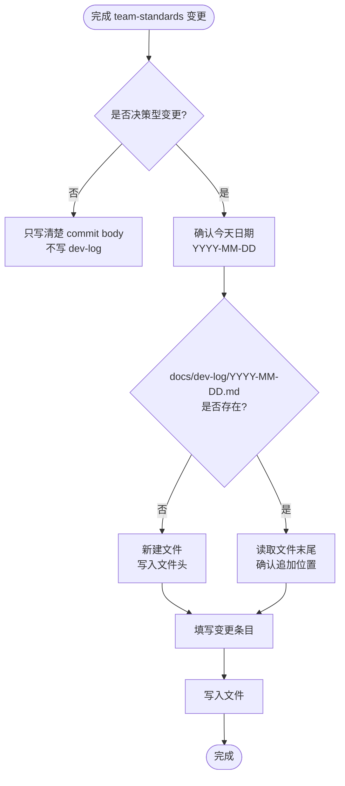

# 开发日志记录规范

## 核心原则

**`git commit` 是默认变更日志；`dev-log` 只记录决策型变更。**

普通的小变更、迭代、措辞调整、索引同步、版本号递增，必须写清楚 commit body，但不需要再写 `docs/dev-log/`，避免同一件事记录两遍。

`dev-log` 的价值是补充 git diff 和 commit body 不容易完整表达的背景：为什么引入这条规则、为什么推翻旧方向、为什么选择这个链路或 Skill 边界。

---

## 触发边界

### 必须写 dev-log

- 新增、删除或重命名 Skill
- 修改 Skill 的触发时机、核心行为、硬门禁或红线
- 推翻旧规则或发生方向反转
- 新增模板、文档链路、跨 Skill 调用关系或维护流程
- 多轮讨论沉淀出的团队原则、架构原则、协作规则
- 影响团队成员日常使用方式的规则变化

### 不需要写 dev-log

- README / AGENTS / CLAUDE / skill-flow 的同步措辞调整
- typo、格式、表格文案、示例补充
- 插件版本号递增本身
- 小范围规则澄清，commit body 已经能说明背景
- 单纯把已存在的规则同步到另一个入口文件

### 判断口诀

```text
commit body 记录“这次为什么改”。
dev-log 只记录“这个规则为什么存在”。
```

---

## 日志目录结构

```
docs/dev-log/
  YYYY-MM-DD.md     ← 每天一个文件，当天所有变更追加到同一文件
```

**规则：**
- 文件名固定为 `YYYY-MM-DD`（ISO 8601 格式，如 `2026-04-02.md`）
- 当天已有文件时，在末尾追加新条目，不新建文件
- 当天无文件时，新建并写入文件头 + 第一条记录

---

## 执行流程



---

## 文件格式

### 新建文件时的文件头

```markdown
# 开发日志 · YYYY-MM-DD

```

### 每条变更条目格式

```markdown
## HH:MM · {变更类型} · {变更对象}

**原因：** {为什么要做这个变更，背景和动机}

**改动：**
- {具体改了什么，一行一项}

**影响：**
- {对哪些 Skill / 规则 / 行为有影响}
```

### 变更类型标签

| 标签 | 含义 |
|------|------|
| `新增 Skill` | 在 skills/ 下新建了 SKILL.md |
| `修改 Skill` | 修改了已有 SKILL.md 的内容 |
| `新增模板` | 在 skill 目录下新增了辅助模板文件 |
| `修改配置` | 修改了会影响插件行为或分发策略的配置 |
| `发版` | 重大版本发布说明；普通 patch 版本号递增不单独记录 |
| `修复规则` | 补充了某个 Skill 中的漏洞或错误描述 |
| `调整流程` | 修改了跨 Skill 调用链路、触发顺序或维护流程 |

---

## 示例

```markdown
# 开发日志 · 2026-04-02

## 14:30 · 新增 Skill · bug-doc-required

**原因：** 发现 AI 在编写 bug 分析文档时缺少结构约束，调用链用文字描述、根因不用表格，导致文档质量不稳定。

**改动：**
- 新建 skills/bug-doc-required/SKILL.md
- 新建 skills/bug-doc-required/template.md

**影响：**
- 今后编写 docs/bug/ 下的文档时触发此 Skill
- 强制要求 Mermaid 调用链图和根因表格

---

## 15:10 · 发版 · team-standards 1.2.0 → 1.3.0

**原因：** 新增了 bug-doc-required 和 pre-implementation-code-orientation 两个 Skill，需要 push 让团队成员通过 /plugin update 获取。

**改动：**
- plugin.json version: 1.2.0 → 1.3.0
- marketplace.json version: 1.2.0 → 1.3.0
- CLAUDE.md Skill 索引表新增两行

**影响：**
- 团队成员执行 /plugin update 后可见这两个 Skill
```

---

## 红色警告

| 想法 | 正确处理 |
|------|----------|
| "所有变更都写 dev-log 更保险" | 错。普通小变更写好 commit body 即可，dev-log 只记录决策型背景 |
| "代码提交里有 commit message 了，所以重大规则也不用 dev-log" | 重大规则仍要写 dev-log，记录规则存在的长期背景 |
| "这次只是版本号递增，也写一条日志" | 版本号递增本身不写；只有伴随重大规则变化才写 |
| "下次再补重大决策日志" | 决策型变更当场记录，延后记录信息失真 |
| "时间不知道填什么" | 用当前时间估算即可，精确到分钟 |
